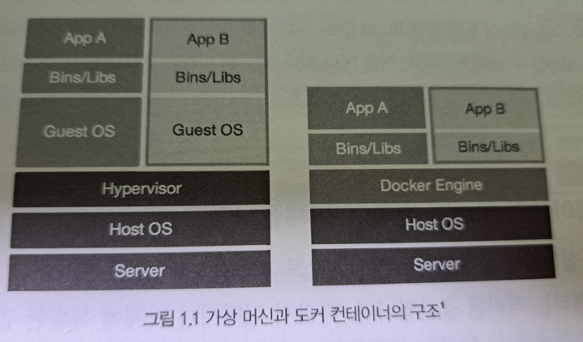
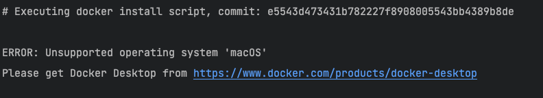
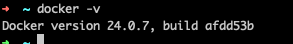
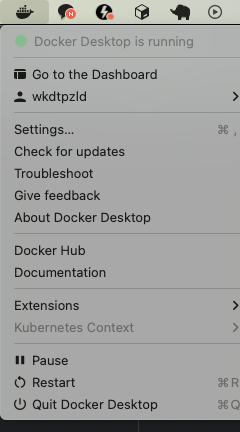
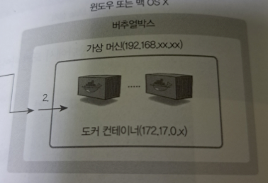
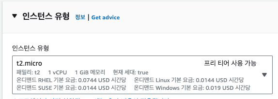
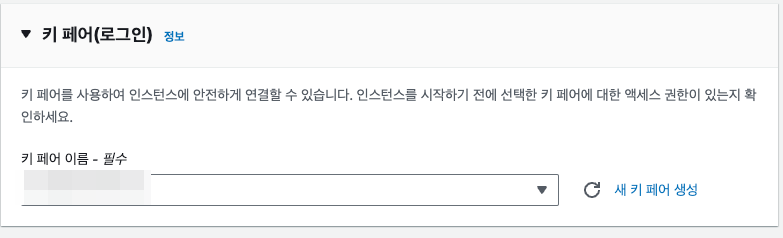
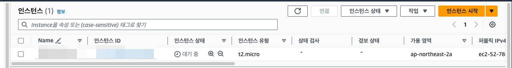

# 1장 도커란?

도커란 리눅스 컨테이너에 여러 기능을 추가함으로써 애플리케이션을 컨테이너로서 좀 더 쉽게 사용할 수 있게 만들어진 오픈소스 프로젝트이다.

도커는 **GO 언어** 로 작성돼 있으며 꾸준히 업데이트가 이루어지고 있다. 기존에 쓰이던 가상화 방법인 가상 머신과는 달리

도커 컨테이너는 손실이 거의 없어서 차세대 클라우드 인프라 솔루션으로써 많은 개발자들에게 주목받고 있다.

도커와 관련된 프로젝트는 도커 컴포즈 , 레지스트리, 도커 허브 등 여러 가지가 있지만 일반적으로 도커라고 한다면
도커 엔진 혹은 도커에 관련된 모든 프로젝트를 의미한다. 보통 도커 엔진이라는 의미로 더 많이 쓰이는데

도커 엔진은 컨테이너를 생성하고 관리하는 주체로서 이 자체로도 컨테이너를 제어할 수 있고 다양한 기능을 제공하는 도커의 주 프로젝트이다.

도커의 생태계이 있는 여러 프로젝트들은 도커 엔진을 좀 더 효율적으로 사용하기 위한 것에 불과하기 때문에

핵심이 되는 것은 도커 엔진이다. 이 때문에 도커 엔진을 사용하는 방법을 익히는 것이 도커와 관련딘 모든 프로젝트를 능숙하게 다루기 위한 첫걸음이라고 봐도 무관하다.

## 1.1 가상 머신과 도커 컨테이너

기존의 가상화 기술은 하이퍼바이저를 이용해 여러 개의 운영체제를 하나의 호스트에서 생성해 사용하는 방싣이었다.

이러한 여러 개의 운영체제는 가상 머신이라는 단위로 구별되고 각 가상 머신에는 우분투 등의 운영체제가 설치되어 사용된다.

하이퍼바이저에 의해 생성되고 관리되는 운영체제는 게스트 운영체제라고 하며, 각 게스트 운영체제는 다른 게스트 운영체제와는 완전히 독립된 공간과 시스템 자원을
할당받아 사용한다.

이러한 가상화 방식을 사용할 수 있는 대표적인 가상화 풀로 VirtualBox, VMware 등이 있다.



각종 시스템 자원을 가상화하고 독립된 공간을 생성하는 작업은 하이퍼바이저를 반드시 거치기 떄문에 일반 호스트에 비해 성능의 손실이 발생한다.

그뿐만 아니라 가상 머신은 게스트 운영체제를 사용하기 위한 라이브러리, 커널 등을 전부 포함하기 떄문에 가상 머신을 배포하기 위한 이미지로 만들었을 떄

이미지의 크기 또한 커진다. 가상 머신은 완벽한 운영체제를 생성할 수 있다는 장점은 있지만 일반 호스트에 비해 성능 손실이 있으며

수 기가바이트에 달하는 가상 머신 이미지를 애플리케이션으로 배포하기에는 부담스럽다는 단점이 있다.

도커 컨테이너는 가상화된 공간을 생성하기 위해 리눅스의 자체 기능은 chroot, 네임스페이스 cgroup 을 사용함으로써 프로세스 단위의 격리 환경을 만들기 때문에

성능 손실이 거의 없다. 컨테이너에 필요한 커널은 호스트이 커널을 공유해 사용하고 컨테이너 안에는 애플리케이션을 구동하는 데 필요한 라이브러리 및 실행 파일만 존재하기 떄문에

컨테이너를 이미지로 만들었을 때 이미지의 용량 또한 가상 머신에 비해 대폭 줄어든다. 따라서 컨테이너를 이미지로 만들어 배포하는 시간이 가상 머신에 비해 빠르며

가상화된 공간을 사용할 때의 성능 손실도 거의 없다는 장점이 있다.

### 1.2 도커를 시작해야 하는 이유

컨테이너는 OpenVZ, LXC, cri-o 등 몇 가지가 존재하지만 특히 그 중에서도 도커는 컨테이너 생태계에서 사실상 표준으로 사용되고 있다.

### 1.2.1 애플리케이션의 개발과 배포가 편해진다.

서버를 부팅할 때 실행되는 운영체제를 일반적으로 호스트 OS 라고 부르며 도커 컨테이너는 호스트 OS 위에서 실행되는 격리된 공간이다.

따라서 컨테이너 자체에 특별한 권한을 주지 않는 한 여러분이 컨테이너 내부에서 수많은 소프트웨어를 설치하고 설치 파일을 수정해도 호스트 OS 에는 영향을 끼치지 않는다.

여러분만의 독립된 개발 환경을 보장받을 수 있다.

컨테이너 내부에서 여러 작업을 마친 뒤 이를 운영 환경에 배포하려고 한다면 해당 컨테이너를 "도커 이미지" 라고 하는 일종의 패키지로 만들어 운영 서버에 전달하기만 하면 된다.

컨테이너에서 사용되던 운영 서버에서 새롭게 패키지 패키지를 설치할 필요도 없으며 각종 라이브러리 설치 등으로 인한 의존성 걱정도 필요 없다.

서비스를 개발했을 떄 사용했던 환경을 다른 서버에서도 컨테이너로서 똑같이 복제할 수 있기 떄문에 개발 / 운영 환경의 통합이 가능해진다.

도커 이미지는 가상 머신의 이미지와 달리 커널을 포함하고 있지 않기 떄문에 이미지 크기가 그다지 크지 않다. 또한 도커는 이미지 내용을 레이어 단위로 구성하며
중복되는 레이어를 재사용할 수 있어서 애플리케이션의 배포 속도가 매우 빨라진다는 장점이 있다.

### 1.2.2 여러 애플리케이션의 독립성과 확장성이 높아진다.

소프트웨어의 여러 모듈이 상호 작용하는 로직을 하나의 프로그램 내에서 구동시키는 방식을 모놀리스 애플리케이션이라고 한다.
소규모 서비스에서는 이 방식이 어울리지도 모르지만 서비스의 기능이 복잡해지고 거대해질수록 소프트웨어 자체의 확장성과 유연성이 줄어든다는 단점이 있다.

이러한 모놀리스 방식을 대채하기 위해 최근 새롭게 떠오른 개념이 바로 마이크로 서비스 구조이다.

마이크로서비스 구조는 여러 모듈을 독립된 형태로 구성하기 떄문에 언어에 종속되지 않고 변화에 빠르게 대응할 수 있으며 각 모듈의 관리가 쉬워진다는 장점이 있다.

컨테이너는 수 초 내로 생성 시작이 가능할 뿐만 아니라 여러 모듈에게 독립된 환경을 동시에 제공할 수 있기 때문에 마이크로서비스 구조에서 가장 많이 사요되고 있는
가상화 기술이다.

웹 서비스는 데이터베이스 컨테이너와 웹 서버 컨테이너로 분리될 수 있고 웹 서비스에 부하가 발생할 시 마이크로서비스 구조의 웹 서버 컨테이너만을 동적으로 늘려서
부하를 분산할 수 있다.

웹 서버와 데이터베이스의 이미지 버전을 독립적으로 관리하기 떄문에 유지 보수도 용이해진다. 

이와 같은 컨테이너 기반의 마이크로서비스는 개발자가 그 구조를 직접 구현하기보다는 도커 스웜 모드, 쿠버네티스 등의 컨테이너 오케스트레이션 플랫폼을 통해 
사용하는 것이 일반적이다.

### 1.3 도커 엔진 설치

### 1.3.1 도커 엔진의 종류 및 버전

2017년 이전의 도커 엔진은 1.12과 같이 1.x 버전으로 표기되어 왔다. 그러나 도커엔진은 1.13을 마지막으로 도커 EE, 와 도커 CE 로 구분되어 제공되고 있다.

도커 EE는 유료로 제공되는 기업용 솔루션이며, 도커 CE는 무료로 제공되는 도커 엔진으로서 별도의 기술 지원 및 서비스를 제공하지는 않지만
도커 엔진 자체의 핵심적인 기능을 무료로 사용할 수 있다는 장점이 있다.

도커 EE 와 도커 CE 는 기술 지원 및 서비스 운용을 위한 부가적인 서비스 지원 수준에서 차이가 있지만, 핵심적인 컨테이너 기술은 도커 CE에서도 동일하게 사용할 수 있다.

### 1.3.2 리눅스 도커 엔진 설치

1. 최신 버전 커널을 사용하고 있는지 확인하기.

호스트 운영 체제가 최소한 3.10 버전 이상을 사용해야 도커 컨테이너를 정상적으로 사용할 수 있다. 
터미널에서 uname -r 명령어를 입력해 커널의 버전이 이를 만족하는지 확인한다. 오래된 버전의 커널을 사용한다면 도커가 정상적으로 작동하지 않을 수 있다.


2. 지원 기간 내에 있는 배포판인지 확인한다.

일부 오래된 리눅스 배포판은 업데이트 등의 지원을 받지 못할 수 있다. 현재 사용 중인 리눅스 배포판의 지원 종료 여부는 각 리눅스 운영체제의
공식 웹사이트에서 확인 가능하다. 2020년을 기준으로 기술 지원이 지속되고 있는 운영체제는 우분투 14.04, 16.04, 18.04 등등이 있다.

3. 64비트 리눅스인지 확인한다.

도커는 64비트에 최적화되어 있다. 32비트 버전에서 도커를 실행하는 방법이 없는 것은 아니지만 권장되지 않는다.

4. sudo 명령어를 통해 설치하거나 root 권한을 소유한 계정에서 설치를 진행해야 한다.

현재 어떤 운영체제를 사용 중인지 잘 모르거나 도커 설치 방법을 찾을 수 없다면 도커에서 제공하는 설치 스크립트로 손쉽게 설치 가능하다.
```
sudo wget -q0- get.docker.com | sh
```

> 저는 wget: command not found 라는 문구가 나와서 brew 로 설치를 해주었습니다.

#### 아오


> https://www.docker.com/products/docker-desktop/ 에서 Docker for desktop 설치하였습니다..






### Docker Toolbox 와 Docker for Windows/Mac 의 차이점

도커 툴박스로 설치된 도커와 자체 가상화 기술로 설치된 도커는 동일한 도커 엔진으로 동작한다.
그러나 전자는 리눅스  가상 머신을 사용해 그 내부에 도커를 설치하지만 후자는 호스트 자체에서 가상화 기술을 적용한다.

이는 도커 컨테이너를 생성한 뒤 외부에서 접근하는 방법의 차이가 있다.



도커 툴박스는 PC에 리눅스 가상 머신을 생성한 뒤 도커를 설치하므로 가상 네트워크가 2개 생성된다.

내부 IP를 가진 가상 머신 안에 NAT IP를 할당받은 도커 컨테이너가 생성되므로 외부에서 컨테이너에 접근하기 위해서는 2중 포트 포워딩이 필요하다.

위 사진의 2번 옆에 나타내는 PC와 가상 머신 사이의 포트 포워딩이며 2번이 나타내는 가상 머신과 컨테이너 사이의
포트 포워딩인데 후자는 도커에서 컨테이너를 생성할 때 쉽게 설정 가능하다.

그렇기 떄문에 호스트 PC의 웹 브라우저 등으로 컨테이너에 접근 하기는 쉽지만 외부에서 컨테이너에 접근하기 위해서는

호스트와 가상 머신 사이의 포트 포워딩이 필요하다.

### 1.3.5 리눅스 환경에 도커 마련하기

도커는 원래 리눅스에서 작동하는데 최적화돼 있으므로 윈도우 맥 OS X 에서 도커를 사용하면 일부 기능이 제약될 수 있다.

그렇다고 물리 서버를 구하는건 쉽지 않기 떄문에 AWS EC2 를 사용해 도커를 설치할 수 있는 리눅스 환경을 마련하는 방법을 소개한다.

### 1.3.5.1 버츄얼박스, VMWare

도커를 공부할 때 사용하는 가장 일반적인 방법은 버추얼박스, VMWare 같은 가상화 도구로 리눅스 환경을 생성한 뒤
도커를 설치하는 것이다. 이 방법은 별도의 리눅스 서버 없이 윈도우, 맥 OS X 에서 마치 실제 리눅스를 사용하는 것처럼 도커를 연습할 수 있다.

### 1.3.5.2 AWS EC2

AWS는 클라우드에서 인스턴스를 제공받아 사용하는 EC2 서비스를 제공한다.

>AWS EC2 에 접속하여 인스턴스 시작하기를 클릭하고 책에서는 우분투 18.04 버전을 사용하였지만
> 현재 프리티어로 접속 가능한 최하 버전인 20 버전을 사용하겠습니다. 인스턴스 또한 t2.micro 를 사용하겠습니다.



카 페어를 등록해주었읍니당



생성하기 클릭 이후 잘 생성되었습니다~



내려받은 키 파일(.pem) 과 인스턴스 Public IP를 사용하면 해당 인스턴스에 접근 가능합니다.

아래는 커멘드라인에서 SSH 클라이언트를 사용해 접근하는 예입니다. SSH 클라이언트로는
커맨드 라인뿐만아니라 PuTTY, XShell 등 다양한 프로그램을 사용 가능하므로 각자의 취향에 맞는 클라이언트를 선택해 사용 가능합니다.

```kubernetes helm
ssh -i mykey.pem ubuntu@52.78...~~~
```

