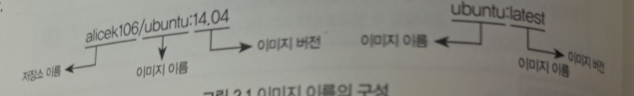

# 2. 도커 엔진

## 2.1 도커 이미지와 컨테이너

도커 엔진에서 사용하는 기본 단위는 이미지와 컨테이너이며 이 두 가지가 도커 엔진의 핵심이다.
사실 이미지와 컨테이너는 이번 장에서 설명한 것보다 훨씬 복잡한 구조이다. 지금은 이미지와 컨테이너가 무엇이고
어떤 방식으로 사용되는지 이해하면 된다.

### 2.1.1 도커 이미지

이미지는 컨테이너를 생성할 때 필요한 요소이며, 가상 머신을 생성할 때 사용하는 iso 파일과 비슷한 개념이다. 이미지는

여러 개의 계층으로 된 바이너리 파일로 존재하고 컨테이너를 생성하고 실행할 때 일기 전용스오 사용된다. 이미지는 도커 명령어로 내려받을 수 있으니 별도로
설치할 필요가 없다.

도커에서 사용하는 이미지의 이름은 기본적으로 [저장소 이름]/[이미지 이름]:[태그] 의 형태로 구성되어있다.

- 저장소 이름은 이미지가 저장된 장소를 의미한다. 저장소 이름이 명시되지 않은 이미지는 도커에서 기본적으로 제공하는 이미지 저장소인 도커 허브의 공식 이미지를 뜻한다.
  그러나 이미지를 생성할 때 저장소 이름을 명시할 필요는 없으므로 생략하는 경우도 많다.
- 이미지 이름은 해당 이미지가 어떤 역할을 하는지 나타낸다. 위 예시는 우분투 컨테이너를 생성하기 위한 이미지라는 것을 알 수 있다.
- 태그는 이미지의 버전 관리, 혹은 리버전 관리에 사용된다. 일반적으로 14.04 와 같은 버전을 명시하지만 태그를 생략하면 도커 엔진은 이미지의 태그를 latest 로 인식한다.

### 2.1.2 도커 컨테이너

앞에서 설명한 도커 이미지는 우분투 CentOS 등 기본적인 리눅스 운영체제부터 아파치 웹 서버 MySQL 데이터베이스 등의 각종 애플리케이션 등 여러가지 종류가 있다.

이러한 이미지로 컨테이너를 생성하면 해당 이미지의 목적에 맞는 파일이 들어 있는 파일 시스템과 격리된 시스템 자원 및 네트워크를 사용할 수 있는 독립된 공간이 생성된다.

이것이 도커 컨테이너가 된다.

대부분의 도커 컨테이너는 생성될 때 사용된 도커 이미지의 종류에 따라 알맞은 설정과 파일을 가지고 있기 때문에 도커 이미지의 목적에 맞도록 사용되는 것이 일반적이다.

예를 들어 웹 서버 도커 이미지로부터 여러 개의 컨테이너를 생성하면 생성된 컨테이너의 개수만큼 웹 서버가 생성되고 이 컨테이너들은 외부에 웹 서비스를 제공하는 데 사용될 것이다.

컨테이너는 이미지를 읽기 전용으로 사용하되 이미지에서 변경된 사항만 컨테이너 계층에 저장하므로 컨테이너에서 무엇을 하던지 원래 이미지는 영향을 받지 않는다.

또한 생성된 각 컨테이너는 각기 독립된 파일시스템을 제공받으며 호스트와 분리돼 있으므로 특정 컨테이너에서 어떤 애플리케이션을 설치하거나 삭제해도 다른 컨테이너와 호스트는 변화가 없다.

예를 들어 우분투 도커 이미지로 두 개의 컨테이너를 생성한 뒤 A 컨테이너에 MySQL 을 설치, B 컨테이너에 아파치 웹 서버를 설치해도 각 컨테이너는 영향을 주지 않는다.