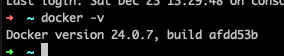
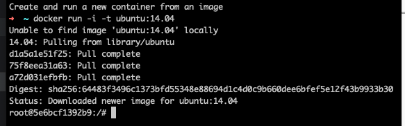
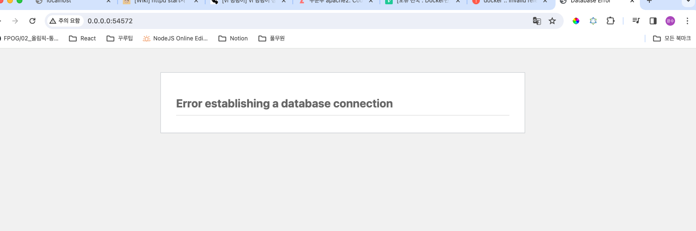
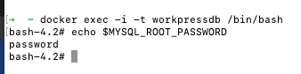
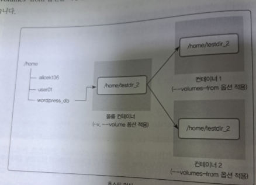
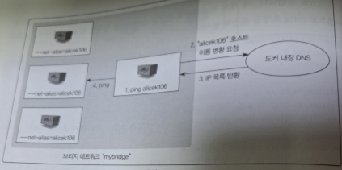

### 2.2.1 컨테이너 생성

도커를 사용하기 전 설치된 도커 엔진의 버전을 확인한다.

```
docker -v
```



사용 가능한 도커의 최신 버전을 확인하는 일은 매우 중요하다. 사소한 버전 차이로 도커의 중요 기능을 사용하지 못할 수 있다.

버전을 확인했다면 다음 명령어를 입력해 첫 번째 컨테이너를 생성한다. docker run 명령어는 컨테이너를 생성하고 실행하는 역할을 한다.

ubuntu:14:04 는 컨테이너를 생성하기 위한 이미지의 이름이며 -i -t 옵션은 컨테이너와 상호 입출력이 가능하게 한다.



단 한 줄의 docker 명령어로 컨테이너를 생성 및 실행과 동시에 컨테이너 내부로 진입헀다. 셀의 사용자의 호스트 이름이 변경된 것이 컨테이너 내부에 들어와 있다는 것을 나타낸다.

docker run 명령어로 컨테이너를 생성할 때 -i 옵션으로 상호 입출력을, -t 옵션으로 tty 를 활성화 해서 배시 셀을 사용하도록 컨테이너를 설정했다.

이 두 옵션 중 하나라도 사용하지 않으면 셀을 정상적으로 사용할 수 없다.

컨테이너와 호스트의 파일시스템은 서로 독립적이므로 ls 명령어로 파일시스템을 확인해보면 아무것도 설치되지 않은 상태임을 확인 가능하다.

---

컨테이너 내부에서 호스트의 도커 환경으로 돌아온다. 컨테이너 내부에서 빠져나오는 방법은 두 가지가 있다. 컨테이너 셀에서 exit 를 입력하거나 Ctrl + D 을 동시입력한다.

그러나 이 방법은 컨테이너 내부에서 빠져나오면서 동시에 컨테이너를 정지시킨다.

```
exit
```

다른 방법은 컨테이너를 정지하지 않고 빠져나오는 것이다 Ctrl + P, Q 를 입력하는 것이다.
exit 명령어는 배시 셀을 종료함으로서 컨테이너를 정지함과 동시에 컨테이너에서 빠져나오지만 해당 명령어는 단순히 컨테이너의 셀에서 빠져나오기만 한다.

컨테이너 애플리케이션을 개발하는 목적으로 컨테이너를 사용할 때는 이 방법을 많이 사용한다. 이 방법을 아래의 centos:7 이미지를 사용하는 컨테이너를 생성하는 예제에서 사용해보자.

컨테이너 내부에서 호스트로 되돌아와 컨테이너를 다시 생성해보자. 이번에는 CentOS 이미지를 사용한다.
docker pull 명령어는 이미지를 내려받을 때 사용한다.

```
docker pull centos:7
```

이미지를 정상적으로 내려받았는지 확인합니다. docker images 명령어는 도커 엔진에 존재하는 이미지의 목록을 출력한다.

```
docker images
```

컨테이너를 생성할 때는 run 명령가 아닌 create 명령어를 사용할 수도 있습니다. 다음 명령어를 입력해 centos:7 이미지로 컨테이너 생성한다.
--name 옵션에는 컨테이너의 이름을 설정한다.

```
docker create -i -t --name mycentos centos:7
// b4411431fad7458a6d6d9301ee24e8d19cbd9e7ba7013018ecf5d52e3a96655b
```

create 명령어의 결과로 출력된 무작위의 16진수 해시값은 컨테이너의 고유 ID이다. 그러나 너무 길어 일반적으로 앞의 12자리만 사용한다.
docker inspect 명령어로 컨테이너의 ID를 다시 확인할 수 있다.

create 명령어는 컨테이너를 생성만 할 뿐 컨테이너로 들어가지 않기 때문이다.

docker start 명령어와 docker attach 명령어를 써서 컨테이너를 시작하고 내부로 들어간다.

Ctrl + P, Q 를 입력해서 컨테이너에서 빠져나온다. 

### 2.2.2 컨테이너 목록 확인

CentOS 컨테이너에서 호스트로 되돌아와 지금까지 생성한 컨테이너의 목록을 확인한다.

```
docker ps
```

ps 명령어는 정지되지 않은 컨테이너만 출력한다. exit 를 사용해 빠져나온 컨테이너는 정지 상태이기 때문에 컨테이너 목록에 출력되지 않는다.

정지된 컨테이너를 포함한 모든 컨테이너를 출력하려면 -a 옵션을 추가한다.

CONTAINER ID: 컨테이너에게 자동으로 할당되는 고유한 ID 이다. 위 출력 결과에서는 ID의 일부분밖에 확인할 수 없지만
docker inspect 명령어를 통해 전체 ID를 확인할 수 있다.

```
docker inspect mycentos | grep ID
```

IMAGE: 컨테이너를 생성할 때 사용된 이미지의 이름을 표시 가능.

COMMAND: 커멘드는 컨테이너가 시작될 때 실행될 명령어이다. 커멘드는 대부분의 이미지에 미리 내장되있기 때문에
별도로 설정할 필요는 없다. 

이미 생성한 이미지에는 /bin/bash 라는 커멘드가 내장되 있기 때문에 컨테이너를 생성할 때 별도의 커멘드를 설정하지 않았다.

이미지에 내장된 커멘드는 docker run 이나 create 명령어의 맨 끝에 입력해서 컨테이너를 생성할 때 덮어쓸 수 있다.

docker run 명령어로 생성되는 컨테이너는 실행될 때마다 echo hello world 를 실행한다.

```
docker run -i -t ubuntu:14.04 echo hello world!
```

그러나 위 명령어로 생성된 컨테이너는 ubuntu:14:04 이미지에 내장된 커멘드인 /bin/bash 를 덮어쓰기 떄문에 상호 입출력이 가능한 셀이 실행되지 않는다.

CREATED: 컨테이너가 생성되고 난 뒤 흐른 시간을 나타낸다.

STATUS: 컨테이너의 상태를 나타내며 컨테이너가 실행 중임을 나타내는 Up, 종료된 상태인 Exited, 일시 중지된 상태인 Pause 상태가 있다.

PORTS: 컨테이너의 고유한 이름이다. 컨테이너를 생성할 때 --name 옵션으로 이름을 생성하지 않으면 도커 엔진이 임의로 형용사와 명사를 조합해
설정하기 때문에 우분투 컨테이너 이름이 angry_name 로 설정되어 있다.
docker rename 명령어로 컨테이너 이름을 변경할 수 있다.

### 2.2.3 컨테이너 삭제

더 이상 사용하지 않는 컨테이너를 삭제할 때는 docker rm 명령어를 사용한다.

실행 중인 컨테이너를 삭제하는 다른 방법은 rm 명령어에 -f 옵션을 추가하면 된다.

prune 명령어를 입력해서 모든 컨테이너를 삭제할 수 있다.

또는 docker ps 명령어의 -a 옵션과 -q 옵션을 조합해 컨테이너를 삭제할 수 있다.
-a 는 컨테이너 상태와 관계 없이 모든 컨테이너를 -q 는 컨테이너의 ID만 출력하는 역할을 한다.

이 옵션들을 사용해 출력된 컨테이너 리스트를 변수로 컨테이너를 삭제하면 모든 컨테이너를 간단히 삭제할 수 있다.
즉 다음 명령어는 컨테이너의 실행 상태와 관계없이 모든 컨테이너를 정지하고 삭제한다.

```
docker stop ${docker ps -a -q}
docker rm ${docker ps -a -q}
```

### 2.2.4 컨테이너를 외부에 노출

컨테이너는 가상 머신과 마찬가지로 가상 IP 주소를 할당받는다. 기본적으로 더커는 컨테이너에 172.17.0.x IP를 순차적으로 할당한다.
컨테이너를 새롭게 생성한 후 ifconfig 명령어로 컨테이너의 네트워크 인터페이스를 확인한다.

```
docker run -i -t --name network_test ubuntu:14.04
root@33d471370c75:/# ifconfig
```

도커의 NAT IP인 172.17.0.2 를 할당받은 eth0 인터페이스와 로컬 호스트인 lo 인터페이스가 있다.
아무런 설정을 하지 않았다면 이 컨테이너는 외부에서 접근할 수 없으며 도커가 설치된 호스트에서만 접근할 수 있다.

외부에 컨테이너의 애플리케이션을 노출하기 위해서는 eth0 와 IP 포트를 호스트의 IP의 포트에 바인딩해야 한다.

컨테이너에서 호스트로 빠져나온 뒤 다음 명령어를 입력해 컨테이너를 생성한다.
이 컨테이너에서 아파치 웹 서버를 설치해 외브에 노출할 것이다.

```
docker run -i -t --name mywebserver -p 80:80 ubuntu:14.04
```

-p 옵션은 컨테이너의 포트를 호스트의 포트와 버인딩해 연결할 수 있게 해준 것이다.
-p 옵션의 입력 형식은 다음과 같다.

[호스트의 포트][컨테이너의 포트]

호스트의 7777번 포트를 컨테이너의 80번 포트와 연결하려면 7777:80 과 같이 입력하며
호스트의 특정 IP를 사용하려면 192.168.0.100:7777:80 과 같이 바인딩할 IP와 포트를 명시한다.

```
docker run -i -t -p 3306:3306 -p 192.168.0.100:7777:80 unbuntu:14.04
```

컨테이너를 생성해 내부로 들어오면 다음과 같은 명령어를 차례로 입력해 아파치 웹 서버를 설치 가능하다.

```
apt-get update
apt-get install apache2 -y

grep ServerName /etc/apache2/apache2.conf
service apache2 start
```

아파치 웹 서버 컨테이너를 생성하고 시작했다. 실제로 아파치 서버가 설치된 것은 컨테이너 내부이므로 호스트에는 어떠한 영향을 주지 않는다.

호스트의 IP와 포트를 컨테이너의 IP와 포트로 연결한다는 개념은 매우 중요하다.
아파치 웹 서버는 172 대역을 가진 컨테이너의 NAT IP와 80번 포트로 서비스하므로

여기에 접근하려면 172.17.0.x:80 의 주소로 접근해야 한다.

그러나 도커의 포트 포워딩 옵션 -p 를 써서 호스트와 컨테이너를 연결했으므로
호스트의 IP와 포트를 통해 172.17.0.x:80 으로 접근 가능하다.

호스트 IP 의 80번 포트로 접근 -> 80번 포트는 컨테이너의 80번 포트로 포워딩 -> 웹 서버 접근

### 2.2.5 컨테이너 애플리케이션 구축

대부분의 서비스는 단일 프로그램으로 동작하지 않는다. 여러 에이전트나 데이터베이스 등과 연결되어 완전한 서비스로서 동작하는 것이 일반적이다.
이런 서비스를 컨테이너화 할 때 여러 개의 애플리케이션을 한 컨테이너에 설치할 수도 있다.

그러나 컨테이너에 애플리케이션을 하나만 동작시키면 컨테이너 간의 독립성을 보장함과 동시에
애플리케이션의 버전 관리, 소스코드 모듈화 등이 더욱 쉬워진다

---

데이터베이스와 워드프레스 웹 서버 컨테이너를 연동하여 워드프레스 기반 블로그 서비스를 만들어 보자.

```
docker run -d \                             
--name workpressdb \
-e MYSQL_ROOT_PASSWORD=password \
-e MYSQL_DATABASE=wordpress \
mysql:5.7
```

실행시 mysql 이 없다는 에러가 발생하였고

docker pull --platform linux/amd64/v8 mysql:5.7 버전으로 해결하였다.

```
docker run -d \
-e WORDPRESS_DB_PASSWORD=password \
--name wordpress \
--link wordpress:mysql \
-p 80 \
wordpress
```

첫 번째 명령어는 mysql 이미지를 사용해 데이터베이스 컨테이너를,
두 번째 명령어는 미리 준비된 워드프레스 이미지를 이용해 워드프레스 웹 서버 컨테이너를 생성
워드프레스 웹 서버 컨테이너의 -p 옵션에서 80을 입력했으므로 호스트의 포트 중 하나와 컨테이너의 80번 포트가 연결된다.

docker ps 명령어로 호스트의 어느 호트와 연결됐는지 확인한다.



아무튼 해냈습니다. 

-i -t 가 컨테이너 내부로 진입하도록 attach 가능한 상태로 설정한다면
-d는 Detacehd 모드로 컨테이너를 실행한다.
Detacehd 모드는 컨테이너를 백그라운드에서 동작하는 애플리케이션으로써 실행하도록 설정한다.

ubuntu:14.04, centos:7 과 같은 대부분의 기본 이미지들은 컨테이너를 시작할 때 /bin/bash 커멘드로 설정해 실행함으로써 배시 셀을 쓸수 있게 설정한다.

그러나 -d 옵션으로 run을 실행하면 입출력이 없는 상태로 컨테이너를 실행한다. 
컨테이너 내부에서 프로그램이 터미널을 차지하는 포그라운드로 실행돼 사용자의 입력을 받지 않는다.

---

-e 옵션은 컨테이너 내부의 환경변수를 설정한다. 컨테이너화된 애플리케이션은 환경변수에서 값을 가져와 쓰는 경우가 많으므로 자주 사용하는 옵션 중 하나이다.
mysql 컨테이너를 생성할 때 설정한 -e 옵션의 값을 살펴보면 mysql 컨테이너의 환경변수로 어떤 것이 설정되었는지 알 수 있다.

```
-e MYSQL_ROOT_PASSWORD=password
```

컨테이너의 mysql_root_password 환경변수의 값을 password 로 설정한다는 의미이다.
그렇다면 이 값이 실제로 컨테이너에 적용됐는지 확인해보자.

```
echo ${ENVIRONMENT_NAME}
```

그러나 echo 명령어를 사용하려면 상호 입출력이 가능한 배시 셀을 사용할 수 있는 환경이 필요하다.
입출력이 가능한 셀 환경을 사용하려면 docker attach 명령어로 컨테이너 내부로 들어가야 하지만
위에서 생성한 mysql 컨테이너는 -d 옵션으로 생성했으므로 명령어를 쓰는것이 의미가 없다.

exec 명령어를 이용하면 컨테이너 내부의 셀을 사용할 수 있다.



A 컨테이너에서 B 컨테이너로 접근하는 방법 중 가장 간단한 것은 NAT로 할당받은 내부 IP를 사용하는 것이다.

B 컨테이너 IP가 172.17.0.3 이라면 A 컨테이너는 이 IP를 사용해서 B컨테이너에 접근할 수 있다.

그러나 도커 엔진은 컨테이너에게 내부 IP를 172.17.0.2,3,4 ... 와 같이 순차적으로 할당한다. 이는 컨테이너를 시작할 때마다 재할당하는 것이므로
컨테이너 IP로 접근하기 쉽지 않다.

--link 옵션은 내부 IP를 알 필요 없이 별명으로 접근 가능하도록 설정해준다.

이처럼 --link 옵션은 컨테이너 간에 이름으로 서로를 찾을 수 있도록 도와주지만 현재 deprecated 된 옵션이다.

### 2.2.6 도커 볼륨

도커 이미지로 컨테이너를 생성하면 이미지는 일기 전용이 되며 컨테이너의 변경 사항만 별도로 저장해서 각 컨테이너의 정보를 보존한다.
예를 들어 위에서 생성했던 mysql 컨테이너는 mysql:5.7 이라는 이미지로 생성됐지만 워드프레스 블로그를 위한 데이터 베이스 등의 정보는 컨테이너가 갖고있다.

이미 생성된 이미지는 어떠한 경우로도 변경되지 않으며 컨테이넉 계층에 원래 이미지에서 변경된 파일시스템 등을 저장한다.

이미지에 mysql을 실행하는 데 필요한 애플리케이션 파일이 들어있다면 컨테이너 계층에는 워드프레스에서 쓴 로그인 정보나 게시글 등과 같이 데이터베이스를 운용하면서
쌓이는 데이터가 저장된다.

mysql 컨테이너를 삭제하면 컨테이너 계층에 저장돼있던 데이터베이스의 정보도 같이 삭제된다.

이를 방지하기 위해서 컨테이너의 데이터를 영속화 데이터로 활용할 수 있는 방법이 몇 가지 있는데 그 중 가장 활용하기 쉬운 방법은 바로 볼륨을 사용하는 것이다.

볼륨을 활요하는 방법은 여러 가지 있다.

호스트와 볼륨을 공유할 수 있고 볼륨 컨테이너를 활용할 수도 있고 도커가 관리하는 볼륨을 생성할 수도 있다.

### 2.2.6.1 호스트 볼륨 공유

```
docker run -d \
--name wordpressdb_hostvolume \
-e MYSQL_ROOT_PASSWORD=password \
-e MYSQL_DATABASE=wordpress \
-v /home/wordpress_db:/var/lib/mysql \
mysql:5.7
```

```
docker run -d \
-e WORDPRESS_DB_PASSWORD=password \
--name wordpress_hostvolume \
--link wordpress_hostvolume:mysql \
-p 80 \
wordpress
```

워드프레스 컨테이너에 -p 옵션으로 컨테이너의 80 포트를 외부에 노출하였으므로 ps 에서 확인한 wordpress_hostvolume 컨테이너의
호스트 포트로 워드프레스 컨테이너에 접근 가능하다.

이전과 다른 점은 -v 옵션을 추가했고 그 값을 /home/wordpress_db 에 설정하였다.
이는 호스트의 /home/wordpress_db 디렉터리와 컨테이너의 /var/lib/mysql 디렉터리와 공유한다는 뜻이다.

즉 [호스트 공유 디렉토링]:[컨테이너 공유 디렉토링] 의 형태를 가지게 된다.

### 2.2.6.2 볼륨 컨테이너

볼륨을 사용하는 두 번째 방법은 -v 옵션으로 볼륨을 사용하는 컨테이너를 다른 컨테이너와 공유하는 것이다.

컨테이너를 사용할 때 --volumes-from 옵션을 설정하면 -v 또는 --volume 옵션을 적용한 컨테이너의 볼륨 디렉터리를 공유할 수 있다.

그러나 이는 직접 볼륨을 공유하는 것이 아닌 -v 옵션을 적용한 컨테이너를 통해 공유하는 것이다.

```
docker run -i -t \
--name volumes_from_container \
--volumes-from volume_overide \
ubuntu:14.04
```

--volumes-from 옵션을 적용한 컨테이너와 볼륨 컨테이너 사이의 관계이다.



여러 개의 컨테이너가 동일한 컨테이너에 --volumns-from 옵션을 사용함으로 써 볼륨을 공유해 사용할 수도 있다.

### 2.2.6.3 도커 볼륨

볼륨을 활용하는 세 번째 방법은 docker volume 명령어를 사용하는 것이다.

지금까지 사용한 방법은 호스트와 볼륨을 공유해 컨테이너의 데이터를 보존하거나 --volumes-from 옵션을 활용하는 것도 나쁘지 않지만
도커 자체에서 제공하는 볼륨 기능을 화용해 데이터를 보존할 수도 있다.

볼륨을 다루는 명령어는 docker volume 으로 시작하며 docker volume create 명령어로 볼륨을 생성한다.

```
docker volume create --name myvolume
```

볼륨 생성할 때 플러그인 드라이버를 설정해 여러 종류의 스토리지 백엔드를 쓸 수 있지만
여기서는 기본적으로 제공하는 드라이버인 local을 사용한다.

[볼륨의 이름]:[컨테이너 공유 디렉토링]

```
docker run -i -t --name myvolume_1 \
-v myvolume:/root/ \
ubuntu:14.04
```

볼륨은 디렉터리 하나에 상응하는 단위로서 도커 엔진에서 관리한다.
도커 볼륨도 호스트 볼륨 공유와 마찬가지로 호스트에 저장함으로써 데이터를 보존하지만 파일 실제로 어디에 저장되는지 사용자는 알 필요 없다.

docker inspect 명령어를 사용하면 myvolume 볼륨이 실제로 어디에 저장되는지 알 수 있다.

--type 옵션에 image, volume 등을 입력하는 것이 좋다.

```
docker inspect --type volume myvolume
```

Driver 볼륨이 쓰는 드라이버를 Label 은 볼륨을 구분하는 라벨을 나타낸다.
Mountpoint는 해당 볼륨이 실제로 어디에 저장되었는지를 뜻한다.

하지만 사용자 입장에서는 알 필요는 없다.

docker volume create 명령을 별도로 입력하지 않아도 -v 옵션을 입력할 떄 이를 수행하도록 설정 가능하다.

```
docker run -i -t --name volume_auto \
-v /root \
ubuntu:14.04
```

### 2.2.7 도커 네트워크

### 2.2.7.1 도커 네트워크 구조

이전 컨테이너 내부에서 ifconfig 를 입력해 컨테이너의 네트워크 인터페이스에 eth0 과 lo 네트워크 인터페이스가 있는 것을 확인했다.

도커는 컨테이너 내부 IP를 순차적으로 할당하며 컨테이너를 재시작 할때마다 달라질 수 있다.

즉 내부 망에서만 쓸 수 있는 IP 이므로 외부와 연결될 필요가 있다.

이 과정은 컨테이너를 시작할 때마다 호스트에 veth 라는 네트워크 인터페이스를 생성함으로써 이뤄진다.

도커는 각 컨테이너에 외부와의 네트워크를 제공하기 위해 컨테이너마다 가상 네트워크 인터페이스를 호스트에 생성하며
이 인터페이스를 생성함으로써 이뤄진다.

가상 네트워크 인터페이스를 호스트에 생성하며 이 인터페이스의 이름은 veth 로 시작한다.

veth 인터페이스는 사용자가 직접 생성할 필요는 없으며 컨테이너가 생성될 때 도커 엔진이 자동으로 생성된다.

### 2.2.7.2 도커 네트워크 기능

컨테이너를 생성하면 기본적으로 docker0 브리지를 통해 외부와 통신할 수 있는 환경을 사용할 수 있지만

사용자의 선택에 따라 여러 네트워크 브리지 호스트 논 컨테이너 오버레이 등등을 사용할 수 있다.

브리지 네트워크는 docker0 가 아닌 사용자 정의 브리지를 새로 생성해 각 컨테이너에 연결하는 네트워크 구조이다.
컨테이너는 연결된 브리지를 통해서 외부와 통신할 수 있다.

```
docker network create --driver bridge mybridge
```

브리지 타임의 mybridge 라는 네트워크가 생성됐다. docker run / create 명령어에 --net 옵션을 설정해
이 네트워크를 사용하도록 설정 가능하다.

ifconfig 를 입력해서 확인하면 새로운 IP 대역이 할당된 것을 알 수 있다.

이렇게 생성된 사용자 정의 네트워크는 docker network disconnect , connect를 통해
컨테이너에 유동적으로 붙이고 뺄 수 있다.

네트워크의 서브넷 게이트웨이 IP 할당 범위 등을 임의로 설정하려면 --subnet, --ip-range, --gateway 옵션을 추가할 수 있다.

컨테이너의 네트워크를 호스트 모드로 설정하면 컨테이너 내부의 애플리케이션을 별도의 포트 포워딩 없이 바로 서비스 가능하다.
마치 실제 호스트에서 애플리케이션을 외부에 노출하는 것과 같다.

호스트 모드를 쓰는 컨테이너에서 아파치 웹 서버러르 구동한다면 호스트의 IP와 컨테이너의 아파치 웹 서버 포토인 80으로 바로 접근할 수 있다.

### 논 네트워크

--net none 을 설정하면 네트워크가 단절된다.

### 컨테이너 네트워크

--net 옵션으로 container 를 입력하면 다른 컨테이너의 네트워크 네임스페이스 환경을 공유할 수 있다.

다른 컨테이너의 환경을 공유하면 내부 IP를 새로 할당받지 않고 호스트에 veth 로 시작하는 가상 네트워크 인터페이스도 생성되지 않는다.

### 브리지 네트워크와 --net-alias

브리지 타입의 네트워크와 run 명령어의 --net-alias 옵션을 함께 사용하면 특정 호스트 이름으로 컨테이너 여러 개에 접근 가능하다.



도커의 DNS는 호스트 이름으로 유동적인 컨테이너를 찾을 떄 주로 사용된다.

가장 대표적인 예가 --link 옵션인데 이는 컨테이너의 IP가 변경되어도 별명으로 컨테이너를 찾을 수 있게 DNS에 의해 자동으로 관리된다.

--net-alias 옵션 또한 --link 옵션과 비슷한 원리로 작동한다.

도커는 기본 브리지 네트워크가 아닌 사용자가 정의한 브리지 네트워크에 사용되는 내장 DNS 서버를 가지며 DNS 의 IP 는 127.0.0.11 이다.
--net-alias 으로 생성한 브리지 네트워크를 입력하면 등록이 된다.

### MacVLAN 네트워크

호스트의 네트워크 인터페이스 카드를 가상화해 물리 네트워크 환경을 컨테이너에게 동일하게 제공한다.
컨테이너는 물리 네트워크상에서 가상의 맥 주소를 가지며 해당 네트워크에 연결된 다른 장치와의 통신이 가능해진다.

### 2.2.8 컨테이너 로깅

#### 2.2.8.1 json-file 로그 사용하기

컨테이너 내부에서 어떤 일이 일어나는지 아는 것은 디버깅 뿐만이 아니라 운영 측면에서도 중요하다.

애플리케이션 레벨에서 로그가 기록되도록 개발해 별도의 로깅 서비스를 쓸 수도 있지만 도커는 컨테이너의 표준 출력과 에러 로그를 별도의 메타데이터 파일로 저장하여
이를 확인하는 명령어를 제공한다.

```
docker run -d --name mysql \
> -e MYSQL_ROOT_PASSWORD=1234 \
> mysql:5.7
```

docker logs 명령어를 써서 컨테이너의 표준 출력을 확인함으로써 애플리케이션의 상태를 알 수 있다.

```
docker logs mysql
```

이번에는 다른 방법으로 컨테이너를 생성해 봅시다. 동일한 mysql 컨테이너를 생성하되 -e 옵션을 제외한다.

```
docker run -d --name no_passwd_mysql \
mysql:5.7
```

위 명령어를 실행한 뒤 docker ps 명령어로 컨테이너의 목록을 확인하면 no_passwd_mysql 컨테이너는 생성됐으나 실행되지 않는ㄷ.

docker logs 명령어를 사용하면 애플리케이션에 무슨 문제가 있는지 확인할 수 있다.

기본적으로 위와 같은 컨테이너 로그는 JSON 형태로 도커 내부에 저장된다.

그러나 컨테이너 내부의 출력이 너무 많은 상태로 방치되면 json 파일의 크기가 계속해서 커질 수 있고 남은 저장공간을 전부 사용할 수도 있다.

--log-opt 옵션으로 컨테이너 json 로그 파일의 최대 크기를 지정할 수 있다.

### syslog 로그

컨테이너의 로그는 JSON뿐 아니라 syslog 로 보내 저장하도록 설정할 수 있다.
syslog 는 유닉스 계열 운영체제에서 로그를 수집하는 오래된 표준 중 하나이다.

```
docker run -d --name syslog_container \
--log-driver=syslog \
ubuntu:14.04 \
echo syslogtest
```

syslog 로깅 드라이버는 기본적으로 로컬호스트의 syslog 에 저장하므로 운영체제 및 배포판에 따라
syslog 파일의 위치를 알아야 이를 확인할 수 있다.

### 2.2.8.3 fluentd 로깅

fluentd 는 로그 기록을 수집하고 저장할 수 있는 기능을 제공하는 오픈소스 도구이다.
도커 엔진의 컨테이너 로그를 fluentd 를 통해 저장할 수 있도록 플러그인을 공식적으로 제공한다.

S3, HDFS, MongoDB 등 다양한 저장소에 저장할 수 있다는 장점이 있다.
