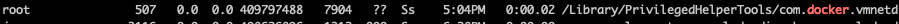
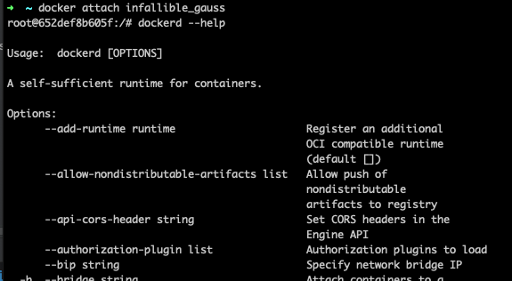
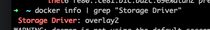
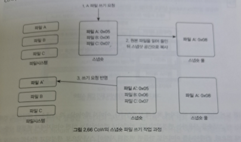
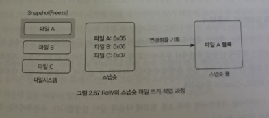
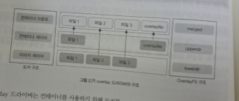

# 2.5 도커 데몬

지금까지는 도커를 사용하는 방법을 설명했고 가장 먼저 알아야 할 컨테이너 부터 시작해서 컨테이너의 밑바탕이 되는 이미지
그리고 그 이미지를 생성할 수 있는 도커 파일을 알아봤다. 그렇다면 이제는 도커 자체를 다뤄볼 차례이다. 도커 자체에 사용할 수 있는 여러 옵션을 익히면
컨테이너와 이미지를 좀 더 쉽게 사용할 수 있을 뿐더러 도커를 이요한 개발이 더욱 수월해질 것이다.

### 2.5.1 도커의 구조

도커를 사용할 때 docker 라는 명령어로 맨 앞에 붙여서 사용했다. 도커는 실제로 어디에 있는가.
which 명령어로 확인이 가능하다.

```
which docker
/use/bin/docker
```

도커 명령어는 /use/bin/docker 에 위치한 파일을 통해 사용되고 있다. 이번에는 실행 중인 도커 프로세스를 확인해 보는 스크립트 이다.

```
ps aux | grep docker
```



컨테이너나 이미지를 다루는 명령어는 /use/bin/docker 에서 실행되지만 도커 엔진의 프로세스는 /usr/bin/dockerd 파일로 실행된다.

이는 docker 명령어가 실제 도커 엔진이 아닌 클라이언트로서의 도커이기 떄문이다.

도커의 구조는 크게 두 가지로 나뉜다. 하나는 클라이언트로서 도커이고, 다른 하나는 서버로서의 도커이다.

실제로 컨테이너를 생성하고 실행하며 이미지를 관리하는 주체는 도커 서버이고, 이는 dockerd 프로세스로서 동작한다.

도커 엔진은 외부에서 API 입력을 받아 도커 엔진의 기능을 수행하는데, 도커 프로세스가 실행되어 서버로서 입력을 받을 준비가 된 상태를 **도커 엔진** 이라 한다.

다른 하나는 도커 클라이언트다. 도커 데몬은 API 입력을 받아 도커 엔진의 기능을 수행하는데 이 API를 사용할 수 있도록
CLI를 제공하는 것이 도커 클라이언트이다. 사용자가 docker 로 시작하는 명령어를 입력하면 도커 클라이언트를 사용하는 것이고. 도커 클라이언트는
입력된 명령어를 로컬에 존재하는 도커 데몬에게 API 로서 전달한다. 

이떄 도커 클라이언트는 /var/run/docker.sock 에 위치한 유닉스 소켓을 통해 도커 데몬의 API 를 호출한다.

유닉스 소켓은 같은 호스트 내에 있는 도커 데몬에게 명령을 전달할 때 사용된다. tcp로 원격에 있는 도커 데몬을 제어하는 방법도 있지만 이는 뒤에서 자세히 설명하겠다.


개발자 -> docker version -> [ 도커 클라이언트 ] -> /var/run/docker.sock -> [ 도커 데몬 ] (dockerd -H unix://var/run/docker.sock -H tcp://0.0.0.0:2375)

즉 터미널이나 puTTY 등으로 도커가 설치된 호스트에 접속해 docker 명령어를 입력하면 아래와 같은 과정으로 도커가 제어된다.

1. 사용자가 docker ps 같은 명령어를 입력한다.
2. /usr/bin/docker 는 /usr/run/dockerd.sock 유닉스 소켓을 사용해 도커 데몬에게 명령어를 전달한다.
3. 도커 데몬은 이 명령어를 파싱하고 명령어에 해당하는 작업을 수행한다.
4. 수행 결과를 도커 클라이언트에게 반환하고 사용자에게 결과를 출력한다.

### 2.5.2 도커 데몬 실행

도커 데몬은 일반적으로 아래와 같은 명령어로 시작, 정지할 수 있다. 우분투에서는 도커가 설치되면 자동으로 서비스를 등록하므로 호스트가 재시작되더라도 자동으로 실행된다.

```
service docker start
service docker stop
```

레드햇 계열의 운영체제는 도커를 설치해도 자동으로 실행되도록 설정되지 않는다. 도커를 자동으로 실행하도록 설정하려면 아래의 명령어로 docker 서비스를 활성화 한다.

```
systemctl enable docker
```

앞에서 설명했듯이 도커 서비스는 dockerd 로 도커 데몬을 실행한다. 그러나 서비스를 사용하지 않고 직접 도커 데몬을 사용할 수도 있다.

dockerd 를 입력하면 도커 데몬이 실행된다. 그럼 도커 데몬에 대한 각종 정보가 출력되는데. 자미가에 입력을 받을 수 있는 상태라는 메세지가 출력된다.

### 2.5.3 도커 데몬 설정

지금까지 도커 데몬과 도커 클라이언트가 어떻게 구성돼 있는지 살펴보았다. 그렇다면 도커 데몬에 적용할 수 있는 옵션을는 무엇이 있는지 dockerd --help 명령어로 확인 가능하다.



### 도커 데몬 제어 : -H

-H 옵션은 도커 데몬의 API를 사용할 수 있는 방법을 추가한다. 아무런 옵션을 설정하지 않고 도커 데몬을 실행하면
도커 클라이언트인 /usr/bin/docker 를 위한 유닉스 소켓은 /var/run/docker.sock 을 사용한다.

-H 에 IP 주소와 포트 번호를 입력하면 원격 API인 Docker Remote API로 도커를 제어할 수 있다.
Remote API는 도커 클라이언트와는 다르게 로컬에 있는 도커 데몬이 아니더라도 제어할 수 있으며, RESTful API 형식을 띠고 있으므로 HTTP 요청으로 도커를 제어할 수 있다.

다음과 같이 도커 데몬을 실행하면 호스트에 존재하는 모든 네트워크 인터페이스의 IP 주소와 2375 번 포트를 바인딩해 입력을 받는다.

```
dockerd -H tcp://0.0.0.0:2375
```

-H 에 unix://var/run/docker.sock 를 지정하지 않고 위와 같이 Remote API 만을 위한 바인딩 주소를 입력했다면
유닉스 소켓은 비활성화 되므로 도커 클라이언트를 사용하지 없게 되며 docker 로 시작하는 명령어를 사용할 수 없다.

다음은 호스트의 모든 네트워크 인터페이스 카드에 할당된 IP 주소와 2375번 포트로 도커 데몬을 제어함을 동시에 도커 클라이언트도 사용할 수 있도록 하는 방법.

```
dockerd -H unix://var/run/docker.sock -H tcp://0.0.0.0:2375
```

도커 클라이언트가 도커 데몬에게 명령어를 수행하도록 요청할 때도 내부적으로는 같은 API를 사용하므로 Remote API 또한 클라이언트에서 사용 가능한 모든 명령어를
사용할 수 있다.

내 IP로 -H remote API를 허용해서 사용할 수도 있다.

### 2.5.3.3 도커 스토리지 드라이버 변경: --storage-driver

도커는 특정 스토리지 백엔드 기술을 사용해 도커 컨테이너와 이미지를 저장하고 관리한다. 일부 운영체제는 도커를 설치할 때 기본적으로 사용하도록 설정된 
스토리지 드라버가 존재하는데 우분투 같은 데비안 계열 운영체제는 overlay2 를 구 버전의 CentOS 같은 운영체제는 devicemapper 를 사용한다.

이는 dokcer info 명령어로 확인 가능하다.

```
docker info | grep "Storage Driver"
```



어떤 스토리지 드라이버를 사용할지는 개발하는 컨테이너 애플리케이션 및 개발 환경에 따라 다르다.

레드햇 계열 운영체젤르 사용한다면 OverlayFS 사용하는 것이 옳은 선택이 될 수도 있다.
안정성을 우선시하는 컨테이너 애플리케이션을 개발하고 있다면 Btrfs 가 좋은 선택이 될 수도 있다.

#### 스토리지 드라이버의 원리

컨테이너 내부에서 읽기와 새로운 파일 쓰기 작업이 일어날 때는 드라이버에 따라 Copy-on-Write 또는 Redirect-on-Write 개념을 사용한다.

스냅숏의 기본 개념은 원본 파일은 읽기 전용으로 사용하되 이 파일이 변경되면 새로운 공간을 할당한다. 이다.

스토리지를 스냅숏으로 만들면 스냅숏 안에 어느 파일이 어디에 저장돼 있는지가 목록으로 저장된다. 그리고 이 스냅숏을 사용하다가 스냅숏 안의 파일에 변화가 생기면
변경된 내역을 따로 관리함으로써 스냅숏을 사용한다.



Cow 는 스냅숏의 파일을 쓰기작업을 수행할 때 스냅숏 공간에 원본파일을 복사한 뒤 쓰기 요청을 반영한다. 
이 과정에서 복사하기 위해 파일을 읽는 작업 한 번, 파일을 스냅숏 공간에 쓰고 변경된 사항을 쓰는 작업으로 총 2번의 쓰기 작업이 일어나므로 오버헤드가 발생



Row는 Cow와 다르게 한 번의 쓰기 작업만 일어난다. 이는 파일을 스냅숏 공간에 복사하는 것이 아니라 스냅숏에 기록된 원본 파일은 스냅숏 파일로 묶은 뒤
변경된 사항을 새로운 장소에 할당받아 덮어쓰는 형식이다.

** 사실 중요한 부분은 아니다. ** 스냅숏이라는 개념으로 스냅숏 파일을 불변 상태로 유지할 수 있다는 점만 알면 된다.

### AUFS 드라이버 사용하기

AUFS 드라이버는 데비안 계열에서 기본적으로 사용할 수 있는 드라이버이며 도커에서 오랜 기간 사용해왔다.

- 안정성 측면에서 우수하다.
- 그러나 커널에 포함되어 있지 않으므로 일부 운영체제에서는 사용할 수 없다. (RHEL, CentOS) 등

```
Docker_OPTS="--storage-driver=aufs"
```

```
grep aufs /proc/filesystems
nodev aufs
```

AUFS 드라이버는 지금까지 설명한 이미지의 구조와 유사하다. 여러 개의 이미지 레이어를 유니언 마운트 지머으로 제공, 
컨테이너 레이어는 여기에 마운트해서 이미지를 읽기 전용으로 사용한다.

AUFS 드라이버는 컨테이너에서 읽기 전용으로 사용하는 파일을 변경해야 한다면 컨테이너 레이어로 전체 파일을 복사하고 파일을 변경함으로써 변경사항을 반영한다.

복사할 파일을 찾기 위해 이미지이 가장 위의 레이어부터 시작해 아래 레이어까지 찾기 때문에 
크기가 큰 파일이 이미지의 아래쪽 레이어에 있다면 시간이 더 오래 걸릴 수 있다.

AUFS는 컨테이너의 실행 삭제 등의 컨테이너 관련 수행 작업이 매우 빠르다. Paas 에 적합한 드라이버이다.

### Devicemapper 드라이버

레드헷 계열의 리눅스 배포판을 위해 개발된 스토리지 드라이버이다. CentOS 를 포함한 대부분의 리눅스 배포판에서 보편적으로 사용할 수 있다는 장점이 있다.

성능상의 이유로 더 이상 사용하지 않는 것을 권장한다.

# 스 킵

### OverlayFS 드라이버 사용하기

OverlayFS 는 레드헷 계열의 라즈비안 우분투 등 대부분의 운영체제에서 도커를 설치하면 자동으로 사용하도록 설정하는 드라이버이다.

AUFS 와 비슷한 원리로 동작하지만 좀 더 간단한 구조로 사용되며 성능 또한 좀 더 좋기 떄문에 기본적으로 사용되고 있다.

overlay 와 overlay2 로 나뉜다. overlay 는 커널 3.18 버전 이상부터 내장되어 있으며
overlay2 는 4.0 버전 이상에 서 사용할 수 있다.

가능하다면 성능이 좀 더 뛰어난 overlay2 를 사용하기를 권장하고 있다.



overlay 드라이버는 컨테이너를 사용하기 위해 도커를 merged, upperdir, lowerdir 구조로 나눈다.

lowerdir은 도커의 이미지 레이어에 해당하고
upperdir는 컨테이너 레이어에 해당한다.

다른 스토리지 드라이버와는 다르게 여러 계층의 이미지 레이어가 존재하는 것이 아니며, 여러 개의 이미지 레이어를 하나의 컨테이너 마운트 지점에서 통합해 사용한다.

upperdir 에는 컨테이너에서 발생한 변경 사항을 담고 있으며 위에서 생성한 컨테이너는 overlayfile 이라는 변경 사항을 가지고 있기 떄문에
upperdir 디렉터리에는 overlayfile 파일이 존재한다. upperdir 은 이미지 레이어에 해당하는 lowerdir 과 함께 마운트되어 최종적으로 컨테이너 내부에 보여지고

이것이 컨테이너 마운트 지점인 merged 디렉터리이다.