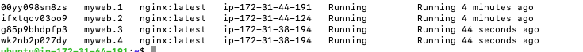

# 3. 도커 스웜

## 3.1 도커 스웜을 사용하는 이유

도커는 대부분 하나의 호스트를 기준으로 운영된다. docker ps 명령어는 하나의 도커 엔진에 존재하는 컨테이너의 목록을 출력하며 create, run
명령어 또한 하나의 도커 엔진에 컨테이너를 생성한다.

그러나 실제로 도커를 운영 환경에 적용한다면 조금 이야기가 달라진다. 하나의 호스트 머신에서 도커 엔진을 구동하다가 용량 부족같은 이슈가 생긴다면
보통은 매우 성능이 좋은 서버를 구비해서 사용하면 되지만 이러한 문제를 돈으로 해결하는 것은 가장 좋은 해답이라고 할 수 없다.

가장 많이 사용하는 방법은 클러스터 형식의 서버를 만들어 자원을 병렬로 확장하는 것이다.

8GB 의 메모리가 탑재된 서버 3대에 도커 엔진을 설치해 실제 운영 환경에 사용된다고 하였을 때 서버에 컨테이너가 너무 많이 생성돼 있어 더는 컨테이너를 사용할 수 없다고 판단할 때
추가로 자원을 늘려 사용하면 총 32GB 가 된다.

이러한 작업을 수동으로 하는 것은 쉽지 않다. 이러한 문제를 해결하는 방법 중 하나가

**도커 스웜 과 스웜 모드**이다.

### 3.2 스웜 클래식 과 도커 스웜 모드

스웜 클래식과 스웜 모드는 여러 대의 도커 서버를 하나의 클러스터로 만들어 컨테이너를 생성하는 여러 기능을 제공한다.

다양한 전략을 세워 컨테이너를 특정 도커 서버에 할당 가능하며 확장도 가능하다.

스웜 모드는 실제 운영환경에서 많이 쓰이는 것은 아니지만 서버 클러스터에서 컨테이너를 어떻게 다루는지에 대한 기초적인 지식에 쌓기에 적합하다.

1.6 버전 이후부터 사용 가능한 스웜클래식과 1.12 이후에 사용 가능한 도커 스웜 모드가 있다. 

스웜 클래식과 스웜 모드의 큰 차이는 사용 목적에 있다.

스웜 클래식은 여러 대의 도커 서버를 하나의 지점에서 사용하도록 단일 접근점을 제공한다면 스웜 모드는 마이크로 서비스 아키텍처의 컨테이너를 다루기 위한 클러스터링 기능에 초점을 맞춘다.

클래식은 일반적인 도커 명령어와 도커 API로 클러스터의 서버를 제어하고 관리할 수 있는 기능을 제공한다. 이에 비에 스웜 모드는 같은 컨테이너를 동시에 여러 개 생성해 필요에 따라 유동적으로 컨테이너를
조절할 수 있다.

스웜 모드가 서비스 확장성과 안정성 등에서 뛰어나기 떄문에 스웜 모드를 더 많이 사용한다.

다른 차이점은 분산 코디네이터 에이전트와 같은 클러스터 툴이 별도로 구동되는가의 차이이다.

스웜 모드는 마이크로 서비스 아키텍처 애플리케이션을 컨테이너로 구축할 수 있도록 도와줄 뿐만 아니라 서비스 장애에 대비한 고가용성과 부하 분산을 위한 로드밸런싱 기능 또한 제공한다.

---------

## AWS EC2

AWS EC2 ubuntu 가상 서버를 사용해서 스웜 서비스를 사용해보기로 했다.

AWS EC2 에 들어가 인스턴스 시작 -> 인스턴스에서 키 페어 pem 을 만들었고 보안그룹을 생성했다.

도커 스웜을 생성할 때 필요한 보안그룹 규칙이 있다고 해서 공유한다.

1. TCP 포트 2377: 이 포트는 Docker Swarm 관리 통신을 위해 사용됩니다. Swarm 클러스터의 노드 간에 관리 데이터를 교환할 때 사용됩니다. Swarm 매니저 노드에서 이 포트를 열어야 합니다.
2. TCP/UDP 포트 7946: 컨테이너 네트워킹을 위해 노드 간에 사용됩니다. Swarm 노드 간에 피어 통신을 할 때 사용됩니다.
3. UDP 포트 4789: 이 포트는 오버레이 네트워크의 VXLAN 트래픽을 위해 사용됩니다. Docker Swarm에서 여러 호스트 간에 네트워크 격리된 컨테이너를 생성할 때 사용됩니다.

2번의 TCP/UDP 에서 우선 TCP만 적용하여 생성했다.

만들어진 인스턴스와 딸려온 PEM 을 사용해서 ssh 에 접속하기 위해

우선 

```
sudo chmod ${PEM} 600
```

커멘드를 입력하여 권한을 주었고

```
ssh -i ${PEM} ${USERNAME}@${EC2IP OR ADDRESS}
```

를 사용해서 접속하였다.

나는 우분투 20 버전을 사용했기 떄문에 우선 도커를 깔기 전 apt-get update 를 진행하였고.

```
sudo apt-get update
```
apt 패키지를 사용하여 HTTPS를 통해 저장소를 사용할 수 있도록 하는 패키지를 설치했다.

```
sudo apt-get install \
apt-transport-https \
ca-certificates \
curl \
software-properties-common
```

Docker의 공식 GPG 키를 추가해야 한다고 하여 설치 명령어 또한 입력

```
curl -fsSL https://download.docker.com/linux/ubuntu/gpg | sudo apt-key add -
```

Docker 저장소를 APT 소스에 추가

```
sudo add-apt-repository \
 "deb [arch=amd64] https://download.docker.com/linux/ubuntu \
 $(lsb_release -cs) \
 stable"
```

다시 한번 update

```
sudo apt-get update
```

도커 CE 설치

```
sudo apt-get install docker-ce
```

---

## 3.3 스웜 모드

AWS 에서 정상적인 도커 설치 과정을 거치고 하단 명령어를 통해서 도커 엔진의 스웜 모드 클러스터 정보를 확인할 수 있다.

```
// input
sudo docker info | grep Swarm
// output
Swarm: inactive
```

지금까지 도커 엔진을 단일 도커 서버에서 사용된 것이므로 비활성 모드로 되어 있다.

### 3.3.1 도커 스웜 모드의 구조

스웜 모드는 매니저 노드와 워커 노드로 구성되어 있다. 워커 노드는 실제로 컨테이너가 생성되고 관리되는 도커 서버이고

매니저 노드는 워커 노드를 관리하기 위한 도커 서버이다.
매니저 노드에도 컨테이너가 생성될 수 있다. 매니저 노드는 기본적으로 워커 노드의 역할을 포함한다.

매니저 노드는 1개 이상이 있어야 하지만 워커 노드는 없을 수도 있다. 이는 매니저 노드가 워커 노드의 역할도 포함하고 있기 떄문이다.
매니저 노드만으로 스웜 클러스터를 구성할 수 있다.

하지만 보통은 구분해서 사용하는 것을 권장한다.

보통은 스웜 모드로 도커 클러스터를 구성하려면 매니저 노드를 다중화 하는 것을 권장한다. 특정 매니저 노드가 큰 부하를 받을 떄 분산하여 안정화 시킬 수 있다.

스웜 모드는 매니저 노드의 절반 이상에 장애가 생겨 정상적으로 작동하지 못할 경우 장애가 생긴 매니저 노드가 복구될 때까지 클러스터의 운영이 중단된다.

**네트워크 파티셔닝** 과 같은 현강이 발생했을 경우 짝수 개의 매니저로 구성한 클러스터는 운영이 중단될 수도 있다. 홀수로 구성한 경우 쿼럼? 매니저에서 운영을
계속할 수 있다.

### 3.3.2 도커 스웜 모드 클러스터 구축

docker swarm init 명령어를 입력해 매니저 역할을 할 서버에서 스웜 클러스터를 시작한다. --advertise-addr 에는 다른 도커 서버가 매니저 노드에 접근하기 위한
IP 주소를 입력한다. 즉 매니저 노드의 IP 주소를 입력한다.

```
docker swarm init --advertise-addr ${EC2_PUBLIC_IP} 
```

```
Swarm initialized: current node (moeu4q9rg1xh39tfrqgt45zxh) is now a manager.

To add a worker to this swarm, run the following command:

docker swarm join --token ${SECRET_KEY} ${IP:PORT}

To add a manager to this swarm, run 'docker swarm join-token manager' and follow the instructions.
```

출력 결과 중 docker swarm join 명령어는 새로운 워커 노드를 스웜 클러스터에 추가할 때 사용된다. --token 옵션에 사용된 토큰 값은 새로운 노드를 해당 스웜 클러스터에
추가하기 위한 비밀 키이다.

워커 노드에서 토큰을 사용해서 워커 노드를 추가한다.

```
// input
sudo docker swarm join --token ${SECRET_KEY} ${IP:PORT}

// output
This node joined a swarm as a worker.
```

특정 도커 서버가 정상적으로 스웜 클러스터에 추가되었는지 확인하기 위해 매니저 노드에서 docker node ls 명령어를 입력한다.


```
sudo docker node ls
```

새로운 매니저 노드를 추가하려면 매니저 노드를 위한 토큰을 사용해 docker swarm join 명령어를 사용한다. 
하단 명령어로 확인 가능하다. 
```
sudo docker swarm join-token manager 
```

토큰을 갱신하려면 swarm join 명령어에 --rotate 옵션을 추가하고 변경할 토큰의 대상을 입력하면 된다. 단 이 작업은 매니저 노드에서만 가능하다.

만약 추가된 워커 노드를 삭제하고 싶으면 해당 워커 노드에서 docker swarm leave 명령어를 입력하면 된다.

특정 워커 노드가 leave 명령어로 스웜 모드를 해제하면 매니저 노드는 해당 워커 노드의 상태를 Down 으로 인지할 뿐 삭제하지는 않는다. 따라서

매니저 노드에서 docker node rm 명령어를 사용해서 삭제해야 한다.

```
docker node ls

docker node rm ${HOSTNAME}
```

매니저 노드는 앞에 --force 옵션을 붙여야만 삭제 가능하다.

워커 노드를 매니저 노드로 변경하려면 docker node promote 명령어를 사용한다. 
매니저 노드를 워커 노드로 변경하려면 docker node demote 명령어를 사용한다.

### 3.3.3 스웜 모드 서비스

#### 3.3.3.1 스웜 모드 서비스 개념

지금까지 사용해온 명령어의 제어 단위는 컨테이너이다. docker run 명령어는 컨테이너를 생성하고 docker rm 명령어는 컨테이너를 삭제했던 것처럼

도커 클라이언트에서 사용하는 명령어가 제어하는 것은 컨테이너 이다. 스웜 모드에서 제어하는 단위는 컨테이너가 아닌 **서비스**이다.

서비스는 같은 이미지에서 생성된 컨테이너의 집합소 이며 서비스를 제어하면 해당 서비스 내의 컨테이너에 같은 명령이 수행된다. 
서비스 내에 컨테이너는 1개 이상 존재할 수 있으며 컨테이너들은 각 워커 노드와 매니저 노드에 할당된다.

이러한 컨테이너들을 태스크(TASK) 라고 한다.


ubuntu:14.04 이미지로 서비스를 생성하고 컨테이너의 수를 3개로 설정했다고 가정해보고 

스웜 스케줄러는 서비스의 정의에 따라 컨테이너를 할당할 적합한 노드를 선정하고 해당 노드에 컨테이너를 분산해서 할당한다.

위 사진은 각 노드에 컨테이너가 하나씩 할당된 경우를 보여주지만 반드시 각 노드에 하나씩 할당되지 않을 수도 있다.

이처럼 함께 생성된 컨테이너를 래플리카 라고 하며 서비스에 설정된 래플리카의 수만큼 컨테이너가 스웜 클러스터 내에 존재해야 한다.

스웜은 서비스의 컨테이너들에 대한 상태를 계속 확인하다가 서비스 내에 정의된 래플리카의 수만큼 컨테이너가 스웜 클러스터에 존재하지 않으면
새로운 컨테이너 래플리카를 생성한다.

컨테이너가 할당된 노드가 다운되면 매니저는 사용 가능한 다른 노드에 같은 컨테이너를 생성한다.

서버가 다운되지 않더라도 서비스 내에 컨테이너 중 일부가 작동을 멈춘다면 새로운 컨테이너를 클러스터에 새롭게 생성한다.

서비스는 롤링 업데이트 기능을 제공한다. 서비스 내 컨테이너들의 이미지를 일괄적으로 업데이트 해야 할 때 컨테이너들의 이미지를 순서대로 변경해 서비스 자체가 다운되는 시간없이
업데이트를 진행할 수 있다.

### 3.3.3.2 서비스 생성

서비스를 제어하는 도커 명령어는 전부 매니저 노드에서만 사용할 수 있다. 따라서 다음 예제는 모두 매니저 노드에서 입력한다는 전제하에 진행된다.

```
sudo docker service create \
ubuntu:20.04 \
/bin/sh -c "while true; do echo hello world; sleep 1; done"
```

컨테이너가 시작할 때 실행할 명령어로 hello world 를 출력하는 셀 명령어를 설정한다.

서비스를 생성했다면 서비스의 목록을 확인해 방금 생성한 서비스가 정상적으로 구동하고 있는지 확인 할 수 있다.

```
docker service ls
```


#### nginx 웹 서버 생성하기

우분투 컨테이너를 생성해 컨테이너 내부에서 단순히 hello world 를 출력하도록 설정했으나 서비스의 레플리카 셋을 정의하지 않았으므로
1개의 컨테이너만 생성되었다. 이번에는 --replica 옵션을 추가하여 Nginx 웹 서버 이미지를 이용해 서비스를 외부로 노출해 보자.

```
docker service create --name myweb \
--replicas 2 \
-p 80:80 \
nginx
```

컨테이너가 정상적으로 생성되면 스웜 클러스터 내의 노드 중 하나를 선택해 80번 포트로 접근해 Nginx 웹 서버가 구동되고 있는 것을 확인할 수 있다.

```
sudo docker service ps myweb
```


80번 포트를 연결 하여 본 모습


Nginx 컨테이너가 없는 worker2 노드로 접근해도 서비스에 접근할 수 있다.
물론 worker1, manager 노드의 IP 로 접근해도 동일한 Nginx 서비스를 확인 가능하다.

서비스 내의 Nginx 컨테이너를 4개로 늘리면 어떻게 될까
sudo docker service scale 명령어로 레플리카 셋의 수를 늘리거나 줄일 수 있다.
```
sudo docker service scale myweb=4
```


출력된 NODE 항목에서 같은 IP 가 두번 할당된 것을 알 수 있지만 문제가 안된다.

컨테이너가 각 컨테이너들의 호스트 80번 포트에 연결된 것이 아니고

실제로는 각 노드의 80번 포트로 들어온 요청을 4개중 하나로 리다이렉트 한다.