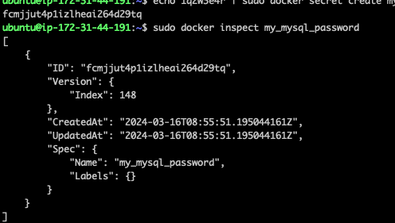

## global 서비스 생성하기

서비스의 모드는 두 가지가 있다. 하나는 위에서 생성한 Nginx 웹 서버 서비스와 같은 레플리카 셋의 수를 정의해 그만큼의 같은 컨테이너를 생성하는
복제 모드로서 실제 서비스를 제공하기 위해 쓰이는 모드이다.

다른 하나는 글로벌 모드다. 클로벌 서비스는 스웜 클러스터 내에서 사용할 수 있는 모든 노드에 컨테이너를 반드시 하나씩 생성한다.

따라서 글로벌 모드로 생성한 서비스는 레플리카 셋의 수를 별도로 지정하지 않는다. 글로벌 서비스는 스웜 클러스터를 모니터링 하기 위한 에이전트 컨테이너 등을
생성해야 할 떄 유용하다.

글로벌 서비스는 다음과 같은 명령어를 추가해 생성할 수 있다.

```
 sudo docker service create --name global_web \
> --mode global \
> nginx

----

vkegyytgxu5d84b1cofn6a8wu
overall progress: 3 out of 3 tasks
o33nbbgboggs: running
9nt57ly2actl: running
moeu4q9rg1xh: running
verify: Service converged
```


### 3.3.3.3 스웜 모드의 서비스 장애 복구

복제 모드로 설정된 서비스의 컨테이너가 정지하거나 특정 노드가 운되면 스웜 매니저는 새로운 컨테이너를 생성해 자동으로 복구한다. 위에서 생성한 myweb 서비스 중 컨테이너 하나를 삭제해보자.

```
docker ps 

docker ps rm -f myweb.${id}
```

다시 docker service ps 명령어를 통해 컨테이너의 목록을 확인해 보면 새오운 컨테이너가 생성되었다.

특정 노드가 다운됐을 때도 위와 같은 방식으로 작동한다. 3개 노드 중 swarm-worker1 노드의 도커 데몬 프로세스를 종료해 노드 장애 상태를 만들자.

```
// worker 1

service docker stop
```

이후 매니저 노드에서 docker node ls 명령어를 입력하면 swarm-worker1 노드의 상태가 Down 으로 바뀌어 있다.

이후에 swarm-manager 노드에 종료된 컨테이너를 대체하고 있다.

다운됐던 노드를 다시 시작해 정상적인 상태로 회복시켜도 다른 노드로 옮겨진 컨테이너가 자동으로 할당되지 않는다.

swarm-worker1 노드에서 도커 엔진을 다시 시작해 컨테이너를 실행할 수 있는 환경을 복구해도 재균형 작업이 일어나지 않는다는 뜻이다.

이럴 경우 scale 명령어를 이용해 컨테이너의 수를 줄이고 다시 늘려야 한다.

```
docker service scale myweb=1
docker service scale myweb=4
```

### 3.3.3.4 서비스 롤링 업데이트

**롤링 업데이트(Rolling Update)는 소프트웨어 개발과 운영에서 널리 사용되는 기법으로, 애플리케이션 또는 시스템의 업데이트를 순차적으로 하나씩 진행하여 전체 시스템을 최신 상태로 업데이트하는 방식을 말한다.**

스웜 모드는 롤링 업데이트를 자체적으로 지원하며 매우 간단하게 사용 가능하다. 롤링 업데이트를 테스트하기 위한 서비스를 생성한다.

교재에서는 앞에서 생성한 서비스와 유사하지만 nginx:1.10? 으로 설정했다.

```
docker service create --name myweb2 \
--replicas 3 \
nginx:1.10
```

서비스가 정상적으로 생성되었다면

```
docker service uodate \
--image nginx:1.11 \
myweb2
```

서비스 내 컨테이너 목록을 확인한다면 각 컨테이너의 이미지가 변경된 것을 알 수 있다.

\_myweb2.1 인 컨테이너가 롤링 업데이트의 대상이 되어 삭제된 컨테이너 이다.


서비스를 생성할 때 롤링 업데이트의 주기 업데이트를 동시에 진행할 컨테이너의 개수 업데이트에 실패했을 때 어떻게 할 것인지를 설정 가능하다.

각 컨테이너 레플리카를 10초 단위로 업데이트 하며 업데이트 작업을 한 번에 2개의 컨테이너를 수행하는 명령어이다.

```
docker service create \
--replicas 4 \
--name myweb3 \
--update-delay 10s \
--update-parallelism 2 \
nginx:1.10
```

위 같은 서비스의 롤링 업데이트 설정은 docker service inspect 또는 docker inspect --type service 명령어로 확인 가능하다.


on failure 항목이 pause 로 설정되어 있는데 이는 업데이트 도중 오류가 발생하면 롤링 업데이트를 중지한다는 것을 의미한다.

업데이트 실패에 아무런 설정을 하지 않으면 pause 로 설정되지만 서비스를 생성할 때 **--update-failure-action** 인자의 값을 continue 로 설정해

오류가 발생해도 계속 롤링 업데이트를 진행하게 할 수 있다.

```
sudo docker service create --name myweb4 --replicas 4 --update-failure-action continue nginx:1.10
```

이러한 롤링 업데이트 옵션은 기본적으로 서비스 자체에 설정되어 있지만 docker service update 명령어 옵션 값을 다르게 설정함으로써 변경 가능하다.

```
docker service rollback myweb3
```

나는 에러가 발생했는데. 뒤로 돌릴 데이터가 없다고 해서 돌릴수 없었다.

### 3.3.3.5 서비스 컨테이너 설정 전보 전달하기. config, secret

애플리케이션을 외부에 서비스하려면 설정 파일이나 값들이 컨테이너 내부에 미리 준비돼 있어야 한다.

docker run -v 옵션을 통해서 호스트에 위치한 설정 파일이나 값을 볼륨으로써 컨테이너에 공유 가능하다.

그러나 스웜 모드와 같은 서버 클러스터에서 파일 공유를 위해 설정 파일을 호스트마다 마련해두는 것은 매우 비효율적이다.

스웜 모드는 secret 과 config 라는 기능을 제공한다. 

secret 는 SSH 인증서 키 비밀번호 등 민감한 데이터를 전송하기 위해서 사용하며
config 는 nginx 나 레지스트리 설정 파일과 같이 암호화할 필요가 없는 설정값들에 대해 쓰일 수 있다.

그러나 스웜 모드에서만 사용될 수 있는 기능이다. docker run 명령어에서는 사용 불가능하다.




생성된 비밀번호를 조회해도 실제 값을 확인 불가능하다. 노드 간에 암호화된 상태로 저장되기 때문이다.

파일 시스템이 메모리에 저장되기 떄문에 서비스 컨테이너가 삭제될 경우 secret 도 함꼐 삭제되는 일종의 휘발성을 띠게 된다.

```
sudo docker service create --name mysql2 \
--replicas 1 \
--secret source=my_mysql_password,target=mysql_root_password \
--secret source=my_mysql_password,target=mysql_password \
-e MYSQL_ROOT_PASSWORD_FILE="/run/secrets/mysql_root_password" \
-e MYSQL_PASSWORD_FILE="/run/secrets/mysql_password" \
-e MYSQL_DATABASE="wordpress" \
mysql:5.7
```

컨테이너로 공윧힌 값은 기본적으로 컨테이너 내부의 /run/secrets/ 디렉터리에 마운트 된다.


이상하게 내 눈에는 mysql 이 안보이는데 다시 같은 명령어를 입력했을 때 중복된 이름은 안된다고 한다.

왜 없지?? 라고 보니 sudo docker service ls 로 확인해야 하는 것 같다.


docker exec ${name} ls /run/secrets 명령어를 입력하면 해당 파일을 확인 가능하다.

### config 사용하기

config 를 사용하는 방법은 secret 와 거의 동일하다.

이전에 만들어 둔 config.yml 파일을 config 로 저장한다.
```
sudo docker config create registry-config config.yml
```

secret 과 달리 이번에는 Data 라는 항목이 존재하는 것을 알 수 있다.

### 3.3.3.6 도커 스웜 네트워크

스웜 모드는 여러 개의 도커 엔진에 같은 컨테이너를 분산해서 할당하기 때문에 각 도커 데몬의 네트워크가 하나로 묶인 이른바 네트워크 풀이 필요하다.

이뿐만 아니라 서비스를 외부로 노출했을 때 어느 노드로 접근하더라도 해당 서비스의 컨테이너에 접근할 수 있게 라우팅 기능이 필요하다.

이러한 네트워크 기능은 스웜 모드가 자체적으로 지원하는 네트워크 드라이버를 통해 사용 가능하다.


bridge, host, none 네트워크 외에도 docker_gwbridge 와 ingress 네트워크가 생성된 것을 볼 수 있다.

docker_gwbridge 는 네트워크 스웜에서 오버레이(overlay) 네트워크를 사용할 때 사용되며 ingress 네트워크는 로드 밸런싱과 라우팅 메시에 사용된다.

### ingress 네트워크

ingress 네트워크는 스웜 클러스터를 생성하면 자동으로 등록되는 네트워크로서 스웜 모드를 사용 할 때만 유용하다.

매너저 노드 뿐 만 아니라 스웜 클러스터에 등록된 노드라면 전부 ingress 네트워크가 생성된다.


ingress 네트워크는 어떤 스웜 노드에 접근하더라도 서비스 내의 컨테이너에 접근할 수 있도록 설정하는 라우팅 메시를 구성하고 서비스 내의 컨테이너에 대한 접근을 
라운드 로빈 방식으로 분산하는 로드 밸런싱을 담당한다.

#### 라운드 로빈 방식

라운드 로빈(Round Robin) 방식은 컴퓨터 네트워킹, 운영 체제, 다양한 애플리케이션에서 널리 사용되는 간단하면서도 공평한 스케줄링 알고리즘입니다. 이 방식은 각 작업이나 요청, 프로세스 등에 동일한 시간 또는 자원을 순서대로 할당함으로써, 공정한 처리 시간을 보장합니다.

#### 라운드 로빈의 작동 원리
- 동일 크기의 시간 할당: 라운드 로빈 스케줄링에서는 모든 작업에 동일한 크기의 시간 할당량(타임 슬라이스 또는 퀀텀)이 주어집니다. 이 시간 동안 작업이 처리됩니다.
- 순환 순서: 작업 목록이나 요청 큐를 순환하면서 각 작업에 순서대로 시간 할당량을 제공합니다. 한 작업의 시간 할당량이 끝나면, 다음 작업으로 넘어갑니다.
- 공정성 보장: 모든 작업은 큐에서 동일한 순서로 처리 기회를 받기 때문에, 어떤 작업도 오랫동안 무시되거나 배제되지 않습니다.

#### 라운드 로빈의 적용 사례
- 프로세스 스케줄링: 운영 체제에서 다수의 프로세스를 공평하게 관리하기 위해 사용됩니다. 각 프로세스는 동일한 시간 할당량 동안 CPU를 사용하고, 시간이 만료되면 다음 프로세스로 교체됩니다.
- 네트워크 트래픽 관리: 부하 분산기(load balancer)나 DNS 서버가 다수의 서버 간에 요청을 분산할 때 라운드 로빈 방식을 사용할 수 있습니다. 이를 통해 모든 서버에 균등한 트래픽이 분배됩니다.
- 멀티태스킹: 시분할 시스템에서 여러 작업을 교대로 실행하여, 사용자에게 동시에 여러 프로그램이 실행되는 것처럼 보이게 만듭니다.

-------

ingress 네트워크 기능을 직접 확인하기 위해 새로운 도커 서비스를 생성

```
sudo docker service create --name hostname -p 80:80 \
> --replicas=4 \
> alicek106/book:hostname
```

4 개의 컨테이너 생성될 것이다. 각 노드에서 docker ps 명령어로 컨테이너 ID를 확인한다.

```
sudo docker ps -a
```


호스트의 이름이 출력되고 있다.

스웜 모드로 생성된 모든 서비스의 컨테이너가 노출되기 위해 무조건 ingress 네트워크를 사용하는 것은 아니다.

docker run -p 를 사용해 외부 컨테이너를 노출했던 것처럼 호스트의 특정 포트를 설정 가능하다.

```
docker service create \
--publish mode=host,target=80,published=8080,protocal=tcp \
--name web \
nginx
```

위와 같이 서비스를 외부로 노출할 경우 어느 호스트에서 컨테이너가 생성될지 알 수 없어 관리가 어렵다. 가급적이면 ingress 를 쓰는걸 권장한다.

### 오버레이 네트워크

스웜 클러스터 내의 컨테이너가 할당받는 IP 주소는 어떻게 설정되어 있을까 적당한 컨테이너 내부에서 ifconfig 명령어를 실행해 보자


컨테이너마다 et0, et1 , lo 가 할당되어 있다. eth0 가 ingress 네트워크와 연결된 네트워크 카드이다.

주목해야 할 점은 swarm-manager 에서 생성된 컨테이너와 swarm-worker1 에서 생성된 컨테이너는 IP 주소가 차례로 할당되었다.


ingress 네트워크는 오버레이 네트워크 드라이버를 사용한다. 오버레이 네트워크는 여러 개의 도커 데몬을 하나의 네트워크 풀로 만드는 네트워크 가상화 기술의 하나로써

도커에 오버레이 네트워클 적용하면 여러 도커 데몬에 존재하는 컨테이너가 서로 통신 가능하다. 여러 스웜 노드에 할당된 컨테이너는 오버레이 네트워크의 서브넷에 해당하는 IP 대역을
핟당받고 이 IP를 통해서 통신 가능하게 된다.

### docker_gwbridge 네트워크

docker network ls 명령어의 출력 결과에서 ingress 말고도 새롭게 추가된 네트워크가 하나 더 있다. docker_gwbridge 네트워크이다.

오버레이 네트워크를 사용하지 않는 컨테이너는 기본적으로 존재하는 브리지 네트워크를 사용해 외부로 연결한다.,

그러나 ingress 를 포함한 모든 오버레이 네트워크는 이와 다른 브리지 네트워크인 docker_gwbridge 네트워크와 함께 사용된다. 

------

### 3.3.3.6 서비스 디스커버리

같은 컨테이너를 여러 개 만들어 사용할 때 쟁점이 되는 부분 중 하나는 새로 생성된 컨테이너 생성의 발견 혹은 없어진 컨테이너의 감지이다.

일반적으로 이 동작은 주키퍼, etcd 등의 분산 코디네이터를 외부에 두고 사용해서 해결하지만 스웜 모드는 서비스 발견 가능성을 자체적으로 지원한다.

VIP(Virtual IP)를 가지게 되어 어느 컨테이너의 감지를 계속해서 알 수 있다.

### 3.3.3.7 스웜 모드 볼륨

도커 데몬 명령어 중 run 명령어에서 -v 옵션을 사용할 때 호스트와 디렉터리를 공유하는 경우와 볼륨을 사용하는 경우에 대한 구분은 딱히 없었다.

```
docker run -i- t --name host_dir_case -v /root:/rrot ubuntu:14.04

docker run -i- t --name volume_case -v myvolume:/root ubuntu:14.04
```

이러한 기능을 스웜 모드에서도 사용 가능하다. 그러나 스웜 모드에서는 도커 볼륨을 사용할지 호스트 외 디렉터리를 공유할지를 좀 더 명확히 해 볼륨을 사용한다.

### volume 타입의 볼륨 생성

스웜 모드에서 도커 볼륨을 사용하는 서비스를 생성하려면 서비스를 생성할 때 --mount 옵션의 type 값에 volume 을 지정한다.

```
docker service create --name ubuntu \ 
--mount type==volume,source=myvol,target=/root \
ubuntu: 14.04
```

source 옵션을 지정하지 않으면 임의의 16진수로 구성된 익명의 일므을 가진 볼륨을 생성한다.

(중간생략)

--------

### 스웜 모드에서 볼륨의 한계점

스웜 클러스터에서 볼륨을 사용하기란 까다롭다. 서비스를 할당받을 수 있는 모든 노드가 볼륨 데이터를 가디고 있어야 하기 때문.

여러 개의 도커 데몬을 관리하는 스웜 모드에서는 도커 볼륨 또는 호스트와의 볼륨 사용이 적합하지 않은 기능일 수 있다.

이를 해결하기 위한 일반적인 방법은 어느 노드에서도 접근 가능한 퍼시스턴트 스토리지를 사용하는 것이다.

퍼시스턴스 스토리지는 호스트와 컨테이너와 별개로 외부에 존재해 네트워크로 마운트 할 수 있는 스토리지이다.

서비스의 컨테이너가 각 노드에 할당될 때 퍼시스턴트 스토리지를 마운트해 사용하면 노드에 볼륨을 생성하지 않아도 되며

컨테이너가 어느 노드에 할당되든 컨테이너에 필요한 파일을 읽고 쓸 수 있다./

또는 각 노드에 라벨을 부여 서비스에 제한을 설정하는 방법이 있다.

### 3.3.4 도커 스웜 모드 노드 다루기

스웜 클러스터에 노드를 추가하고 삭제하는 방법을 다루었지만 서비스를 좀 더 유연하게 할다하려면 새로운 노드를 추가하는 것뿐만이 아니라 노드를 다루기 위한 전략도 필요하다.

### 3.3.4.1 노드 AVAILABILTY 변경하기

```
docker node ls
```

위 명령어를 입력하면 STATUS 에 대한 정보가 나온다. READY, AVAILABILITY 항목이 ACtive 인것이 확인 가능하다.

그러나 일반적으로 매니저와 같은 마스터 노드는 최대한 부하를 받지 않도록 서비스를 할당받지 않도록 하는게 좋다.

이를 위해 특정 노드의 AVAILABILITY 를 설정함으로써 컨테이너 할당 가능 여부를 정할 수 있다.

#### Active

새로운 노드가 스웜 클러스터에 추가되면 기본적으로 설정되는 상태이다.
서비스의 컨테이너를 할당받을 수 있음을 의미한다.

Active 상태가 아닌 노드를 Active 상태로 변경하려면 다음과 같이 docker node update 명령어를 입력한다.

```
docker node update \
--availablity active \
{name}
```

#### Drain

노드를 Drain 상태로 설정하면 스웜 매니저는 컨테이너를 해당 노드에 할당하지 않는다.

Drain 상태는 일반적으로 매니저 노드에 설정하는 상태지만

노드에 문제가 생겨 일시적으로 사용하지 않는 상태로 설정해야 할 떄도 자주 사용된다.

```
docker node update \
--availablity drain \
{name}
```

노드를 Drain 상태로 변경하면 해당 노드에서 실행 중이던 서비스의 컨테이너는 전부 중지되고 Active 상태의 노드로 다시 할당된다.

그렇다고 Drain 의 상태를 Active 로 바꾼다고 다시 컨테이너가 분산되어 할당되지 않으므로

docker service scale 명령어로 균형을 맞춰야 한다.

#### Pause

서비스의 컨테이너를 더는 할당받지 않는다는 점에서 Drain 과 같지만 실행 중인 컨테이너가 중지되지 않는다는 점에서 다르다.

### 3.3.4.2 노드 라벨 추가

노드에 라벨을 추가하는 것은 노드를 분류하는 것과 비슷하다. 라벨은 키-값 형태를 가지고 있으며

키 값으로 노드를 구별할 수 있다.

특정 노드에 라벨을 추가하면 서비스를 할당할 때 컨테이너를 생성할 노드의 그룹을 선택하는 것이 가능하다.

만약 worker1, worker2 에서 라벨을 구분하고 worker2 에서만 노드를 사용해야할 때 라벨을 붙여 worker2 에만 할당할 수 있다.

#### 노드 라벨 추가하기.

docker node update 명령에서 --label-add 옵션을 사용해 라벨 설정이 가능하다.

```
docker node update \
--label-add storage=ssd \
swarm-worker1
```


### 서비스 제약 설정

docker service create 명령어에 --constraint 옵션을 추가하면 서비스의 컨테이너가 할당될 노드의 종류를 선택 가능하다.

#### node.labels 제약조건

다음 명령어는 storage 키의 값이 ssd 로 설정된 노드에 서비스의 컨테이너를 할당한다.

```
docker service create --name label-test \
--constraint 'node.labels.storage == ssd' \
--replicas=5 \
ubuntu:14.04 \
```

ssd 로 설정된 worker1 노드에만 컨테이너가 생성된 것을 확인할 수 있다.

#### node.id 제약 조건

node.id 조건에 맞는 노드 ID 를 제약조건으로 설정해 할당할 노드를 선택할 수 있다.

#### node.hostname 과 node.role 제약조건

스웜 클러스터에 등록된 호스트 이름 및 역할로 제한 조건을 설정 가능하다.

```
// hostname
--constraint 'node.hostname = swarm-worker1'

// role
--constraint 'node.role !== manager'
```

#### engine.labels 조건

도커 엔진(도커 데몬)에 라벨을 설정해 제한 조건을 설정할 수 있다. 이를 사용하려면 데몬의 실행 옵션을 변경해야한다.

(생략)

-------------------

제한 조건은 동시에 여러 개를 사용할 수도 있다.
