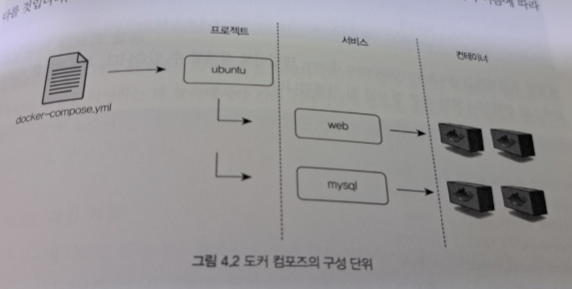
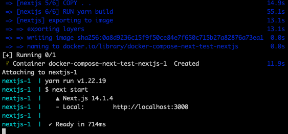
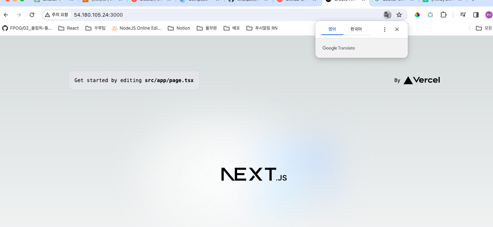

## 04장 도커 컴포즈

여러 개의 컨테이너가 하나의 애플리케이션으로 동작할 때 이를 테스트하려면 각 컨테이너를 하나씩 생성해야 한다.

예를 들어 웹 애플리케이션을 테스트하려면 웹 서버 컨테이너와 데이터베이스 컨테이너를 생성해야 한다. 

```
docker run --name mysql -d alicek106/composetest:mysql mysqld

docker run -d -p 80:80 \ --link mysql:db --name web \ ~~apache
```

run 명령에 사용되는 이미지는 테스트용으로서 명령어를 실행하면 아파치 웹 서버 컨테이너와 mysql 컨테이너를 생성한다.

이처럼 여러 개의 컨테이너로 구성된 애플리케이션을 구축하기 위해 run 명령어를 여러 번 사용할 수 있지만 각 컨테이너가 제대로 동작하는지 확인하는 테스트 단계에서는
이렇게 하기가 번거롭다. 매번 run 명령어에 옵션을 설정해 CLI 로 컨테이너를 생성하기보다는 여러 개의 컨테이너를 하나의 서비스로 정의해 컨테이너 묶음으로 관리할 수 있다면
좀 더 편리할 것이다.

도커 컴포즈는 컨테이너를 이용한 서비스의 개발과 CI를 위해 여러 개의 컨테이너를 하나의 프로젝트로서 다룰 수 있는 작업 환경을 제공한다.

도커 컴포즈는 여러 개의 컨테이너의 옵션과 환경을 정의한 파일을 읽어 컨테이너를 순차적으로 생성하는 방식으로 동작한다.
도커 컴포즈의 설정 파일은 run 명령어의 옵션을 그대로 사용할 수 있으며, 각 컨테이너의 의존성 네트워크 볼륨 등을 함께 정의가 가능하다.

스웜 모드의 서비스와 유사하게 설정 파일에 정의된 서비스의 컨테이너 수를 유동적으로 조절할 수 있으며 컨테이너 개발 환경에서는 도커 엔진의 run 명령어로
컨테이너를 생성하는 것이 더 편리할 수도 있다. 그렇지만 컨테이너의 수가 많아지고 정의해야 할 옵션이 많아진다면 도커 컴포즈를 사용하는 것이 좋다.

```
# Docker Compose 설치
$ sudo curl -L https://github.com/docker/compose/releases/latest/download/docker-compose-$(uname -s)-$(uname -m) -o /usr/local/bin/docker-compose

# Docker Compose 실행 권한 부여
$ sudo chmod +x /usr/local/bin/docker-compose

# 설치된 Docker Compose 실행 확인
$ docker-compose --version
```

## 4.3 도커 컴포즈 사용

### 4.3.1 도커 컴포즈 기본 사용법 

도커 컴포즈는 컨테이너의 설정이 정의된 YAML 파일을 읽어 도커 엔진을 통해 컨테이너를 생성한다.

도커 컴포즈를 사용하려면 가장 먼저 YAML 파일을 작성해야 한다.

### 4.3.1.1 docker-compose.yml 작성 활용

도커 컴포즈의 사용법을 알아보기 위해 다음과 같은 run 명령어를 docker-compose.yml 파일로 변환해 컨테이너를 생성하고 실행할 수 있다.

```
docker run -d --name mysql \
alicek106/composetest:mysql \
mysqld

docker run -d -p 80:80 \
--link mysql:db --name web \
alicek106/composetest:web \
apachetl - DFOREGROUND
```

```
version: '3.0'
services:
    web:
        image: alicek106/composetest:web
        ports:
            - "80:80"
        links:
            - mysql:db
        command: apachetl -DFOREGROUND
    mysql:
        image: alicek106/composetest:mysql
        command: mysqld
```

어떠한 설정도 하지 않으면 도커 컴포즈는 현재 디렉터리의 docker-compose.yml 파일을 읽어 로컬의 도커 엔진에게 컨테이너 생성을 요청한다.

docker-compose.yml 파일로 저장한 후 이 파일을 저장한 디렉터리에서 docker-compose up -d 명령어로 컨테이너를 생성하면

하단과 같은 출력 결과를 확인할 수 있었다.

version: YAML 파일 포맷의 버전을 나타낸다. 버전은 1.2, 2.1, 3.0 등이 있다. 도커 컴포즈 1.8은 버전 2를 도커 컴포즈는 1.9는 버전 2.1을
도커 컴포즈 1.10 은 버전 3.0을 사용한다. 단 버전 1은 사용되지 않는다.

도커 컴포즈 버전은 도커 엔진 버전에 의존성이 있으므로 가능하다면 최신 버전을 사용하는 것이 좋다.

service: 생성될 컨테이너들을 묶어놓은 단위이다. 서비스 항목 아래에는 적용될 생성 옵션을 지정한다.

web, mysql: 생성될 서비스의 이름이다. 이 항목 아래에 컨테이너가 생성돨 때 필요한 옵션을 지정할 수 있다.
5.1 YMAL 파일에서 docker run 에서 사용하는 옵션과 동일하게 image, ports, links, commands 등을 정의할 수 있다.

### 4.3.1.2 도커 컴포즈의 프로젝트 서비스 컨테이너

Web 서비스와 mysql 서비스를 정의했고 서비스별로 컨테이너가 1개씩 생성되었으며 각 컨테이너의 이름은 ubuntu_web_1, ubuntu_mysql_1 이었다.

도커 컴포즈는 컨테이너를 프로젝트 및 서비스 단위로 구분하므로 컨테이너의 이름은 일반적으로 다음과 같은 형식으로 정해진다.

[프로젝트 이름]_[서비스 이름]_[서비스 내에서 컨테이너의 번호]

위 예제에서 생성한 프로젝트 이름은 ubuntu 이고 서비스의 이름은 mysql, web 이다. 위에서 docker-compose up -d 를 실행했을 떄 프로젝트의 이름을 별도로 입력하지 않았지만
도커 컴포즈는 기본적으로 docker-compose.yml 파일이 위치한 디렉터리의 이름을 프로젝트 이름으로 사용한다.

프로젝트 이름은 docker-compose.yml 파일이 저장된 디렉터리의 이름에 따라 다를 것이다.



하나의 프로젝트는 여러 개의 서비스로 구성되고 각 서비스는 여러 개의 컨테이너로 구성된다. 스웜 모드에서의 서비스와 마찬가지로 하나의 서비스에는
여러 개의 컨테이너가 존재할 수 있으므로 차례대로 증가하는 컨테이너의 번호를 붙여 서비스 내의 컨테이너를 구별한다.

docker-compose scale 명령어로 여러개의 서비스를 생성 가능하다.

docker-compose scale 명령어를 사용한 뒤 docker-compose ps 명령어로 컨테이너의 목록을 확인하면 서비스의 컨테이너가 늘어난 것을 알 수 있다.
이처럼 서비스의 컨테이너 수를 늘리거나 줄여서 같은 컨테이너 수를 일정하게 유지할 수 있다.

생성된 프로젝트는 docker-compose down 명령어로 삭제할 수 있다.

도커 컴포즈는 기본적으로 현재 디렉터리의 이름으로 된 프로젝트를 제어한다. 예를 들어

/home/ubuntu 디렉터리에 docker-compose.yml 파일이 있고 docker-compose down 명령어를 입력하면
ubuntu라는 이름을 가진 프로젝트를 삭제한다. docker-compose 의 -p 옵션에 프로젝트의 이름을 사용해 제어할 프로젝트의 이름을 명시할 수 있다.

------

## NEXT.JS Docker-compose 로 올려보기

NEXT.JS 프로젝트를 생성하고 github 저장소에 public 으로 올려두었다.

그리고 생성된 프로젝트에 Dockerfile 이라는 파일을 생성해서 도커에 등록을 시켜야 한다고 하여 만들어 주었다.

```
# 기본 이미지로 node의 LTS(장기지원) 버전을 사용
FROM node:lts-alpine

# 앱 디렉토리 생성
WORKDIR /app

# 앱 의존성 설치
# package.json 과 yarn.lock 파일을 /app 디렉토리로 복사
COPY package.json yarn.lock ./

# 의존성 설치
RUN yarn install --frozen-lockfile

# 앱 소스 추가
# (모든 파일을 복사해서 Dokcer 이미지에 포함한다는 뜻)
COPY . .

# Next.js 앱 빌드
RUN yarn build

# 앱 실행을 위한 포트
EXPOSE 3000

# Next.js 앱 시작
CMD ["yarn", "start"]
```

또한 docker-compose.yml 파일을 생성했다.

```
version: '3'
services:
  nextjs:
    build: .
    ports:
      - "3000:3000"
    volumes:
      - .:/app
      - /app/node_modules
```

그리고 EC2 에 node, npm, yarn 등을 설치해서

```
docker-compose up --build
```

위 명령어를 실행해서 프로젝트를 실행시켰다.




세상에