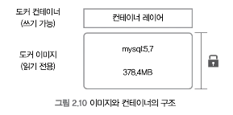
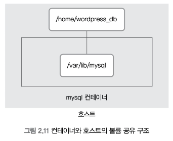
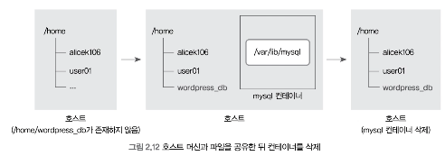
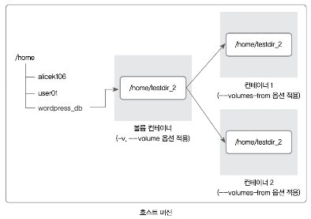
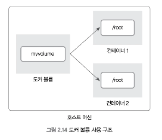
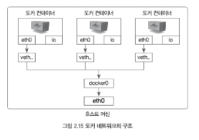
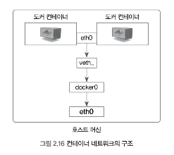
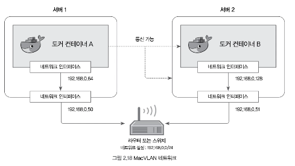

# 2.2.1 컨테이너 생성

#### 컨테이너 생성하기

`docker run`
- 해당 명령어는 컨테이너를 생성하고 실행하는 역할을 한다.
- run 명령어는 pull, create, start 명령어를 일괄적으로 실행한 후 attach 가 가능한 컨테이너라면 내부로 들어간다.
- ubuntu:14.04는 컨테이너를 생성하기 위한 이미지의 이름이며, -i -t 옵션은 컨테이너와 상호(interactive) 입출력을 가능하게 한다.

`docker create`
- --name : 컨테이너의 이름을 설정한다.
- run 명령어를 실행했을때와 달리 컨테이너를 생성만 할 뿐 내부로 들어가지 않는다.
- pull 한뒤에 컨테이너를 생성만 할 뿐 start, attach 를 실행하지 않는다.

#### 컨테이너 내부에서 빠져나오기

1. `exit` 혹은 `Ctrl + D` 를 동시에 입력
   그러나 이 방법은 컨테이너 내부에서 빠져나오면서 동시에 컨테이너를 정지시킨다.

2. `Ctrl + P + Q`
   단순히 컨테이너의 셸에서만 빠져나온다.
   때문에 컨테이너 애플리케이션을 개발하는 목적으로 컨테이너를 사용할 때는 이 방법을 많이 쓴다.

#### 이미지 내려받기

`docker pull`
해당 명령어를 통해 이미지를 내려받는다.

다음과 같이 사용한다.
`docker pull centos:7`

이미지를 내려받았다면 정상적으로 내려받았는지 확인하도록 하자

`docker images` : 도커 엔진에 존재하는 이미지의 목록을 출력

#### 컨테이너 시작하기 & 컨테이너 내부로 들어가기

컨테이너 시작하기
`docker start 컨테이너명`

컨테이너 내부로 들어가기
`docker attach 컨테이너명`

# 2.2.2 컨테이너 목록 확인

`docker ps`: 컨테이너 목록 확인
- 정지되지 않은 컨테이너만 출력한다.
- -a : 정지된 컨테이너를 포함하여 출력한다.


# 2.2.3 컨테이너 삭제

더 이상 사용하지 않는 컨테이너를 삭제할 때는 `docker rm` 를 사용한다.

실행중인 컨테이너는 삭제할 수 없다는 에러가 발생하게 되며 컨테이너가 실행중일 경우
`docker stop` 명령어를 통해 컨테이너를 정지시킨 후 삭제를 진행하도록 하자.

강제로 삭제하려면 `docker rm` 명령어에 -f 옵션을 붙여 삭제한다.

만약 모든 컨테이너를 삭제해야 한다면
`docker container prune` 명령어를 통해 모두 삭제할 수 있다.

혹은 `docker ps` 명령어의 -a 옵션과 -q 옵션을 통해 삭제할 수도 있다.
-a 는 컨테이너 상태와 관계없이 모든 컨테이너를
-q 는 컨테이너의 ID만을 출력하는 역할을 한다.

이 옵션들을 사용해 출력된 컨테이너 리스트를 변수로 컨테이너를 삭제하면 모든 컨테이너를 간단히 삭제할 수 있다.

`docker stop $(docker ps -a -q)`
`docker rm $(docker ps -a -q)`

# 2.2.4 컨테이너를 외부에 노출

컨테이너는 가상 머신과 마찬가지로 가상 IP 주소를 할당 받는다.
기본적으로 도커는 컨테이너에 172.17.0.x 의 IP를 순차적으로 할당한다.

아무런 설정을 하지 않았다면 이 컨테이너는 외부에서 접근할 수 없으며 도커가 설치된 호스트에서만 접근할 수 있다.
외부에 컨테이너의 애플리케이션을 노출하기 위해서는 eth() 의 IP와 포트를 호스트의 IP와 포트에 바인딩해야 한다.

다음과 같이 호스트포트와 컨테이너 포트를 바인딩해 연결할 수 있다.

`docker run -i -t --name mywebserver -p 80:80 ubuntu:14.04`

여러 개의 포트를 외부에 개방하려면 -p 여러번 써서 설정한다.

`docker run -i -t -p 3306:3306 -p 192.168.0.100:7777:80 ubuntu:14.04`

# 2.2.5 컨테이너 애플리케이션 구축

대부분의 서비스는 단일 프로그램으로 동작하지 않는다.
여러 에이전트나 데이터베이스 등과 연결되어 완전한 서비스로써 동작하는것이 일반적이다.

이런 서비스를 컨테이너화(Containerize)할 때 여러 개의 애플리케이션을 한 컨테이너에 설치할 수도 있다.
그러나 컨테이너에 애플리케이션을 하나만 동작시키면 컨테이너 간의 독립성을 보장함과 동시에 애플리케이션의 버전 관리, 소스코드 모듈화 등이 더욱 쉬워진다.

한 컨테이너에 프로세스 하나만 실행하는 것이 도커의 철학이기 때문이다.

### 데이터베이스와 워드프레스 웹 서버 컨테이너를 연동해 워드프레스 기반 블로그 서비스를 만들기

```bash
docker run -d --name wordpressdb -e MYSQL_ROOT_PASSWORD=password -e MYSQL_DATABASE=wordpress mysql:5.7
```

mysql 이미지를 사용해 데이터베이스 컨테이너를 생성

```bash
docker run -d -e WORDPRESS_DB_HOST=mysql -e WORDPRESS_DB_USER=root -e WORDPRESS_DB_PASSWORD=password --name wordpress --link wordpressdb:mysql -p 80 wordpress
```

미리 준비된 워드프레스 이미지를 이용해 워드프레스 웹 서버 컨테이너를 생성한다.
워드프레스 웹 서버 컨테이너의 -p 옵션에서 80을 입력했으므로 호스트의 포트 중 하나와 컨테이너의 80번 포트가 연결된다.

docker ps 명령어로 호스트의 어느 포트와 연결됐는지 확인하자.

>호스트와 바인딩된 포트만 확인하려면 docker port 명령어를 사용하자.

```text
$ docker port wordpress
80/tcp -> 0.0.0.0:32769
```

0.0.0.0:32769 -> 80/tcp 에서 0.0.0.0은 호스트의 활용 가능한 모든 네트워크 인터페이스에 바인딩함을 뜻한다.

웹 브라우저로 확인해보면 워드프레이스 컨테이너가 정상적으로 성공된것을 확인해볼 수 있다.

### docker run 명령어 -i -t 옵션과 -d 옵션의 차이

- -d : -i -t 가 컨테이너 내부로 진입하도록 attach 가능한 상태로 설정한다면 -d 는 Detached 모드로 컨테이너를 실행한다. Detached 모드는 컨테이너를 백그라운드에서 동작하는 애플리케이션으로써 실행하도록 설정한다.
#### -i -t 옵션으로 run

```text
> echo hello!
hello!
```

표준 입출력이 활성화된 상호작용이 가능한 셸 환경을 사용할 수 있다.
`/bin/bash` 를 커맨드로 설정해 실행하여 배시 셸을 쓸 수 있게 설정핸다.
`docker ps` 의 `/bin/bash` 가 여기에 해당한다.

#### -d 옵션으로 run

```text
[innoDB] starting..
[innoDB] mysql..
```

입출력이 없는 상태로 컨테이너를 실행한다.
컨테이너 내부에서 프로그램이 터미널을 차지하는 포그라운드로 설정돼 사용자의 입력을 받지 않는다.
Detached 모드인 컨테이너는 반드시 컨테이너에서 프로그램이 실행되야  하며,
포그라운드 프로그램이 실행되지 않으면 컨테이너는 종료된다.

mysql 은 하나의 터미널을 차지하는 mysqld를
워드프레스는 하나의 터미널을 차지하는 apache2-foreground 를 실행하므로 -d 옵션을 지정해 백그라운드로 설정한 것이다.

#  2.2.6 도커 볼륨

도커 이미지로 컨테이너를 생성하면 이미지는 읽기 전용이 되며 컨테이너의 변경 사항만 별도로 저장해서 각 컨테이너의 정보를 보존한다.

예를 들어 위에서 생성했던 mysql 컨테이너는 mysql:5.7 이라는 이미지로 생성됐지만 워드프레스 블로그를 위한 데이터베이스 등의 정보는 컨테이너가 갖고 있다.

즉 다음과 같은 구조를 띄게된다.



이미 생성된 이미지는 어떠한 경우로도 변경되지 않으며, 컨테이너 계층에 원래 이미지에서 변경된 파일시스템 등을 저장한다.

이미지에 mysql을 실행하는 데 필요한 애플르케이션 파일이 들어있다면 컨테이너 계층에는 워드프레스에서 쓴 로그인 정보나 게시글 등과 같이 데이터베이스를 운용하면서 쌓이는 데이터가 저장된다.

그러나 여기에는 **치명적인 단점**이 있다.
mysql 컨테이너를 삭제하면 컨테이너 계층에 저장돼있던 데이터베이스의 정보도 삭제된다는 점이다.

도커의 컨테이너는 생성과 삭제가 매우 쉬우므로 실수로 컨테이너를 삭제하면 데이터를 복구할 수 없게된다. 이를 방지하기 위해 컨테이너를 영속적(Persistent) 데이터로 활용할 수 있는 몇가지 방법이 있다.

그중 가장 활용하기 쉬운 방버이 바로 **볼륨을 활용**하는 것이다.

볼륨을 활용하는 방법은 여러 가지가 있다.
- 호스트와 볼륨을 공유
- 볼륨 컨테이너를 활용할 수 있다.
- 도커가 관리하는 볼륨을 생성할 수도 있다.

### 2.2.6.1 호스트 볼륨 공유

mysql 데이터베이스 컨테이너와 워드프레스 웹 서버 컨테이너를 생성한다.

```bash
docker run -d \
--name wordpressdb_hostvolume \
-e MYSQL_ROOT_PASSWORD=password \
-e MYSQL_DATABASE=wordpress \
-v /home/wordpress_db:/var/lib/mysql \
mysql:5.7
```

```bash
docker run -d \
-e WORDPRESS_DB_PASSWORD=password \
--name wordpress_hostvolume \
--link wordpressdb_hostvolume:mysql \
-p 80 \
wordpress
```

워드프레스 컨테이너에 -p 옵션으로 컨테이너의 80번 포트를 외부에 노출했으므로
docker ps 명령어에서 확인한 wordpress_hostvolume 컨테이너의 호스트 포트로 워드프레스 컨테이너에 접속할 수 있다.

여기서 사용한 -v 옵션은 그 값을 /home/wordpress_db:/bar/lib/mysql 로 설정한 것이다.
이는 호스트의 /home/wordpress_db 디렉터리와 컨테이너의 /var/lib/mysql 디렉터리를 공유한다는 뜻이다. 즉, `[호스트의 공유 디렉터리]:[컨테이너의 공유 디렉터리]` 형태이다.

- -v : 호스트와 컨테이너 디렉터리를 공유 `[호스트의 공유 디렉터리]:[컨테이너의 공유 디렉터리]`

>/var/lib/mysql 디렉터리는 MySQL 데이터베이스의 데이터를 저장하는 기본 디렉터리이다.

-v 옵션을 써서 컨테이너의 디렉터리를 호스트와 공유한 것을 그림으로 나타내면 다음과 같다.



> 디렉터리 단위의 공유뿐 아니라 단일 파일 단위의 공유도 가능하며, 동시에 여러 개의 -v 옵션을 쓸 수도 있다.



호스트에 예를 들어 /home/wordpress_db 디렉터리가 존재하지 않을경우
-v 옵션을 사용함으로써 호스트에 /home/wordpress_db 디렉터리가 생성되고
이 디렉터리에 파일이 공유된다. 결과적으로 컨테이너의 파일이 호스트로 복사된다는 의미이다.

### 2.2.6.2 볼륨 컨테이너

볼륨을 사용하는 두 번째 방법은 -v 옵션으로 볼륨을 사용하는 컨테이너를 다른 컨테이너와 공유하는 것이다.

컨테이너를 생성할 때 --volumes-from 옵션을 설정하면 -v 또는 --volume 옵션을 적용한 컨테이너의 볼륨 디렉터리를 공유할 수 있다.
그러나 이는 직접 볼륨을 공유하는 것이 아닌 -v 옵션을 적용한 컨테이너를 통해 공유하는 것이다.

`docker run -i -t --name volumes_from_container --volumes-from volume_overide ubuntu:14.04`

위 예제는 volume_overide 컨테이너 볼륨을 공유받는 경우이다.
--volumes-from 옵션을 적용한 컨테이너와 볼륨 컨테이너 사이의 관계는 다음과 같이 나타낼 수 있다.



여러 개의 컨테이너가 동일한 컨테이너에 --volumes-from 옵션을 사용함으로써 볼륨을 공유해 사용할 수도 있다.
이러한 구조를 활용하면 호스트에서 볼륨만 공유하고 별도의 역할을 담당하지 않는 '볼륨 컨테이너' 로 활용이 가능하다.

즉 볼륨을 사용하려는 컨테이너에 -v 대신 --volumes-from 옵션을 사용함으로써 볼륨 컨테이너에 연결해 데이터를 간접적으로 공유받는 방식이다.

### 2.2.6.3 도커 볼륨

볼륨을 활용하는 세 번째 방법은 `docker volume` 명령어를 사용하는 것이다.
지금까지 한 방법을 활용하는 것도 나쁘지 않지만 도커 자체에서 제공하는 볼륨 기능을 활용해 데이터를 보존할 수도 있다.

```bash
docker volume create --name myvolume
```

`docker volume ls` 명령어를 통해 생성된 볼륨을 볼 수 있다.

볼륨을 생성할 때 플러그인 드라이버를 설정해 여러 종류의 스토리지 백엔드를 쓸 수 있지만 여기서는 기본적으로 제공되는 드라이버인 local을 사용한다.

이 볼륨은 로컬 호스트에 저장되며 도커엔진에 의해 생성되고 삭제된다.

**이제 생성한 볼륨을 사용하는 컨테이너를 생성해보자.**

`[볼륨의 이름]:[컨테이너의 공유 디렉터리]`

`docker run -i -t --name myvolume_2 -v myvolume:/root/ ubuntu:14.04`

컨테이너 공유 디렉터리 경로에 같은 파일이 존재할 것이다.

docker volume 명령어로 생성한 볼륨은 아래 그림과 같은 구조로 활용된다.
도커 볼륨도 여러 개의 컨테이너에 공유되어 활용될 수 있다.



볼륨은 디렉터리 하나에 상응하는 단위로서 도커 엔진에서 관리한다.
**도커 볼륨도 호스트 볼륨 공유와 마찬가지로 호스트에 저장함으로써 데이터를 보존하지만 실제로 어디에 저장되는지 사용자는 알 필요가 없다.**

`docker volume create` 명령을 별도로 입력하지 않아도 -v 옵션을 입력할 때 이를 수행하도록 설정할 수 있다.

```bash
docker run -i -t --name volume_auto -v /root ubuntu:14.04
```

생성된 volume 을 보면 무작위인 16진수 형태인 볼륨이 자동으로 생성된 것을 볼 수 있다.

도커 볼륨을 생성하고 삭제하다보면 불필요한 볼륨들이 남아있을 때가 있다.
도커 볼륨을 사용하고 있는 컨테이너를 삭제해도 볼륨이 자동으로 삭제되지 않기 떄문.

**이처럼 컨테이너가 아닌 외부에 데이터를 저장하고 컨테이너는 그 데이터로 동작하도록 설계하는 것을 스테이트리스(stateless)하다고 말한다.**

컨테이너 자체는 상태가 없고 상태를 결정하는 데이터는 외부로부터 제공받는다.
컨테이너가 삭제되어도 데이터는 보존되므로 스테이트리스한 컨테이너 설계는 도커를 사용할 때 매우 바람직한 설계이다.

**이와 반대로 컨테이너가 데이터를 저장하고 있어 상태가 있는 경우 스테이트풀(stateful) 하다고 말한다.**
스테이트풀한 컨테이너 설계는 컨테이너 자체에서 데이터를 보관하므로 지양하는 것이 좋다.

# 2.2.7 도커 네트워크

### 2.2.7.1 도커 네트워크 구조

컨테이너 내부에서 ifconfig를 입력해 컨테이너 네트워크 인터페이스에 eth0과 lo 네트워크 인터페이스가 있다는 것을 확인했다.

도커는 컨테이너 내부 IP를 순차적으로 할당하며,
이 IP는 컨테이너를 재시작할 때마다 변경될 수 있다.

이 내부 IP는 도커가 설치된 호스트, 즉 내부 망에서만 쓸 수 있는 IP이므로 외부와 연결될 필요가 없다.
이 과정은 컨테이너를 시작할 때마다 호스트에 veth... 라는 네트워크 인터페이스를 생성함으로써 이뤄진다.

도커는 각 컨테이너에 외부와의 네트워크를 제공하기 위해 컨테이너마다 가상 네트워크 인터페이스를 호스트에 생성하며 이 인터페이스의 이름은 veth로 시작한다.

veth 인터페이스는 사용자가 직접 생성할 필요는 없으며 컨테이너가 생성될때 도커 엔진이 자동으로 생성한다.


도커가 설치된 호스트에서 ifconfig 나 ip addr 과 같은 명령어로 네트워크 인터페이스를 확인하면
실행중인 컨테이너 수만큼 veth로 시작하는 인터페이스가 생성된것을 알 수 있다.

출력 결과에서 eth0 은 공인 IP 또는 내부 IP가 할당되어 실제로 외부와 통신할 수 있는 호스트의 네트워크 인터페이스이다.

veth 으로 시작하는 인터페이스는 컨테이너를 시작할 때 생성됏으며, 각 컨테이너 eth0과 연결됐다.

veth 인터페이스뿐 아니라 docker0이라는 브리지도 존재하는데 docker0 브리지는 각 veth 인터페이스와 바인딩돼 호스트 eth0 인터페이스와 이어주는 역할을 한다.

즉 컨테이너와 호스트의 네트워크는 아래 그림과 같은 구성이다.



**정리하면 컨테이너의 eth0 인터페이스는 호스트의 veth...라는 인터페이스와 연결됐으며
veth 인터페이스는 docker0 브리지와 바인딩돼 외부와 통신할 수 있다.**

### 2.2.7.2 도커 네트워크 기능

컨테이너를 생성하면 기본적으로 docker0 브리지를 통해 외부와 통신할 수 있는 환경을 사용할 수 있지만 사용자의 선택에 따라 여러 네트워크 드라이버를 사용할 수 있다.

도커가 자체적으로 제공하는 대표적인 네트워크 드라이버로는 브리지(bridge), 호스트(host), 논(none), 컨테이너(container), 오버레이(overlay)가 있다.

서드파티 플러그인 솔루션으로는 weave, flannel, openvswitch 등이 있으며, 더 확장된 네트워크 구성을 위해 활용된다.
여기서는 도커 자체만으로 손쉽게 쓸 수 있는 브리지, 호스트, 논, 컨테이너에 대해 알아본다.

#### 브리지 네트워크

`도커 네트워크 구조` 에서 설명한 docker0 브리지와 비슷하게 브리지 네트워크는 docker0이 아닌 사용자 정의 브리지를 새로 생성해 각 컨테이너에 연결하는 네트워크 구조이다.

컨테이너는 연결된 브리지를 통해 외부와 통신할 수 있다.

**기본적으로 존재하는 docker0 을 사용하는 브리지 네트워크가 아닌 새로운 브리지 타입의 네트워크를 생성할 수 있다.**

새로운 브리지 네트워크를 생성해보자.

`docker network create --driver bridge mybridge`

이제 docker run 또는 docker create 명령어에 --net 옵션의 값을 설정하면 컨테이너가 이 네트워크를 사용하도록 설정할 수 있다.

```bash
docker run -i -t --name mynewtwork_container --net mybridge ubuntu:14.04
```

컨테이너 내부에서 ifconfig 를 입력하면 새로운 IP 대역이 할당된 것을 알 수 있다.
브리지 타입의 네트워크를 생성하면 도커는 IP 대역을 차례대로 할당한다.
여기서는 172.18 대역의 내부 IP가 할당되었다.

이렇게 생성된 사용자 정의 네트워크는 docker network disconnect, connect를 통해 컨테이너에 유동적으로 붙이고 땔 수 있다.

`docker network disconnect mybridge mynewtwork_container`
`docker network connect mybridge mynewtwork_container`

단 논 네트워크, 호스트 네트워크 등과 같은 특별한 네트워크 모드에는 해당 명령을 사용할 수 없다.

브리지 네트워크, 오버레이 네트워크 같이 특정 IP 대역을 갖는 네트워크 모드에만 이 명령어를 사용할 수 있다.

네트워크의 서브넷, 게이트웨이, IP 할당 범위 등을 임의로 설정하려면 네트워크를 생성할 때 아래와 같이
--subnet, --ip-range, --gateway 옵션을 추가한다.
단 --subnet 과 --ip-range는 같은 대역이어야 한다.

```bash
docker network create --driver=bridge --subnet=172.72.0.0/16 --ip-range=172.72.0.0/24 --gateway=172.72.0.1 my
_custom_network
```

#### 호스트 네트워크

**네트워크를 호스트로 설정하면 호스트의 네트워크 환경을 그대로 쓸 수 있다.**
브리지 드라이버 네트워크와 달리 호스트 드라이버 네트워크는 별도 생성할 필요 없이 기존의 host 라는 이름의 네트워크를 사용한다.

`docker run -i -t --name network_host --net host ubuntu:14.04`

--net 옵션을 입력해 호스트를 설정한 컨테이너의 내부에서 네트워크 환경을 확인하면 호스트와 같은 것을 알 수 있다.
호스트 머신에서 설정한 호스트 이름도 컨테이너가 물려받기 때문에 컨테이너의 호스트 이름도 무작위 16진수가 아닌 도커 엔진이 설치된 호스트의 호스트 이름으로 설정된다.

컨테이너의 네트워크를 호스트 모드로 설정하면 컨테이너 내부의 애플리케이션을 별도의 포트 포워딩 없이 바로 서비스할 수 있다.
이는 마치 실제 호스트에서 애플리케이션을 외부에 노출하는 것과 같다.
예를 들어 호스트 모드를 쓰는 컨테이너에서 아파치 웹 서버를 구동한다면 호스트의 IP와 컨테이너의 아파치 웹 서버 포트인 80으로 바로 접근할 수 있다.

#### 논 네트워크

none 은 말 그대로 아무런 네트워크를 쓰지 않는 것을 뜻환다.
다음과 같이 컨테이너를 생성하면 외부와 연결이 단절된다.

`docker run -i -t --name network_none --net none ubuntu:14.04`

--net 옵션을 none 으로 설정한 컨테이너 내부에서 네트워크 인터페이스를 확인하려면 로컬 호스트를 나타내는 lo 외에는 존재하지 않는 것을 볼 수 있다.

```text
lo        Link encap:Local Loopback
          inet addr:127.0.0.1  Mask:255.0.0.0
```


#### 컨테이너 네트워크

--net 옵션으로 container를 입력하면 다른 컨테이너의 네트워크 네임스페이스 환경을 공유할 수 있다.
공유되는 속성은 내부 IP, 네트워크 인터페이스의 맥(MAC) 주소 등

--net 옵션의 값으로 `container:[다른컨테이너ID]` 를 입력한다.


`docker run -i -t -d --name network_container_1 ubuntu:14.04`
`docker run -i -t -d --name network_container_1 --net container:network_container1 ubuntu:14.04`

>-i, -t, -d 옵션을 함께 사용하면 컨테이너 내부에서 셸을 실행하지만 내부로 들어가지 않으며 컨테이너도 종료되지 않는다. 위와 같이 테스트용으로 컨테이너를 생성할 때 유용하게 쓸 수 있다.

위와 같이 다른 컨테이너의 네트워크 환경을 공유하면 내부 IP를 새로 할당받지 않으며 호스트에 veth로 시작하는 가상 네트워크 인터페이스도 생성되지 않는다.

`docker exec network_container_1 ifconfig`
`docker exec network_container_2 ifconfig`

두 컨테이너의 eth0 에 대한 정보가 완전히 같은것을 알 수 있다.
그림으로 나타내면 다음과 같다.



##### 브리지 네트워크와 --net-alias
브리지 타입의 네트워크와 run 명령어의 --net-alias 옵션을 함께 쓰면 특정 호스트 이름으로 컨테이너 여러 개에 접근할 수 있다.

##### MacVLAN 네트워크

**MacVLAN 은 호스트의 네트워크 인터페이스 카드를 가상화해 물리 네트워크 환경을 컨테이너에게 동일하게 제공한다.**

따라서 MacVLAN을 사용하면 컨테이너는 물리 네트워크상에서 가상의 맥 주소를 가지며
해당 네트워크에 연결된 다른 장치와의 통신이 가능해진다.

MacVLAN에 연결된 컨테이너는 기본적으로 할당되는 IP 대역인 172.17.X.X 대신 네트워크 장비의 IP를 할당받기 때문이다.



위 그림과 같이 공유기, 라우터, 스위치와 같은 네트워크 장비에 두 대의 서버가 연결돼 있고
각 서버는 192.168.0.0/24 대역에서 IP를 동적으로 할당받는다고 가정해보자.

MacVLAN을 사용하면 각 컨테이너에 192.168.0.0/24 대역의 IP를 할당할 수 있다.
따라서 MacVLAN을 사용하는 컨테이너들과 동일한 IP 대역을 사용하는 서버 및 컨테이너들은 서로 통신이 가능하다.

# 2.2.8 컨테이너 로깅

### 2.2.8.1 json-file 로그 활용하기

애플리케이션 레벨에서 로그가 기록되도록 개발해 별도의 로깅 서비스를 쓸 수 있지만
도커는 컨테이너 표준 출력(StdOut)과 에러(StdErr) 로그를 별도의 메타 데이터 파일로 저장하며 이를 확인하는 명령어를 제공한다.

`docker logs` 명령어를 통해 애플리케이션의 문제를 확인할 수 있다.

### 2.2.8.2 syslog 로그

>유닉스 계열 운영체제에서 로그를 수집하는 오래된 표준 중 하나이다.
>커널, 보안 등 시스템과 관련된 로그, 애플리케이션의 로그 등 다양한 종류의 로그를 수집해 저장한다.
>대부분의 유닉스 계열 운영체제에서는 syslog 를 사용하는 인터페이스가 동일하기 때문에 체계적으로 로그를 수집하고 분석할 수 있다는 장점이 있다.

### 2.2.8.3 fluentd 로깅

>fluentd는 각종 로그를 수집하고 저장할 수 있는 기능을 제공하는 오픈소스 도구로서
>도커 엔진의 컨테이너의 로그를 fluentd 를 통해 저장할 수 있도록 플러그인을 공식적으로 제공한다
>fluentd는 데이터 포맷으로 JSON을 사용하기 때문에 쉽게 사용할 수 있을뿐만 아니라 수집되는 데이터를 AWS S3, HDFS, MongoDB 등 다양한 저장소에 저장할 수 있다는 장점이 있다.

### 2.2.8.4 아마존 클라우드워치 로그

>AWS 에서는 로그 및 이벤트 등을 수집하고 저장해 시각적으로 보여주는 클라우드워치를 제공한다.
>도커를 AWS EC2에서 사용하고 있따면 다른 도구를 별도로 설치할 필요 없이 컨테이너에서 드라이버 옵션을 설정하는 것만으로 클라우드워치 로깅 드라이버를 사용할 수 있다.


# 2.2.9 컨테이너 자원 할당 제한

컨테이너를 생성하는 run, create 명령어에서 컨테이너의 자원 할당량을 조정하도록 옵션을 입력할 수 있다.
아무런 옵션을 입력하지 않으면 컨테이너는 호스트의 자원을 제한없이 쓸 수 있게 설정되므로
제품 단계의 컨테이너를 고려한다면 컨테이너 자원 할당을 제한해 호스트와는 다른 컨테이너의 동작을 방해하지 않게 설정하는 것이 좋다.

컨테이너에 자원할당 옵션을 설정하지 않으면 호스트의 자원을 전부 점유해 다른 컨테이너들 뿐 아니라
호스트 자체의 동작이 멈출 수 있다.

현재 컨테이너에 설정된 자원 제한을 확인하는 가장 쉬운 방법은 docker inspect 명령어를 입력하는 것이다.

>run 명령어에서 설정된 컨테이너의 자원 제한을 변경하려면 update 명령어를 사용한다.
>`docker update (변경할 자원 제한) (컨테이너이름)`
>`docker update --cpuset-cpus-1 centos ubuntu`

### 2.2.9.1 컨테이너 메모리 제한

docker run 명령어에 --memory를 지정해 컨테이너 메모리를 제한할 수 있다.

### 2.2.9.2 컨테이너 CPU 제한

#### --cpu-shares
--cpu-shares : 컨테이너에 가중치를 설정해 해당 컨테이너가 CPU를 상대적으로 얼마나 사용할 수 있는지를 나타낸다.

#### --cpuset-cpu
호스트에 CPU가 여러 개 있을 때 --cpuset-cpus 옵션을 지정해 컨테이너가 특정 CPU만 사용하도록 설정할 수 있다.

#### --cpu-period, --cpu-quota
컨테이너의 CFS 주기는 기본적으로 100ms로 설정되지만
run 명령어의 옵션 중 --cpu-period 와 --cpu-quota로 이 주기를 변경할 수 있다.
해당 명령을 통해 주기를 설정한 컨테이너는 `[--cpu-quota]/[--cpu-period]` 만큼 CPU 시간을 할당받는다.
#### --cpus
--cpus 옵션은 --cpu-period, --cpu-quota 와 동일한 기능을 하지만 좀 더 직관적으로
CPU의 개수를 직접 지정한다는 점에서 다르다.

--cpus 0.5 를 설정하면 --cpu-period=100000 또는 --cpu-quota=50000 과 동일하게 컨테이너를 제한할 수 있다.

### 2.2.9.3 Block I/O 제한

컨테이너를 생성할때 아무 옵션도 설정하지 않으면 컨테이너 내부에서 파일을 읽고 쓰는 대역폭에 제한이 설정되지 않는다.
하나의 컨테이너가 블록 입출력을 과도하게 사용하지 않게 설정하려면
- --device-write-bps : 쓰는 작업의 초당 제한을 설정
- --device-read-bps : 읽는 작업의 초당 제한을 설정
- --device-write-iops
- --device-read-iops

옵션을 지정해 블록 입출력을 제한할 수 있다.
단 Direct I/O 의 경우 에만 블록 입출력이 제한되며 Buffered I/O 는 제한되지 않는다.

### 2.2.9.4 스토리지 드라이버와 컨테이너 저장 공간 제한

도커 엔진은 컨테이너 내부 저장 공간을 제한하는 기능을 보편적으로 제공하지는 않지만
도커의 스토리지 드라이버나 파일 시스템 등이 특정 조건을 만조갛는 경우에만 이 기능을 제한적으로 사용할 수 있다.

단 모든 스토리지 드라이버에서 컨테이너 저장 공간을 제한할 수 있는 것은 아니다.

따라서 컨테이너 애플리케이션이 해당 스토리지 드라이버에 적합하지 않다면 이 기능을 사용하지 않는 것이 좋을 수도 있다. 또한 컨테이너 내부에서 개발하고 있거나 그 외의 다른 특별한 상황이 아니라면 컨테이너 자체가 상태를 가지는 것은 그다지 바람직하지 않다.

따라서 컨테이너의 저장공간을 제한하지 않는다는 선택지도 고려해볼 수 있다.

