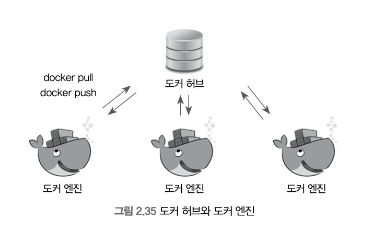
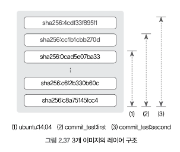
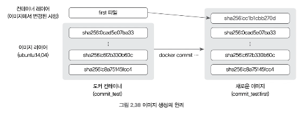

# 2.3 도커 이미지

모든 컨테이너는 이미지를 기반으로 생성되므로 이미지를 다루는 방법은 도커 관리에서 빼놓을 수 없는 부분이다.

이미지의 이름을 구성하는 저장소, 이미지 이름, 태그를 잘 관리하는 것뿐만 아니라 이미지가 어떻게 생성되고 삭제되는지, 이미지의 구조는 어떻게 돼 있는지 등을 아는 것 또한 중요하다.

이미지를 관리하는 기본적인 방법에 대해 살펴보자.



데비안 운영체제에서 apt-get install 을 실행하면 apt 리포지터리에서 패키지를 내려받고 레드햇 운영체제에서 yum install 을 실행하면 yum 리포지터리에서 패키지를 내려받듯이
도커는 기본적으로 **도커 허브(Docker Hub)** 라는 중앙 이미지 저장소에서 이미지를 내려받는다.

도커 허브는 도커가 공식적으로 제공하고 있는 이미지 저장소로서, 도커 계정을 가지고 있다면 누그든지 이미지를 올리고 내려받을 수 있기 때문에 다른 사람들에게 이미지를 쉽게 공유할 수 있다.

docker create, docker run, docker pull 의 명령어로 이미지를 내려받을 때 도커는 도커 허브에서 해당 이미지를 검색한 뒤 내려받는다.

필요한 대부분의 이미지는 도커 허브에서 공식적으로 제공하거나(ubuntu:14.04, centos:7 등)
다른 사람들이 도커 허브에 이미 올려놓은 경우(Apache, Tomcat, Hadoop)가 대부분이라서 애플리케이션 이미지를 직접 만들지 않아도 손쉽게 사용할 수 있다는 장점이 있다.

단, 도커 허브는 누구나 이미지를 올릴 수 있기 때문에 공식(Official) 라벨이 없는 이미지는 사용법을 찾을 수 없거나 제대로 동작하지 않을 수 있다.

또한 이미지 저장소를 다른사람들에게 공개하지 않기 위해 비공개 저장소를 사용하려면 비공개 저장소의 수에 따라 요금을 지불해야 한다.

이를 해결하기 위해 도커 이미지 저장소를 직접 구축해 비공개로 사용할 수도 있으며 이는 뒤의 "도커 사설 레지스트리"에서 자세히 다룬다.

도커 허브에 어떤 이미지가 있는지 확인하기 위해 도커 허브 사이트를 직접 접속해서 찾아볼 수도 있지만 도커 엔진에서 docker search 명령어를 사용할 수도 있다.

예를 들어, ubuntu 라는 키워드와 관련된 이미지는 어떤 것이 있는지 검색해보자.

>docker search 명령어는 도커 허브에서 이미지를 검색하여 도커 허브 이미지임을 명시하기 위해 docker, io/ubuntu와 같이 docker.io 접두어를 사용할 수도 있다.
>이는 구글 이미지 레지스트리(gcr.io) 등과 같은 다른 이미지 저장소와 구분하기 위함이다.
>그러나 일반적으로 최상위 접두어를 명시하지 않으면 도커 허브의 이미지를 의미한다.

```text
$ docker search ubuntu
NAME                             DESCRIPTION                                      STARS     OFFICIAL   AUTOMATED
ubuntu                           Ubuntu is a Debian-based Linux operating sys…   16735     [OK]
websphere-liberty                WebSphere Liberty multi-architecture images …   296       [OK]
```

STARS는 해당 이미지가 도커 사용자로부터 얼마나 즐겨찾기됐는지를 나타낸다.

## 2.3.1 도커 이미지 생성

docker search를 통해 검색한 이미지를 pull 명령어로 받아 사용할 수 있지만
도커로 개발하는 많은 경우에는 컨테이너에 애플리케이션을 위한 특정 개발 환경을 직접 구축한 뒤 사용자만의 이미지를 직접 생성해야 할 것이다.

이를 위해 컨테이너 안에서 작업한 내용을 이미지로 만드는 방법을 알아보자.

**컨테이너 안에서 작업한 내용을 이미지로 만드는 방법**

```bash
docker run -it --name commit_test ubuntu:14.04
echo test_first! >> first
```

first 파일을 만들어 변경사항을 만들었다면 호스트로 나와 `docker commit` 명령어를 입력해 컨테이너를 이미지로 만든다.

`docker commit [OPTIONS] CONTAINER [REPOSITORY[:TAG]]`

commit_test:first 라는 이름의 이미지로 생성해보자.

`docker commit -a "vespucci95" -m "my first commit" commit_test commit_test:first`

- -a : author 를 의미. 이미지의 작성자를 나타내는 메타데이터를 이미지에 포함시킨다.
- -m : 커밋 메시지를 뜻하며 이미지에 포함될 부가 설명을 입력

최상위 디렉터리에 first 라는 파일이 있는 도커 이미지가 생성됐다.

docker images 명령어로 이미지가 생성됐는지 확인한다.

```bash
$ docker images
REPOSITORY              TAG       IMAGE ID       CREATED         SIZE
commit_test             first     81ef8d813f7a   2 minutes ago   197MB
ubuntu                  14.04     13b66b487594   2 years ago     197MB
```

ubuntu:14.04 이미지의 크기와 비교했을 때 차이가 없는것은 변경사항에 해당하는 파일이 수바이트에 불과하기 때문

## 2.3.2 이미지 구조 이해

컨테이너를 이미지로 만드는 작업은 commit 명령어를 통해 수행할 수 있다.
그러나 이미지를 좀 더 효율적으로 다루기 위해 컨테이너가 어떻게 이미지로 만들어지며,
이미지 구조는 어떻게 돼 있는지 알 필요가 있다.

`docker inspect ubuntu:14.04`
`docker inspect commit_test:first`


>inspect 명령어는 컨테이너뿐만 아니라 네트워크, 볼륨, 이미지 등 모든 도커 단위의 정보를 얻을 때 사용할 수 있다. 단, 이름이 중복될 경우 컨테이너에 대해 먼저 수행되므로 `--type`을 명시하는 것이 좋다.

doker inspect 명령어는 많은 정보를 출력하지만 주의 깊게 살펴볼 항목은 가장 아랫부분에 있는 Layers 항목이다.

```text
// ubuntu:14.04
"Layers": [
"sha256:f2fa9f4cf8fd0a521d40e34492b522cee3f35004047e617c75fadeb8bfd1e6b7",
"sha256:30d3c4334a2379748937816c01f5c972a8291a5ccc958d6b33d735457a16196e",
"sha256:83109fa660b2ed9307948505abd3c1f24c27c64009691067edb765bd3714b98d"
]
```

```text
// commit_test:first
"Layers": [
"sha256:f2fa9f4cf8fd0a521d40e34492b522cee3f35004047e617c75fadeb8bfd1e6b7",
"sha256:30d3c4334a2379748937816c01f5c972a8291a5ccc958d6b33d735457a16196e",
"sha256:83109fa660b2ed9307948505abd3c1f24c27c64009691067edb765bd3714b98d",  "sha256:5887801e392091ee8463402b714d2c574c4e64a63e664be243384437c8906e54"
]
```

```text
"Layers": [
"sha256:f2fa9f4cf8fd0a521d40e34492b522cee3f35004047e617c75fadeb8bfd1e6b7",
"sha256:30d3c4334a2379748937816c01f5c972a8291a5ccc958d6b33d735457a16196e",
"sha256:83109fa660b2ed9307948505abd3c1f24c27c64009691067edb765bd3714b98d",
"sha256:5887801e392091ee8463402b714d2c574c4e64a63e664be243384437c8906e54",
"sha256:a6a289977cd7dca9360b15f4d408a6850623852124ee77693e099efdb94e2a77"
]
```

좀 더 쉽게 그림으로 나타내보자.



docker images 에서 위 3개의 이미지 크기가 각각 188MB라고 출력돼도 188MB 크기의 이미지가 3개 존재하는 것은 아니다.

이미지를 커밋할 때 컨테이너에서 변경된 사항만 새로운 레이어로 저장하고, 그 레이어를 포함해 새로운 이미지를 생성하기 때문에 전체 이미지의 실제 크기는 188MB + first 파일의 크기 + second 파일의 크기가 된다.

first 파일은 commit_test:first 이미지를 생성할 때 사용했던 컨테이너에서 변경된 사항이고
second 파일은 commit_test:second 이미지를 생성할 때 사용했던 컨테이너에서 변경된 사항이다.



즉 그림과 같이 ubuntu:14.04 이미지를 기반으로 생성했던 첫 번째 컨테이너 commit_test 에서
변경된 사항인 first 파일이 sha256:cc1b1cbb270d 레이어가 된다.
이는 commit_test:second 이미지를 생성할 떄도 같다.

>이러한 이미지 레이어 구조는 docker history 명령어를 통해 좀 더 쉽게 확인할 수 있다.
>이미지가 어떤 레이어로 생성됐는지 출력한다.
>`docker history commit_test:second`

도커 이미지 삭제
`docker rmi`
- 도커 이미지를 삭제한다.
    - ex ) `docker rmi commit_test:first`
- -f : 강제 옵션
    - 이는 레이어 파일을 실제로 삭제하지 않고 이미지 이름만 삭제하기 때문에 의미가 없다.

때문에 다음과 같이 삭제한다.
`docker stop commit_test2 && docker rm commit_test2`
`docker rmi commit_test:first`

컨테이너가 사용중인 이미지를 docker rmi -f 로 강제로 삭제하면 이미지 이름이 `<none>` 으로 변경되며, 이러한 이미지를 댕글링(dangling) 이미지라고 한다.

댕글링 이미지는 docker images -f dangling=true 명령어를 통해 확인할 수 있다.
사용중이지 않은 댕글링 이미지는 docker image prune 명령어로 한꺼번에 삭제할 수 있다.

commit_test:first 이미지를 삭제했따고 해서 실제로 해당 이미지의 레이어 파일이 삭제되지는 않는다.
하위 이미지인 second가 존재하기 때문

따라서 실제 이미지 파일은 삭제하지 않고 레이어에 부여된 이름만 삭제한다.
rmi 명령어의 출력 결과인 Untagged: ... 는 이미지에 부여도니 이름만 삭제한다는 것을 뜻한다.

commit_test:second 이미지를 사용하고 있는 컨테이너가 없으니 바로 삭제할 수 있다.

```text
docker rmi commit_test:second
Untagged: commit_test:second
Deleted: sha256:1d63120876432fa038c5e589897c9cf8f4351001afb6dbe591c7bfc161553da0
Deleted: sha256:24586328ea0bf7b790b555998609564e94d5c989ba8d4d3c48f580ed344d856d
Deleted: sha256:81ef8d813f7ab06b3bbb7619b152cdd3f2a555291c8fc0c36b2ee61fd7d41b97
Deleted: sha256:8b19f70400c75b83c9951adcf354c67b27f3c90cf10efffb088a427fdb8fd11c
```

Deleted 라는 출력 결과는 이미지 레이어가 실제로 삭제됐음을 뜻한다.

그렇지만 commit_test:second 이미지를 삭제했다고 해서 ubuntu:14.04 이미지도 함께 삭제되는 것은 아니다. 앞에서는 second, first 파일이 존재하는 레이어만 삭제됐는데,
commit_test:first 이미지 태그는 이미 삭제되어 존재하지 않지만 우분투 이미지를 가리키는 ubuntu:14.04이미지 태그는 아직 존재하기 때문이다.

따라서 우분투 이미지 레이어는 commit_test:second 이미지를 삭제할 때 함께 삭제되는 레이어의 범위에 포함되지 않는다.

## 2.3.3 이미지 추출

도커 이미지를 별도로 저장하거나 옮기는 등 필요에 따라 이미지를 단일 바이너리 파일로 저장해야 할 때가 있다.

이미지 추출
`docker save`
- 컨테이너의 커맨드, 이미지 이름과 택 ㅡ등, 이미지의 모든 메타데이터를 포함해 하나의 파일로 추출
    - ex ) `docker save -o ubuntu_14_04.tar ubuntu:14.04`
- -o : 추출될 파일명 입력

추출된 이미지를 다시 도커에 로드
`docker load`
- 이전의 이미지와 완전히 동일한 이미지가 도커 엔진에 생성된다.
    - ex ) `docker load -i ubuntu_14_04.tar`

export, import
docker commit 명령어로 컨테이너를 이미지로 만들면 컨테이너에서 변경된 사항뿐만 아니라 컨테이너가 생성될 때 설정된 detached 모드, 컨테이너 커맨드와 같은 컨테이너의 설정 등도 이미지에 함께 저장된다.

그러나 export 명령어는 컨테이너의 파일 시스템을 tar 파일로 추출하며 컨테이너 및 이미지에 대한 설정 정보를 저장하지 않는다.

export 명령어를 통해 mycontainer 라는 컨테이너 파일 시스템을 rootFS.tar 파일로 추출하고
이 파일을 import 명령어로 myimage:0.0 이라는 이미지로 다시 저장
`docker export -o rootFS.tar mycontainer`
`docker import rootFS.tar myimage:0.0`

그러나 이미지를 단일 파일로 저장하는 것은 효율적인 방법이 아니다.
추출된 이미지는 레이어 구조의 파일이  아닌 단일 파일이기 때문에 여러 버전의 이미지를 추출하면 이미지 용량을 각기 차지하게 된다.

## 2.3.4 이미지 배포

이미지를 생성했다면 이를 다른 도커 엔진에 배포할 방법이 필요하다.
save나 export 와 같은 방법으로 이미지를 단일 파일로 추출해서 배포할 수도 있지만 이미지 파일의 크기가 너무 크거나 도커 엔진의 수가 많다면 이미지를 파일로 배포하기 어렵다.
또한 도커의 이미지 구조인 레이어 형태를 이용하지 않으므로 매우 비효율적이다.

#### 첫 번째 방법 : 도커 허브 이미지 저장소를 사용
private 저장소의 수에 제한이 있는것이 단점이다.
공개 저장소는 무료이므로 만든 이미지를 다른 사용자에게 공개해도 상관없다면 도커 허브를 사용

[도커허브](https://hub.docker.com/)

**이미지 저장소 생성**
1. 가입 후 로그인
2. Repositorys -> Create repository -> 생성

**저장소에 이미지 올리기**
1. `docker run -it --name commit_container1 ubuntu:14.04`
2. `docker commit commit_container1 my-image-name:0.0`

이 이름으로는 이미지를 저장소에 올릴 수 없다.
이미지 이름의 접두어는 이미지가 저장되는 저장소 이름으로 설정한다.
즉 특정 이름의 저장소에 이미지를 올리려면 저장소 이름(사용자이름)을 이미지 앞에 접두어로 추가해야 한다.

이미지의 이름 추가
`docker tag [기존의 이미지이름][새롭게 저장될 이미지이름]`

>tag 명령어로 이미지의 이름을 변경했다고 해서 기존의 이름이 사라지는 것은 아니며 이미지를 가리키는 새로운 이름을 추가할 뿐이다.

3. `docker login`
4. `docker push vespucci95/my-image-name:0.0`

이 이미지를 내려 받으려면 별도로 로그인하지 않고 다음 명령어를 입력하면 된다.
`docker pull vespucci95/my-image-name:0.0`

>비공개로 설정한 저장소는 접근 권한을 가진 계정으로 로그인해야만 이미지를 받을 수 있다.
>권한을 주려면 Collaborators 에 권한을 부여할 사용자 이름을 추가해야한다.

**조직, 팀 생성**
생략 (유료)

**저장소 웹훅(Webhook) 추가**
Repository > images > webhooks
저장소가 push 됐을 때 특정 URL로 http 요청을 전송하도록 설정할 수 있다.
이 기능을 웹훅이라 한다.

도커 허브의 웹훅 기능은 저장소에 새로운 이미지가 생성됐을 때 지정된 URLf로 해당 이미지 정보와 함께 http 요청을 전송한다.
이 기능은 저장소에 추가된 새로운 이미지를 각 서버에 배포하는 애플리케이션을 작성할 때 유용하게 활용할 수 있다.

#### 두 번째 방법 : 도커 사설 레지스트리(Docker Private Registry)
사용자가 직접 이미지 저장소 및 사용되는 서버, 저장 공간 관리를 해야하므로 도커허브보다는 까다롭다.
회사의 내부마오가 같은 곳에서 도커 이미지를 배포해야한다면 더 좋은 방안이 될 수 있다.

**사설 레지스트리 컨테이너 생성**
- 개인 서버에 이미지를 저장할 수 있는 저장소를 만들 수 있다.
- 이 레지스트리는 컨테이너로서 구현되므로 이에 해당하는 도커 이미지가 존재한다.
- 이 이미지는 도커에서 공식적으로 제공하고 있기 때문에 run 명령어로 간단히 사용할 수 있다.

```bash
docker run -d --name myregistry \
-p 5000:5000 \
--restart=always \
registry:2.6
```

- `--restart` : 컨테이너가 종료됐을 때 재시작에 대한 설정
    - `always` : 컨테이너가 정지될 때마다 다시 시작하도록 설정, 도커 호스트, 도커엔진 재시작 하면 컨테이너도 함께 재시작됨.
    - `on-failure:5` : 컨테이너 종료 코드가 0이 아닐 때 컨테이너 재시작을 5번까지 시도한다.
    - `unless-stopped` : 컨테이너를 stop 명령어로 정지했다면 도커 호스트나 도커 엔진을 재시작해도 컨테이너가 시작되지 않도록 설정한다.

레지스트리 컨테이너는 기본적으로 5000번 포트를 사용하므로 5000번 포트와 연결
이 포트로 레지스트리 컨테이너의 RESTful API를 사용할 수 있다.
다음 명령어를 입력해 레지스트리 컨테이너가 정상적으로 작동하는지 확인한다.
curl은 HTTP 요청을 보내는 도구 중 하나이며, 어느 도구를 사용해도 상관없다.

`curl localhost:5000/v2/`

**사설 레지스트리에 이미지 푸시하기**

도커 허브의 저장소를 사용할 때 썻던 이미지를 레지스트리 컨테이너에 올려보자.
`${DOCKER_HOST_IP}` 에는 레지스트리 컨테이너를 생성한 도커 호스트의 IP를 입력한다.

`docker tag my-image-name:0.0 ${DOCKER_HOST_IP}:5000/my-image-name:0.0`

레지스트리 컨테이너에 이미지를 올리려면 이미지의 접두어를 레지스트리 컨테이너가 존재하는 호스트의 IP와 레지스트리 컨테이너의 5000번 포트와 연결된 호스트의 포트로 설정해야한다.

도메인 이름이 있다면 다음과 같이 도메인명으로도 설정할 수 있다.

`my.domain.anme:5000/my-image-name:0.0`

레지스트리 컨테이너에 이미지를 올리기
도커 허브에서 이미지를 push할 때와 같다.

`docker push 192.168.99.101:5000/my-image-name:0.0`

그러나 출력결과와 함께 이미지가 push 되지 않는다.

기본적으로 도커 데몬은 HTTPS를 사용하지 않은 레지스트리 컨테이너에 접근하지 못하도록 설정한다.
HTTPS를 사용하려면 인증서를 적용해 별도로 설정해야하는데 이는 뒤에서 설명한다.

지금은 테스트를위해 HTTPS를 사용하지 않아도 이미지를 push, pull 할 수 있게 해보자.
`DOCKER_OPTS="--insecure-registry=192.168.99.101:5000"`

--insecure-registry 옵션은 HTTPS 를 사용하지 않는 레지스트리 컨테이너에 이미지를 push, pull 할 수 있도록 설정한다.

다시 push 하면 정상적으로 레지스트리 컨테이너에 전송된 것을 볼 수 있다.

이미지를 pull 할 때도 이미지의 접두어를 레지스트리 컨테이너의 URL로 입력해야 한다.
pull도 push와 마찬가지로 --insecure-registry 플래그가 도커 데몬에 설정돼야만 사용할 수 있다.

`docker pull 192.168.99.101:5000/my-image-name:0.0`

>레지스트리 컨테이너는 생성됨과 동시에 컨테이너 내부 디렉터리에 마운트되는 도커 볼륨을 생성한다.
>push된 이미지 파일은 이 볼륨에 저장되며 레지스트리 컨테이너가 삭제돼도 볼륨은 남아있게 된다.
>컨테이너를 삭제할 때 볼륨도 함께 삭제하고 싶다면 docker rm 명령어에 --volumes 옵션을 추가한다.
>`docker rm --volumes myregistry`

### Nginx 서버로 접근 권한 생성

레지스트리 컨테이너 자체에서 인증 정보를 설정할 수도 있지만 여기서는 별도의 Nginx 서버 컨테이너를 생성해 레지스트리 컨테이너와 연동하는 방식을 살펴보자.

로그인 인증 기능은 보안을 적용하지 않은(insecure) 레지스트리 컨테이너에서는 사용할 수 없으므로
여기서는 스스로 인증한(Self-Signed) 인증서와 키를 발급함으로써 TLS를 적용하는 방법을 함께 살펴보자.

다음 명령을 통해 Self-signed ROOT 인증서(CA) 파일을 생성

`mkdir docker-certs`

`openssl genrsa -out ./docker-certs/ca.key 2048`

`openssl req -x509 -new -key ./docker-certs/ca.key -days 10000 -out ./docker-certs/ca.crt`

입력란은 전부 공백을 입력해도 상관없다.

앞에서 생성한 ROOT 인증서로 레지스트리 컨테이너에 사용될 인증서를 생성한다.
인증서 서명요청 파일인 CSR(certificate signing request) 파일을 생성하고 ROOT 인증서로 새로운 인증서를 발급한다.
${DOCKER_HOST_IP}에는 레지스트리 컨테이너가 존재하는 도커 호스트 서버의 IP나 도메인 이름을 입력한다.

이 IP로 Nginx 서버 컨테이너에 접근할 것이다.

생략(107p)

### 사설 레지스트리 RESTful API

도커 엔진은 명령행 도구로 docker ps 와 같은 명령어를 사용할 수 있었지만 레지스트리 컨테이너는 별도의 인터페이스를 제공하지 않으므로 레지스트리 컨테이너를 제어하려면 RESTful API를 사용해야 한다.

앞에서도 설명했지만 RESTfulAPI는 기본적으로 컨테이너의 5000번 포트로 사용할 수 있으므로 호스트와 포트를 바인딩해 사용하는 것이 일반적이다.

>레지스트리 API를 직접 사용하는 것이 어렵다면 다른 개발자들이 만들어놓은 CLI를 사용할 수 있다.
>docker registry cli 와 같은 키워드로 검색해 마음에 드는 CLI 도구를 사용해도 좋다.

생략 (111p~117p)

