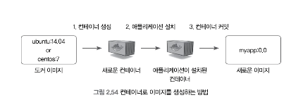
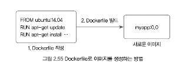
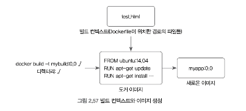
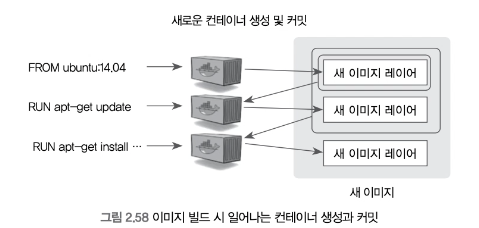
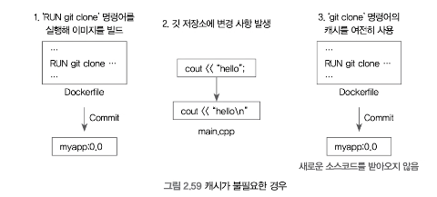
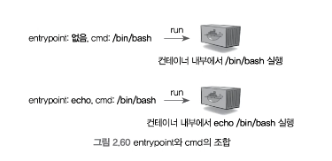
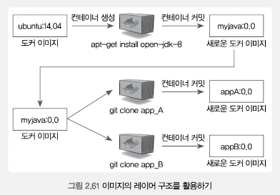

# 2.4 Dockerfile
## 2.4.1 이미지를 생성하는 방법

개발한 애플리케이션을 컨테이너화할 때 가장 먼저 생각나는 방법은 아래와 같다.

1. 아무것도 존재하지 않는 이미지(우분투, CentOS 등)로 컨테이너를 생성
2. 애플리케이션을 위한 환경을 설치하고 소스코드 등을 복사해 잘 동작하는 것을 확인
3. 컨테이너를 이미지로 커밋



이 방법을 사용하면 애플리케이션이 동작하는 환경을 구성하기 위해 일일이 수작업으로 패키지를 설치하고 소스코드를 깃(Git)에서 복제하거나 호스트에서 복사해야한다.

물론 직접 컨테이너에서 애플리케이션을 구동해보고 이미지로 커밋하기 때문에 이미지의 동작을 보장할 수 있다는 점도 있다.



도커는 위와 같은 일련의 과정을 손쉽게 기록할 수 있는 빌드 명령어를 제공한다.

완성된 이미지를 생성하기 위한 작업들을 수행한다.
- 컨테이너에 설치해야 하는 패키지
- 추가해야 하는 소스코드
- 실행해야 하는 명령어, 쉘 스크립트 등

이를 #Dockerfile 이라 한다.

#### Dockerfile
- 작업을 기록한 파일
- 빌드 명령어는 Dockerfile을 읽어 이미지를 생성한다.
- 직접 컨테이너를 생성하고 이미지로 커밋해야 하는 번거로움을 덜 수 있다.
- 깃과 같은 개발도구를 통해 애플리케이션의 빌드 및 배포를 자동화할 수 있다.
- 도커 허브 등을 통해 배포할 대 이미지 자체를 배포하는 대신 Dockerfile을 배포할 수 있다.

#### 그냥 컨테이너에 작업을 마치고 이미지로 커밋하면 되는거 아니야?
애플리케이션을 컨테이너화하기 위한 장기적인 시점에서 Dockerfile을 작성하는 것은 이미지를 생성하는 방법을 기록하며, 이미지의 빌드, 배포 측면에서도 매우 유리하다.
애플리케이션에 필요한 패키지 설치 등을 명확히 할 수 있고 이미지 생성을 자동화할 수 있으며, 쉽게 배포할 수 있기 때문이다.

## 2.4.2 Dockerfile 작성

웹 서버를 생성하는 예

```bash
mkdir dockefile && dockerfile
echo test >> test.html
```

새롭게 생성한 디렉터리 내부에서 아래 내용으로 Dockerfile이라는 이름의 파일을 저장한다.
아래의 Dockerfile은 이미지에 아파치 웹 서버를 설치한 뒤, 로컬에 있는 test.html 파일을 웹 서버로 접근할 수 있는 컨테이너의 디렉터리인 `/var/www/html` 에 복사한다.

```dockerfile
FROM ubuntu:14.04
MAINTAINER alicek106
LABEL "purpose"="practice"
RUN apt-get update
RUN apt-get install apache2 -y
ADD test.html /var/www/html
WORKDIR /var/www/html
RUN ["/bin/bash", "-c", "echo hello >> test2.html"]
EXPOSE 80
CMD apachectl -DFOREGROUND
```

>도커 엔진은 Dockerfile을 읽어 들일 때 기본적으로 현재 디렉터리에 있는 Dockerfile 이라는 이름을 가진 파일을 선택한다.
>Dockerfile은 빈 디렉터리에 저장하는 것이 좋은데,
>이는 이미지를 빌드할 때 사용되는 컨텍스트때문이다. (2.4.3.2)

Dockerfile에서 사용되는 명령어에는 여러 가지가 있지만
여기서는 FROM, RUN, ADD 등 기초적인 명령어를 우선적으로 다루었다.

Dockerfile은 한 줄이 하나의 명령어가 되고,
명령어를 명시한 뒤에 옵션을 추가하는 방식이다.

**명령어를 소문자로 표기해도 상관은 없지만 일반적으로 대문자로 표기한다.**

- `FROM`
    - **생성할 이미지의 베이스가 될 이미지를 뜻함.**
    - Dockerfile 작성 시 한 번 이상 입력해야 한다.
    - 이미지 이름의 포맷은 `docker run` 명령어에서 이미지 이름을 사용할 때와 같다.
    - 사용하려는 이미지가 도커에 없다면 자동으로 pull 한다.
- `MAINTAINER`
    - **이미지를 생성한 개발자의 정보를 나타낸다.**
    - 일반적으로 Dockerfile을 작성한 사람과 연락할 수 있는 메일 등을 입력한다.
    - **도커 1.13.0 버전 이후로 사용하지 않는다.**
    - 대신 LABEL로 교체해 표현할 수 있다.
        - `LABEL maintainer "vespucci95 <developer.vespucci95@gmail.com>"`
- `LABEL`
    - **이미지에 메타데이터를 추가한다.**
    - `키:값`의 형태로 저장되며, 여러 개의 메타데이터가 저장될 수 있다.
    - 추가된 메타데이터는 `docker inspect`명령어로 이미지의 정보를 구해서 확인할 수 있다.
- `RUN`
    - **이미지를 만들기 위해 컨테이너 내부에서 명령어를 실행한다.**
    - Dockerfile을 이미지로 빌드하는 과정에서는 별도의 입력이 불가능하기 때문에 `apt-get install apache2`와 같은 명령어에서 설치할 것일지 선택하는 `Y/N` 을 `Yes` 로 설정해야 한다. **이미지를 빌드할 때 별도의 입력을 받아야 하는 RUN이 있다면 build 명령어는 이를 오류로 간주하고 빌드를 종료한다.**
    - `RUN ["/bin/bash", "echo >> test2.html"]`과 같이 입력하면 `/bin/bash` 셸을 이용해 `echo hello >> test2.html`을 실행한다.
        - 이처럼 배열의 형태로 사용할 수 있다.
        - `RUN ["실행 가능한 파일", "명령줄 인자1", "명령줄 인자2", ...]`
        - JSON 배열 입력 형식을 따라 JSON 형식과 일치해야 한다.
            - 단, JSON 배열 형태로 Dockerfile의 명령어를 사용하면 셸을 실행하지 않는다.
            - 예를들어 `["echo", "$MY_ENV"]`는 `$MY_ENV` 환경변수를 사용하지 않는다.
            - 이 형태로 셸을 사용하려면 `["sh", "-c", "echo $MY_ENV"]`와 같이 사용하는 것이 좋다.
- `ADD`
    - **파일을 이미지에 추가한다.**
    - 추가하는 파일은 Dockerfile이 위치한 디렉터리인 컨텍스트에서 가져온다.
    - JSON 배열의 형태로 `["추가할 파일 이름", ... "컨테이너에 추가될 위치"]`와 같이 사용할 수 있다. 추가할 파일명은 여러 개를 지정할 수 있으며 배열의 마지막 원소가 컨테이너에 추가될 위치이다.
- `WORKDIR`
    - **명령어를 실행할 디렉터리를 나타낸다.**
    - 배시 셸에서 cd 명령을 입력하는 것과 같은 기능을 한다.
        - 에를들어 `WORKDIR /var/www/html` 이 실행되고 나서 `RUN touch test`를 실행하면 `/bar/www/html/`디렉터리에 test파일이 생성된다.
    - 여러번 사용하면 cd 명령어를 여러번 사용한 것과 같다.
        - `WORKDIR /var`
        - `WORKDIR www/html`
        - 위 입력은 `/var/www/html` 과 같다.
- `EXPOSE`
    - **Dockerfile의 빌드로 생성된 이미지에서 노출할 포드를 설정한다.**
    - EXPOSE를 설정한 이미지로 컨테이너를 생성했다고 해서 이 포트와 호스트의 포트와 바인딩되는 것은 아니며, 단지 컨테이너의 80번 포트를 사용할 것임을 나타내는 것 뿐이다.
    - EXPOSE 컨테이너를 생성하는 run 명령어에서 모든 노출된 컨테이너의 포트를 호스트에 퍼블리시 하는 -P 플래그(flag) 와 함께 사용된다.
- `CMD`
    - 컨테이너가 시작될 때마다 실행할 명령어(커맨드)를 설정한다.
    - Dockerfile에서 한 번만 사용할 수 있다.
    - CMD는 run 명령어의 이미지 이름 뒤에 입력하는 커맨드와 같은 역할을 하지만 docker run 명령어에서 커맨드 명령줄을 입력하면 Dockerfile에서 사용한 CMD의 명령어는 run의 커맨드로 덮어 쓰인다.
        - 이와 마찬가지로 ubuntu:14.04 이미지에 내당된 커맨드인 /bin/bash 또한 Dockerfile의 CMD에 의해 덮어쓰인다.
    - JSON 배열 형태인 `["실행 가능한 파일", "명령줄 인자1", "명령줄 인자2", ...]` 형태로 사용할 수 있다.
    - CMD는 `ENTRYPOINT`의 명령줄 인자로 사용될 수도 있다.

## 2.4.3 Dockerfile 빌드

### 2.4.3.1 이미지 생성

Dockerfile을 빌드해보자.

`docker build -t mybuild:0.0 ./`

- -t : 생성될 이미지의 이름을 설정한다. 사용하지 않으면 16진수 형태의 이미지가 저장된다.
- 명령어의 끝에는 Dockerfile이 지정된 경로를 입력한다.

생성된 이미지로 컨테이너를 실행해보자.

`docker run -d -P --name myserver mybuild:0.0`

- - P : 이미지에 설정된 EXPOSE의 모든 포트를 호스트에 연결하도록 설정한다.
    - 위 예시의 Dockerfile에서 EXPOSE를 80번으로 설정했으며 이미지에 '컨테이너의 80번 포트를 사용한다'는 것을 의미한다.
    - 즉 이미지를 생성하기 위한 Dockerfile을 작성하는 개발자로서는 EXPOSE를 이용해 이미지가 실제로 사용될 때 어떤 포트가 사용돼야 하는지 명시할 수 있으며, 이미지를 사용하는 입장에서는 컨테이너의 애플리케이션이 컨테이너 내부에서 어떤 포트를 사용하는지 알 수 있게 된다.
    - EXPOSE로 노출된 포트를 호스트에서 사용 가능한 포트에 차례로 연결하므로 이 컨테이너가 호스트의 어떤 포트와 연결됐는지 확인할 필요가 있다.

`docker ps`, `docker port`

해당 명령어로 컨테이너와 연결된 호스트의 포트를 확인할 수 있다.
호스트 IP와 이 포트로 컨테이너의 웹 서버에 접근할 수 있다.

Dockerfile에서
ADD 로 test.html 파일을
RUN 으로 test2.html 파일을
웹 서버 디렉터리인 /var/www/html 에 추가하였으므로

`[호스트 IP]:[포트]/test.html` 혹은 `test2.html` 로 접근해 각 파일의 내용을 확인할 수 있다.

```text
docker port myserver
80/tcp -> 0.0.0.0:55000
```

Dockerfile에 이미지 라벨을 purpose=practice로 설정했으므로 docker images 명령어의 필터에 이 라벨을 적용할 수 있다.
- --filter :해당 라벨을 가지는 이미지, 즉 위에서 생성한 이미지를 출력한다.

`docker images --filter "label=purpose=practice"`

>라벨은 도커 이미지뿐만 아니라 컨테이너, 도커 엔진 등에 메타데이터를 추가할 수 있는 유용한 방법이다.
>docker run 명령어에 서--label 옵션을 사용할 수 있으며
>docker ps 명령어에서 --filter 옵션을 통해 적용할 수 있다.
>라벨은 부가적인 정보를 부여함으로써 원하는 조건의 컨테이너, 이미지 등을 쉽게 찾을 수 있도록 도와주기 때문에 반드시 기억하도록 하자.

### 2.4.3.2 빌드 과정 살펴보기

build 명령어를 입력했을 때 다양한 내용이 출력됐다.
Dockerfile의 RUN을 실행해서 컨테이너 내부에서 발생한 표준 출력이지만
이미지를 생성하는 부분은 조금 눈여겨볼 필요가 있다.

#### 빌드 컨텍스트




이미지 빌드를 시작하면 가장 먼저 빌드 컨텍스트를 읽어들인다.

**빌드 컨텍스트**
이미지를 생성하는 데 필요한 각종 파일, 소스코드, 메타데이터 등을 담고 있는 디렉터리를 의미
Dockerfile이 위치한 디렉터리가 빌드 컨텍스트가 된다.

Dockerfile에서 빌드될 이미지에 파일을 추가할 때 사용된다.
- 이미지 파일 추가방법은 ADD 외에 COPY가 있는데 이 명령어들은 빌드 컨텍스트의 파일을 이미지에 추가한다.

컨텍스트에 대한 정보는 이미지를 빌드할 때 출력된 내용 중 맨 위에 위치한다.

```text
Sending build context to Docker daemon 3.584kb
...
```

컨텍스트는 build 명령어의 맨 마지막에 지정된 위치에 있는 파일을 전부 포함한다.
깃(Git)과 같은 외부 URL에서 Dockerfile을 읽어 들인다면 해당 저장소(Repository)에 있는 파일과 서브 모듈을 포함한다.

**따라서 Dockerfile이 위치한 곳에는 이미지 빌드에 필요한 파일만 있는 것이 바람직하다.**

컨텍스트는 단순 파일뿐만 아니라 하위 디렉터리도 전부 포함하게 되므로 빌드에 불필요한 파일이 포함된다면 빌드 속도가 느려질뿐더러 호스트의 메모리를 지나치게 점유할 수 있다.

이를 방지하기위해 `.gitignore` 와 유사한 `.dockerignore` 라는 파일을 작성하면
이 파일에 명시된 이름의 파일을 컨텍스트에서 제외한다.

`.dockerignore` 는 컨텍스트의 최상위 경로, build 명령어에서 맨 마지막에 오는 경로인 Dockerfile이 위치한 경로와 같은곳에 위치해야한다.

`.dockerignore`의 예

```text
test2.html
*.html
*/*.html
test.htm?
```

제외 목록에 해당하지만 특수한 파일만 포함하도록 설정하고 싶다면 `!` 를 사용한다.
이는 특정 파일을 제외하지 않음을 뜻한다.

```text
*.html
!test*.html
```

html 파일을 모두 제외하지만 test로 시작하는 html 파일은 컨텍스트에서 제외하지 않는다.

#### Dockerfile을 이용한 컨테이너 생성과 커밋

build 명령어는 Dockerfile에 기록된 대로 컨테이너를 실행한 뒤 완성된 이미지를 만들어낸다.
**그렇지만 이미지로 만드는 과정이 하나의 컨테이너에서 일어나는 것은 아니다.**

이미지를 빌드할때 나오는 출력 결과를 통해 어느 정도 짐작할 수 있다.

Dockerfile에서 명령어 한 줄이 실행될 때마다 이전 Step에서 생성된 이미지에 의해 새로운 컨테이너가 생성되며, Dockerfile에 적힌 명령어를 수행하고 다시 새로운 이미지 레이어로 저장된다.



따라서 이미지의 빌드가 완료되면 Dockerfile의 명령 줄 수만큼의 레이어가 존재하게 되며,
중간에 컨테이너도 같은 수만큼 생성되고 삭제된다.

#### 캐시를 이용한 이미지 빌드

한 번 이미지 빌드를 마치고 난 뒤 다시 같은 빌드를 진행하면 이전의 이미지 빌드에서 사용했던 캐시를 사용한다.

이전에 빌드했던 Dockerfile에 같은 내용이 있다면 build 명령어는 이를 새로 빌드하지 않고 같은 명령어 줄까지 이전에 사용한 이미지 레이러를 활용해 이미지를 생성한다.

이는 같은 명령어를 여러 번 실행해야 하는 여러 개의 이미지를 빌드하거나 빌드 도중 Dockerfile의 문법과 기타 오류가 발생했을 때 불필요하게 다시 명령어를 실행하지 않게 한다.

>이미지 빌드 중 오류가 발생했을 때는 build 명령어가 중지되며
>이미지 레이어 생성을 위해 마지막으로 생성된 임시 컨테이너가 삭제되지 않은 채로 남게 된다.
>또한 이미지의 빌드가 완전하지 않기 때문에 -t 옵션의 값으로 지정된 이미지의 이름이 아닌
>`<none>:<none>`으로 이미지가 생성된다.
>이러한 이미지를 생성하기 위해서는 rmi 명령어에 docker images 의 출력결과의 이미지 ID를 입력한다.
>`docker rmi 이미지 ID`



그러나 캐시 기능이 너무 친절한 나머지 캐시 기능이 필요하지 않을 때도 있다.
깃허브 같은 소스코드 저장소에서 git clone 등의 명령어를 사용해 빌드할 때가 여기에 해당한다.

캐시를 사용하지 않으려면 build 명령어에 `--no-cache` 옵션을 추가한다.
`--no-cache` 옵션을 사용하면 기존 빌드에 사용된 캐시를 사용하지 않고 처음부터 다시 이미지 레이어로서 빌드한다.

`docker build --no-cache -t mybuild:0.0`

또한 캐시로 사용할 이미지를 직접 지정할 수도 있다.
특정 Dockerfile을 확장해서 사용한다면 기존의 Dockerfile로 빌드한 이미지를 빌드 캐시로 사용할 수 있다.
예를 들어, 도커 허브의 nginx 공식 저장소에서 nginx:latest 이미지를 빌드하는 Dockerfile에 일부 내용을 추가해 사용한다면 로컬의 nginx:latest 이미지를 캐시로 사용할 수 있다.

`docker build --cache-from nginx -t my_extend_nginx:0.0`

### 2.4.3.3 멀티 스테이지를 이용한 Dockerfile 빌드하기

일반적으로 애플리케이션을 빌드할 때는 많은 의존성 패키지와 라이브러리를 필요로 한다.
예를 들어, Go로 작성된 소스코드를 빌드하기 위해서는 Go 와 관련된 빌드 툴과 라이브러리가 미리 설치되어 있어야 한다.

Dockerfile에서 Go 소스코드를 빌드하기 위해서 가장 먼저 생각나는 방법은
1. Go와 관련된 도구들이 미리 설치된 이미지를 FROM에 명시
2. RUN 명령어로 소스코드를 컴파일

```go
package main
import "fmt"

func main() {
	fmt.Println("hello world")
}
```

```dockerfile
FROM golang
ADD main.go /root
WORKDIR /root
RUN go build -o /root/mainApp /root/main.go
CMD ["./mainApp"]
```

단순히 helloworld 를 실행하는 이미지임에도 800mb에 달한다.
이는 소스코드 빌드에 사용된 각종 패키지 및 라이브러리가 불필요하게 이미지 크기를 차지하고 있는 것이다.

17.0.5 버전 이상을 사용하는 도커 엔진이라면 이미지 크기를 줄이기위해
**멀티 스테이지(Multi-state) 빌드 방법을 사용할 수 있다.**

멀티 스테이지 빌드
하나의 Dockerfile 안에 여러 개의 FROM 이미지를 정의함으로써 빌드 완료 시 최종적으로 생성될 이미지의 크기를 줄이는 역할을 한다.

이번에 위 Dockerfile에서 빌드된 이미지와 동일한 역할을 하지만, 멀티 스테이지 빌드를 사용해 이미지를 빌드하는 예시를 살펴보자.

```dockerfile
FROM golang
ADD main.go /root
WORKDIR /root
RUN go build -o /root/mainApp /root/main.go

FROM alpine:latest
WORKDIR /root
COPY --from=0 /root/mainApp .
CMD ["./mainApp"]
```

일반적인 Dockerfile 과는 다르게 2개의 FROM을 통해 2개의 이미지가 명시되었다.

첫 번째 FROM
- 명시된 golang 이미지는 이전과 동일하게 main.go 파일을 /root/mainApp으로 빌드했다.
  두 번째 FROM
- 아래에서 사용된 COPY 명령어는 첫 번째 FROM에서 사용된 이미지의 최종 상태에 존재하는 /root/mainApp 파일을 두 번째 이미지인 alpine:latest에 복사한다.
- 이때 --from=0 은 첫 번째 FROM에서 빌드된 이미지의 최종 상태를 의미한다.

**즉 첫 번째 FROM 이미지에서 빌드한 /root/mainApp 파일을 두 번째 FROM에 명시된 이미지인 alpine:latest 이미지에 복사하는 것이다.**

>alpine이나 busybox와 같은 이미지는 우분투나 CentOS에 비해 이미지 크기가 매우 작지만 기본적인 프로그램 실행에 필요한 런타임 요소가 포함되어 있는 리눅스 배포판 이미지이다.
>이러한 이미지를 활용하면 경량화된 애플리케이션 이미지를 간단히 생성할 수 있다는 장점이 있다.

Dockerfile을 빌드한 뒤 빌드 이미지 크기를 확인해보자
이전과 동일한 역항르 하는 이미지임에도 불구하고 이미지의 최종 크기가 크게 줄은것을 확인할 수 있을것이다.

이와 같이 멀티 스테이지 빌드는 반드시 필요한 실행 파일만 최종 이미지에 결과물에 포함시킴으로써 이미지 크기를 줄일 때 유용하게 사용할 수 있다.

>멀티 스테이지 빌드를 사용하는 Dockerfile은 2개 이상의 이미지를 사용할 수 있다.
>각 이미지는 먼저 FROM에서 명시된 순서대로 0, 1..의 순으로 차례대로 구분되어 사용된다.
>이를 활용하면 여러 개의 이미지를 사용해 멀티 스테이지 빌드를 사용할 수 있다.

```dockerfile
FROM golang
ADD main.go /root
WORKDIR /root
RUN go build -o /root/mainApp /root/main.go

FROM golang
ADD main2.go /root
WORKDIR /root
RUN go build -o /root/mainApp2 /root/main2.go

FROM alpine:latest
WORKDIR /root
COPY --from=0 /root/mainApp .
COPY --from=0 /root/mainApp2 .
```

또는 특정 단계의 이미지에 별도의 이름을 정의해서 사용할 수 있다.

아래 에는 첫 번째 단계의 최종이미지에 builder라는 이름을 붙여 사용한 예시이다.

```dockerfile
FROM golang as builder
ADD main.go /root
WORKDIR /root
RUN go build -o /root/mainApp /root/main.go
FROM alpine:latest
WORKDIR /root
COPT --from=builder /root/mainApp .
CMD ["./mainApp"]
```

## 2.4.4 기타 Dockerfile 명령어

같단한 애플리케이션을 이미지로 빌드한다면 지금까지의 내용으로 충분하지만
가끔 Dockerfile에서 더 많은 작업을 수행해야 할 때가 있다.

자주 쓰이는 명령어와 각종 build 옵션에 대해 알아보자.

### 2.4.4.1 ENV, VOLUME, ARG, USER
- ENV
    - Dockerfile에서 사용될 환경 변수를 지정한다.
- VOLUME
    - 빌드된 이미지로 컨테이너를 생성했을 때 호스트와 공유할 컨테이너 내부의 디렉터리를 설정한다.
- ARG
    - build 명령어를 실행할 때 추가로 입력을 받아 Dockerfile 내에서 사용될 변수의 값을 설정한다.
- USER
    - USER로 컨태이너 내에서 사용될 사용자 계정의 이름이나 UID를 설정하면 그 아래의 명령어는 해당 사용자 권한으로 실행된다.
    - **루트 권한이 필요하지 않다면 USER를 사용하는 것을 권장한다.**

### 2.4.4.2 Onbuild, Stopsignal, Healthcheck, Shell
- ONBUILD
    - 빌드된 이미지를 기반으로 하는 다른 이미지가 Dockerfile로 생성될 때 실행할 명령어를 추가한다.
- STOPSIGNAL
    - 컨테이너가 정지될 때 사용될 시스템 콜의 종류를 지정한다. (default: SIGTERM)
    - docker run 명령어에서 --stop-signal 옵션으로 컨테이너에 개별적으로 설정할 수도 있다.
    - 이는 docker stop 뿐 아니라 docker kill 에도 적용된다.
- HEALTHCHECK
    - 이미지로부터 생성된 컨테이너에서 동작하는 애플리케이션의 상태를 체크하도록 설정한다.
    - 컨테이너 내부에서 동작중인 애플리케이션의 프로세스는 종료되지는 않으나 애플리케이션이 동작하고 있지 않은 상태를 방지하기 위해 사용될 수 있다.
- SHELL
    - 이미지의 기본 셸을 설정한다.
    - Dockerfile에서 사용하는 셸은 리눅스에서 "/bin/sh -c", 윈도우에서 "cmd /S /C" 이다.
    - 셸을 따로 지정하고 싶을 수도 있다. 그런 경우에 사용한다.
### 2.4.4.3 ADD, COPY

- COPY
    - 로컬 디렉터리에서 읽어 들인 컨텍스트로부터 이미지에 파일을 복사하는 역할을 한다.
    - 형식은 ADD와 같다.

```text
COPY test.hmtl /home/
COPY ["test.html", "/home/"]
```

#### ADD와 COPY의 차이점은 무엇인가?
차이점이 없는 것처럼 보일 것이다. 기능 그 자체만으로 봤을때는 같다.
그러나 COPY는 로컬의 파일만 이미지에 추가할 수 있지만
ADD는 외부 URL 및 tar 파일에서도 파일을 추가할 수 있다는 점에서 다르다.
즉 COPY의 기능이 ADD에 포함되는 셈이다.
ADD 명령어를 사용하여 tar 파일을 그대로 추가하게되면 자동으로 해제해서 추가한다.

#### ADD를 사용하는 것은 권장되지 않는다.
그 이유는 ADD로 URL이나 tar 파일을 추가할 경우 이미지에 정확히 어떤 파일이 추가될지 알 수 없기 때문이다.
그에 비해 COPY는 로컬 컨텍스트로부터 파일을 직접 추가하기 때문에 빌드 시점에도 어떤 파일이 추가될지 명확하다.

### 2.4.4.4 ENTRYPOINT, CMD

CMD는 컨테이너가 시작될 때 실행될 명령어를 설정한다.
이는 docker run 명령어에 맨 뒤에 입력했던 커맨드와 같은 역할을 한다.

그러나 CMD와 유사한 ENTRYPOINT라는 명령어도 존재한다.
역할 자체는 비슷하지만 서로 역할을 담당하는 명령어이다.

#### ENTRYPOIN와 CMD의 차이점

entrypoint는 커맨드와 동일하게 컨테이너가 시작될 때 수행할 명령을 지정한다는 점에서 같다.
그러나 entrypoint는 커맨드를 인자로 받아 사용할 수 있는 스크립트의 역할을 할 수 있다는 점에서 다르다.



entrypoint가 설정되지 않았다면 cmd에 명령어를 그대로 실행하지만
설정되었다면 cmd는 단지 entrypoint에 대한 인자의 기능을 한다.

#### entrypoint를 이용한 스크립트 실행

앞에서 살펴본 것처럼 entrypoint에 하나의 명령어만 입력할 수도 있찌만 일반적으로 스크립트 파일을 entrypoint의 인자로 사용해 컨테이너가 시잘될 대마다 해당 스크립트 파일을 실행하도록 설정한다.

스크립트 파일을 entrypoint에 설정하려면 스크립트 파일의 이름을 entrypoint의 인자로 입력한다.

`docker run -it --name entrypoint_sh --entrypoint="/test.sh" ubuntu:14.04 /bin/bash`

단 실행할 스크립트 파일은 컨테이너 내부에 존재해야한다.
이는 이미지 내에 스크립트 파일이 존재해야 한다는 것을 의미한다.

Dockerfile 중 이미지에 파일을 추가하는 좋은 방법이 있다. COPY or ADD

이미지를 빌드할 때 이미지가 작동하기 위해선 다음 단계를 거친다.
1. 어떤 설정 및 실행이 필요한지에 대해 스크립트로 정리
2. ADD 또는 COPY로 스크립트를 이미지로 복사
3. ENTRYPOINT를 이 스크립트로 설정
4. 이미지를 빌드해 사용
5. 스크립트에 필요한 인자는 docker run 명령어에서 cmd로 entrypoint의 스크립트에 전달

>Dockerfile에서 스크립트뿐 아니라 CMD와 ENTRYPOINT를 조합해서 사용할 수 있다.

```dockerfile
ENTRYPOINT ["echo"]
CMD ["hello", "world"]
```

그러나 Dockerfile에 명시된 CMD 와 ENTRYPOINT는 docker run 명령어에서 --entrypoint 옵션과 마지막 옵션으로 재정의해 사용하면 재정의한 명령어로 덮어 쓰인다.

예제

```dockerfile
FROM ubuntu:14.04
RUN apt-get update
RUN apt-get install apache2 -y
ADD entrypoint.sh /entrypoint.sh
RUN chmod +x /entrypoint.sh
ENTRYPOINT ["/bin/bash", "/entrypoint.sh"]
```

entrypoint.sh : 인자로 받은 2개의 값을 echo로 출력하고 아파치 웹 서버를 실행하는 내용
```shell
echo $1 $2
apachectl -DFOREGROUND
```

빌드한 뒤 이미지로 컨테이너를 생성해 컨테이너 내부에서 출력된 내용을 확인하면 정상적으로 작동되는 것을 볼 수 있다.

`docker build -t entrypoint_image:0.0 ./`
`docker run -d --name entrypoint_apache_server entrypoint_image:0.0 first second`
`docker logs entrypoint_apache_server`

#### JSON 배열 형태와 일반 방식의 차이점

CMD 또는 ENTRYPOINT 에 설정하려는 명령어를 /bin/sh 로 사용할 수 없다면 JSON 배열의 형태로 명령어를 설정해야한다.
JSON 배열 형태가 아닌 CMD와 ENTRYPOINT를 사용하면 실제로 이미지를 생성할때 cmd와 entrypoint에 /bin/sh -c 가 앞에 추가되기 때문이다.

```dockerfile
CMD echo test
# -> /bin/sh -c echo test

ENTRYPOINT /entrypoint.sh
# -> /bin/sh -c /entrypoint.sh

# 실제 컨테이너에서 실행되는 명령어는 /bin/sh -c entrypoint.sh /bin/sh -c echo test
```

CMD, ENTRYPOINT 를 JSON 형태로 입력하면 그대로 이미지에서 사용된다.

```dockerfile
CMD ["echo", "test"]
# -> echo test

ENTRYPOINT ["/bin/bash", "/entrypoint.sh"]
# -> /bin/bash /entrypoint.sh

# 실제로 컨테이너에서 실행되는 명령어는 /bin/bash entrypoint.sh echo test
```

## 2.4.5 Dockerfile로 빌드할 때 주의할 점

Dockerfile을 사용하는데 좋은 습관(practice)
- 하나의 명령어를 \\(역슬래시)로 나눠서 가독성을 높임
- .dockerignore 파일을 작성해 불필요한 파일을 빌드 컨텍스트에 포함하지 않는 것
- 빌드 캐시를 이용해 기존에 사용했던 이미지 레이어를 재사용하는 방법

좋은 예 : 백슬래시로 가독성을 높임

```dockerfile
RUN apt-get install package-1 \
package-2 \
package-3
```

나쁜 예 : 이미지를 비효율적으로 빌드하는 예시

```dockerfile
FROM ubuntu:14.04
RUN mkdir /test
RUN fallocate -l 100m /test/dummy
RUN rm /test/dummy
```

fallocate 명령어는 100mb 크기의 파일을 가상으로 만들어 컨테이너에 할당하고
이를 이미지 레이어로 빌드한다.
그리고 이 파일을 rm 명령어로 삭제한다.
즉 빌드가 완료되어 최종 생성된 이미지에는 100mb 크기의 /dummy가 존재하지 않는다.

그러나 위 Dockerfile로 빌드하면 어떻게 될까?
일반적으로 생각하면 ubuntu:14.04 이미지의 크기와 같아야 한다.
하지만 위 Dcokerfile로 빌드된 이미지의 크기는 ubuntu:14.04 에 100mb 를 더한 크기를 차지하게된다.

파일이 존재하지 않는데 왜 이렇게 되었을까?
`RUN rm /test/dummy` 명령어로 파일을 삭제한 상태로 이미지를 빌드했기 때문이다.
이는 컨테이너를 이미지로 생성할 때 컨테이너에서 변경된 사항만 새로운 이미지 레이어로 생성하는 방식의 단점 중 하나이다.

`RUN rm /test/dummy` 명령어를 수행해 100mb 크기의 파일을 삭제하더라도 이는 "파일을 삭제했다"라는 변경사항으로서의 레이어로 새롭게 저장될 뿐, 실제 100mb 크기의 파일은 이전 레이어에 남아있기 때문이다.

즉 실제로 컨테이너에서 사용하지 못하는 파일이 이미지 레이어로 존재하기 때문에 저장공간은 차지하지만 실제로는 의미가 없는 저장 공간일 수도 있는 것이다.

#### 방지하는 방법

Dockerfile을 작성할 때 && 로 각 RUN 명령을 하나로 묶는 것이다.

```dockerfile
FROM ubuntu:14.04
RUN mkdir /test && \
fallocate -l 100m /test/dummy && \
rm /test/dummy
```

RUN이  하나의 이미지 레이어아 된다는 것을 생각해보면 매우 간단한 해결책이다.
**이 방법은 이미지 레이어 수를 줄이는 데도 활용할 수 있다.**
여러 개의 RUN 명령어가 하나로 묶일 수 있다면 이미지 레이어의 개수 또한 하나로 줄어들기 때문이다.

>도커의 레이어 이미지 구조는 위의 경우에 단점으로 작용할 수 있지만 잘 활용하면 장점으로 작용할 수 있다.

예를 들어 A,B 애플리케이션이 500mb 크기의 같은 라이브러리를 사용해야 한다면 각 애플리케이션의 이미지에 라이브러리를 각각 설치하기 보다는 500mb 크기의 라이브러리 이미지를 미리 만들어 놓은 다음 이 이미지를 이용해 A, B 애플리케이션의 이미지를 생성함으로써 저장 곤간을 절약할 수 있다.
즉, A와 B 애플리케이션의 이미지는 이 라이브러리로 인해 각각 500mb를 차지해 1GB의 저장 공간을 사용하는 것이 아닌, 500MB의 이미지 레이어를 공유하게 된다.



또한 이미지를 배포할 때도 애플리케이션에 해당하는 변경된 부분만 내려받으면 되므로 이미지를 빠르게 전송할 수 있다.

----

다른 사람이 빌드한 이미지에 불필요한 레이어가 들어있다면 해당 이미지로 컨테이너를 생성하고 docker export, import 명령어를 사용해 컨테이너를 이미지로 만듦으로써 이미지의 크기를 줄일 수 있다.

익스포트(export)된 파일을 임포트해서 다시 도커에 저장하면 레이어가 한개로 줄어든다.
그러나 이전 이미지에 저장돼 있던 각종 이미지 설정은 잃어버리게 되므로 주의해야 한다.

```text
# docker run -it -d --name temp falloc_100mb:0.0
d7f99...

# docker export temp | docker import - falloc_100mb:0.1
sha256:742...

# docker run -it -d --name temp2 falloc_100mb:0.1
Error response from daemon: No command specified.
```

위 예는 베이스 이미지인 ubuntu:14.04 이미지의 커맨드 명령어가 손실되어 설정되지 않았고
entrypoint 또한 설정되지 않아 에러를 출력하며 컨테이너가 생성되지 않았다.
