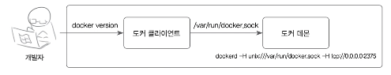
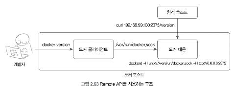
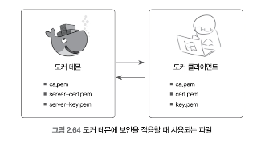
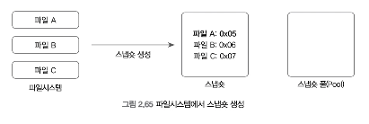
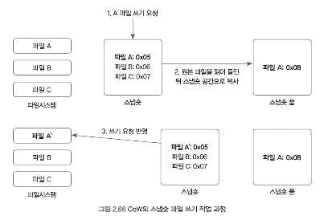
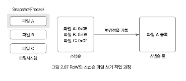
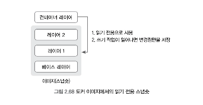
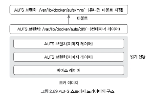
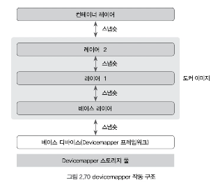
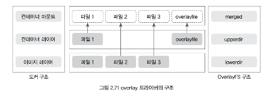

# 2.5 도커데몬
도커 자체에 대해 다뤄보자.
도커 자체에서 사용할 수 있는 여러 옵션을 익히면 컨테이너와 이미지를 좀 더 쉽게 사용할 수 있을뿐더러
도커를 이용한 개발이 더욱 수월해질 것이다.

## 2.5.1 도커의 구조

도커를 사용할 때 docker라는 명령어를 맨 앞에 붙여서 사용해왔다.
그렇다면 도커는 실제로 어디에 있는 걸까?

`wihch` 명령어로 도커 명령어의 위치를 알 수 있다.

```bash
which docker
/usr/bin/docker
```

실행중인 도커 프로세스를 확인해보자.

`ps aux | grep docker`

컨테이너나 이미지를 다루는 명령어는 `/usr/bin/docker` 에서 실행되지만
도커 엔진의 프로세스는 `/usr/bin/dockerd` 파일로 실행되고 있다.

**이는 docker 명령어가 실제 도커 엔진이 아닌 클라이언트로서의 도커이기 때문이다.**

**도커의 구조는 크게 두 가지로 나뉜다.**
- 클라이언트로서의 도커
- 서버로서의 도커

실제로 컨테이너를 생성하고 실행하며 이미지를 관리하는 주체는 **도커 서버**이다.
이는 dockerd 프로세스로서 동작한다.

#### 도커 데몬

>도커 엔진은 외부에서 API 입력을 받아 도커 엔진의 기능을 수행하는데,
>도커 프로세스가 실행되어 서버로서 입력을 받을 준비가 된 상태를 **도커 데몬**이라고 이야기한다.

#### 도커 클라이언트

>도커 데몬은 API 입력을 받아 도커 엔진의 기능을 수행하는데,
>이 API를 사용할 수 있도록 CLI를 제공하는 것이 도커 클라이언트이다.

사용자가 docker로 시작하는 명령어를 입력하면 도커 클라이언트를 사용하는 것이다.
도커 클라이언트는 입력된 명령어를 로컬에 존재하는 도커 데몬에게 API로서 전달한다.

이때 도커 클라이언트가 사용하는 **유닉스 소켓**은 같은 호스트 내에 있는 도커 데몬에게 명령을 전달할 때 사용한다.

이때 도커 클라이언트는 `/var/run/docker.sock`에 위치한 유닉스 소켓을 통해 도커 데몬의 API를 호출한다.
도커 클라이언트가 사용하는 유닉스 소켓은 같은 호스트 내에 있는 도커 데몬에게 명령을 전달할 때 사용된다.
tcp로 원격에 있는 도커 데몬을 제어하는 방법은 이후에 설명한다.



즉 터미널이나 PuTTY 등으로 도커가 설치된 호스트에 접속해 docker 명령어를 입력하면 아래와 같은 과정으로 도커가 제어된다.
1. 사용자가 docker version 같은 도커 명령어를 입력
2. /usr/bin/docker는 /var/run/docker.sock 유닉스 소켓을 사용해 도커 데몬에게 명령어를 전달한다.
3. 도커 데몬은 임이 명령어를 파싱하고 명령어에 해당하는 작업을 수행한다.
4. 수행 결과를 도커 클라이언트에게 반환하고 사용자에게 결과를 출력한다.

**이것은 아무런 설정을 하지 않았을 때 일반적으로 도커 데몬을 제어하는 순서이다.**
도커 데몬에 각종 옵션을 추가해 실행한다면 위 순서에 별도의 과정이 포함될 수 있다.

---

## 2.5.2 도커 데몬 실행

우분투에서는 도커가 설치되면 자동으로 서비스로 등록되므로 호스트가 재시작되더라도 자동으로 실행된다.
도커 데몬은 아래와 같은 명령어로 시작, 정지할 수 있다.

```bash
service docker start
service docker stop
```

레드햇 계열의 운영체제는 도커를 설치해도 자동으로 실행되도록 설정되지는 않는다.
도커를 자동으로 실행하도록 설정하려면 아래의 명령어로 docker 서비스를 활성화한다.

```bash
systemctl enabel docker
```

**앞에서 설명했듯이 도커 서비스는 dockerd로 도커 데몬을 실행한다.**
그러나 서비스를 사용하지 않고 직접 도커 데몬을 실행할 수도 있다.

### 도커를 직접 실행

도커 서비스를 정지한 뒤 명령어로 도커를 직접 실행해보자.
dockerd 명령어 또한 /usr/bin/dockerd 로서 존재하기 때문에 docker 명령어와 같이 바로 사용할 수 있다.

```bash
# service docker stop
# dockerd
INFO[2024-01-27T15:14:10.692553176Z] Starting up
INFO[2024-01-27T15:14:10.771606339Z] [graphdriver] using prior storage driver: overlay2
INFO[2024-01-27T15:14:10.795431132Z] Loading containers: start.
INFO[2024-01-27T15:14:11.313531767Z] Default bridge (docker0) is assigned with an IP address xxx.xx.x.x/xx. Daemon option --bip can be used to set a preferred IP address
INFO[2024-01-27T15:14:11.392918620Z] Loading containers: done.
INFO[2024-01-27T15:14:11.439823670Z] Docker daemon                                 commit=a61e2b4 graphdriver=overlay2 version=24.0.5
INFO[2024-01-27T15:14:11.440024171Z] Daemon has completed initialization
INFO[2024-01-27T15:14:11.483379755Z] API listen on /var/run/docker.sock
```

**dockerd를 입력하면 도커 데몬이 실행된다.**
그럼 도커 데몬에 대한 각종 정보가 출력되는데

**마지막에 /var/run/docker.sock 에서 입력을 받을 수 있는 상태라는 메시지가 출력된다.**

터미널을 하나 더 연 다음 도커 명령어를 입력하면 이전처럼 도커를 사용할 수 있다.
터미널에 실행된 도커 데몬을 종료하려면 Ctrl + C 를 입력하면 된다.

### 도커를 직접 실행은 어떤 경우에 사용할까?

>디버깅이나 도커 자체의 트러블 슈팅이 필요하다면 도커 데몬을 직접 실행하는 것이 더 편리할 수도 있다.
>그러나 직접 도커 데몬을 실행하면 하나의 터미널을 차지하는 포그라운드 상태로 진행되기 때문에 운영 및 관리 측면에서 바람직하지 않다.
>**실제 운영 환경**에서는 도커 데몬을 직접 실행하기보다는 service, systemctl 명령어를 통해 리눅스 서비스로서 관리하는 것이 좋다.


---

## 2.5.3 도커 데몬 설정

도커 데몬에 적용할 수 있는 옵션이 무엇이 있는지 dockerd --help 명령어로 확인해보자.

옵션은 매우 많다.
- --insecure-registry : 레지스트리 컨테이너를 구축할때 사용
- --log-driver :컨테이너 로깅을 설정할때 사용
- --storage-opt :스토리지 백엔드를 변경할때 사용

도커 데몬의 옵션을 설명하기 위해 dockerd 명령어로 예로 들지만,
실제로 사용할 때는 설정 파일의 **DOCKER_OPTS**에 입력하면된다.

예를 들어, 다음 두 방식은 동일하게 도커 데몬을 설정하며,
직접 도커 데몬을 실행하느냐 서비스로 실행하느냐의 차이만 있다.

다음은 dockerd로 직접 도커 데몬을 실행한다.

```bash
dockerd -H tcp://0.0.0.0:2375 --insecure-registry=192.168.1000.99:5000 --tls=false
```

다음은 설정 파일인 `/etc/default/docker`는 우분투 14.04에서 도커를 실행하는 경우의 설정파일이다.
dockerd라는 이름의 서비스가 이 파일을 읽어 도커 데몬을 서비스로서 실행한다.

```bash
vi /etc/default/docker

# ...
```

도커 데몬의 설정옵션은 매우 많으니 도커 공식 매뉴얼을 참조하자.

---

### 2.5.3.1 도커 데몬 제어 : -H

**-H 옵션은 도커 데몬의 API를 사용할 수 있는 방법을 추가한다.**

아무런 옵션을 설정하지 않고 도커 데몬을 실행하면 도커 클라이언트인 /usr/bin/docker를 위한
유닉스 소켓인 /var/run/docker.sock 를 사용한다.

그러므로 단순히 dockerd를 입력해 도커 데몬을 실행해도 도커 클라이언트의 CLI를 사용할 수 있다.

즉, 다음 두 명령어는 차이가 없다.
```bash
docker
docker -H unix:///var/run/docker.sock
```

-H에 IP 주소와 포트 번호를 입력하면 원격 API인 **Docker Remote API**로 도커를 제어할 수 있다.

Remote API 는 도커 클라이언트와는 다르게 로컬에 있는 도커 데몬이 아니더라도 제어할 수 있으며
RESTful API 형식을 띠고 있으므로 HTTP 요청으로 도커를 제어할 수 있다.

다음과 같이 도커 데몬을 실행하면 호스트에 존재하는 모든 네트워크 인터페이스의 IP 주소와 2375번 포트를 바인딩해 입력을 받는다.

```bash
dockerd -H tcp://0.0.0.0:2375
```

-H에 `unix:///var/run/docker.sock` 를 지정하지 않고
위와 같이 Remote API만을 위한 바인딩 주소를 입력했다면 유닉스 소켓은 비활성화되므로 도커 클라이언트를 사용할 수 없게 되며, docker 명령어를 사용할 수 없다.

**따라서 일반적으로 도커 클라이언트를 위한 유닉스 소켓과 Remote API를 위한 바인딩 주소를 동시에 설정한다.**

다음은 호스트와 모든 네트워크 인터페이스 카드에 할당된 IP 주소와 2375번 포트로 도커 데몬을 제어함과 동시에 도커 클라이언트를 사용할 수 있는 예이다.

```bash
docker -H unix:///var/run/docker.sock -H tcp://0.0.0.0:2375
```

도커 클라이언트가 도커 데몬에게 명령어를 수행하도록 요청할 때도 내부적으로는 같은 API를 사용하므로 Remote API 또한 도커 클라이언트에서 사용 가능한 모든 명령어를 사용할 수 있다.

-H 로 Remote API를 사용하려면 cURL 같은 HTTP 요청 도구를 사용한다.

에를 들어, IP wnthrk 192.168.99.100인 도커 호스트에서 -H 로 Remote API를 허용했다면 다른 호스트에서 다음과 같이 Remote API를 사용할 수 있다.

```bash
# docker-daemon
dockerd -H tcp://192.168.99.100:2375

# client
curl 192.168.99.100:2375/version --silent | python -m json.tool
```




위 예에서 -H tcp://192.168.99.100:2375 라는 옵션을 사용해 192.168.99.100 이라는 IP 주소화 2375 포트로 도커 데몬을 바인딩 했다.

그리고 다른 호스트에서 192.168.99.100:2375/version 이라는 URL로 http 요청을 보내 도커 데몬의 버전을 확인했다.

즉 192.168.99.100:2375/version 으로 HTTP 요청을 전송하는 것은 docker version 이라는 명령어와 같다.

Remote API 종류는 도커 명령어의 개수 만큼 있으며,
API에 따라서 사용 방법이 도커 명령어와 조금씩 다른 부분도 있으므로 **HTTP 도구로 직접 API 요청을 전송하기보다는 특정 언어로 바인딩된 라이브러리를 사용하는 것이 일반적이다.**

뒤에서 Remote API를 특정 언어의 라이브러리로 사용하여 Remote API를 사용하기 위해 HTTP 요청을 사용할 필요도 없고, 도커를 활용할 수 있는 전략을 세우는 방법에 대해 다룬다.

>Remote API 로 사용할 수 있는 도커 명령어를 HTTP 요청으로 사용하는 방법에 알고싶다면 공식 문서를 참고하도록 하자.

쎌의 환경 변수를 설정해 원격에 있는 도커를 제어할 수도 있다.

도커 클라이언트는 셸의 DOCKER_HOST 변수가 설정돼 있다면 해당 도커 데몬에 API 요청을 전달한다.
다음 예시는 192.168.99.100:2375 주소에 연결해 도커 데몬을 제어한다.

```bash
export DOCKER_HOST="tcp://192.168.99.100:2375"
docker version
```

---

### 2.5.3.2 도커 데몬에 보안 적용: --tlsverify

**도커를 설치하면 기본적으로 보안 연결이 설정돼 있지 않다.**
이는 도커 클라이언트, Remote API를 사용할 때 별도의 보안이 적용되지 않음을 의미한다.

**실제 운영환경에서 도커 보안이 적용되어 있지 않다면 Remote API와 바인딩된 IP 주소와 포트 번호만 알면 도커를 제어할 수 있기 때문에 보안을 꼭 설정하자.**



보안을 적용할 때 사용되는 파일은 총 5개다.
- ca.pem
- server-cert.pem
- server-key.pem
- cert.pem
- key.pem

그림과 같이 클라이언트 측에서 도커 데몬에 접근하려면 ca.pem, cert.pem, key.pem 파일이 필요하다.

#### 1. 서버 측 파일 생성

```bash
# 1. 인증서에 사용될 키를 생성 (비밀번호를 설정해야 한다.)
openssl genrsa -aes256 -out ca-key.pem 4086

# 2. 공용키 생성 (비밀번호 입력 이후 항목은 공백으로 둬도 상관없다.)
openssl req -new -x509 -days 10000 -key ca-key.pem -sha256 -out ca.pem

# 3. 서버측에서 사용될 키를 생성
openssl genrsa -out server-key.pem 4096

# 4. 서버측에서 사용될 인증서를 위한 인증 요청서 파일을 생성
# $HOST 부분에는 사용중인 도커 호스트의 IP 주소 또는 도메인을 입력하며
# 이는 외부에서 접근 가능한 IP 주소 또는 도메인 이름이어야 한다.
openssl req -subj "/CN=$HOST" -sha256 -new -key server-key.pem -out server.csr

# 5. 접속에 사용될 IP 주소를 extfile.cnf 파일로 저장한다.
# $HOST 는 도커 호스트의 IP주소 또는 도메인 이름을 입력
echo subjectAltName = IP:$HOST,IP:127.0.0.1 > extfile.cnf

# 6. 서버 측의 인증서 파일을 생성
openssl x509 -req -days 365 -sha256 -in server.csr -CA ca.pem -CAkey ca-key.pem -CAcreateserial -out server-cert.pem -extfile extfile.cnf
Certificate request self-signature ok
subject=CN = xxx.xxx.xxx.xxx
```

#### 2. 클라이언트 측에서 사용할 파일 생성

```bash
# 1. 클라이언트 측의 키 파일과 인증 요청 파일을 생성하고
# extfile.cnf에 extendedKeyUsage 항목을 추가한다.
openssl genrsa -out key.pem 4096
openssl req -subj '/CN=client' -new -key key.pem -out client.csr
echo extendedKeyUsage = clientAuth > extfile.cnf

# 2. 클라이언트 측의 인증서를 생성
openssl x509 -req -days 30000 -sha256 -in client.csr -CA ca.pem -CAkey ca-key.pem -CAcreateserial -out cert.pem -extfile extfile.cnf

# 3. 파일이 만들어졌는지 확인, 필요한 파일은 5개다.
ls
# ca-key.pem  ca.pem  ca.srl  cert.pem  client.csr  extfile.cnf  key.pem  server-cert.pem  server-key.pem  server.csr

# 4. 생성된 파일의 쓰기 권한을 삭제해 읽기 전용 파일로 만든다.
chmod -v 0400 ca-key.pem key.pem server-key.pem ca.pem server-cert.pem cert.pem

# 5. 도커 데몬의 설정 파일이 존재하는 디렉터리인 ~/.docker 로 도커 데몬 측에서 필요한 파일을 옮긴다. 이것은 필수적이지는 않지만 도커 데몬에 필요한 파일을 한곳에 모아두면 관리하기 쉽기 때문이다.
cp {ca,server-cert,server-key,cert,key}.pem ~/.docker
```

보안 적용을 위한 파일을 모두 생성했으므로 다음 명령을 입력해 암호화가 적용된 도커 데몬을 실행해보자.

TLS 보안 적용 활성화하기 위해 -tlsverify 옵션을 추가하고.
--tlscacert, --tlscert, --tlskey 에는 각각 보안을 적용하는 데 필요한 파일의 위치를 입력한다.

```bash
dockerd --tlsverify \
--tlscacert=/root/.docker/ca.pem \
--tlscert=/root/.docker/server-cert.pem \
--tlskey=/root/.docker/server-key.pem \
-H=0.0.0.0:2376 \
-H unix:///var/run/docker.sock
```

**--tlsverify 등의 모든 도커 데몬 옵션은 도커 서비스의 설정 파일을 변경해 사용할 수 있다는 점을 잊지말자.**

이제 도커 데몬에 TLS 보안이 정상적으로 적용됐다.
다른 도커 호스트에서 도커 클라이언트에 -H를 추가해 보안이 적용된 도커를 제어해보자.

```bash
docker -H 192.168.99.100:2376 version
```

>도커의 Remote API를 사용하는 포트는 보안이 적용돼 있지 않다면 2375 포트를
>보안이 적용돼 있다면 2376 포트를 사용하도록 설정하자.
>이는 반드시 지켜야할 규칙은 아니지만 도커 커뮤니티 내에서 약속한 관례이다.


TLS 연결 설정을 하지않았다는 에러가 출력되고
보안이 적용된 도커 데몬을 사용하려면 ca.pem, key.pem, cert.pem 파일이 필요하다.
이 파일을 docker 명령어의 옵션에 명시하고 다시 원격 제어를 시도해보자.

```bash
docker -H 192.168.99.100:2376 \
--tlscacert=/root/.docker/ca.pem \
--tlscert=/root/.docker/server-cert.pem \
--tlskey=/root/.docker/server-key.pem \
--tlsverify version
```

인증이 정상적으로 이뤄졌고, 도커 클라이언트로 원격 제어가 정상적으로 수행된 것을 알 수 있다.

매번 도커 명령을 입력할 때마다 인증 관련 옵션을 입력하는 것은 귀찮은 일이니
이 또한 셸의 DOCKER_HOST 환경변수와 마찬가지로
인증 관련 환경변수를 설정해 매번 파일의 위치를 입력하지 않게 설정할 수 있다.

DOCKER_CERT_PATH는 도커 데몬 인증에 필요한 위치를
DOCKER_TLS_VERIFY는 TLS인증을 사용할지를 설정한다.

```bash
export DOCKER_CERT_PATH="/root/.docker"
export DOCKER_TLS_VERIFY=1

docker -H 192.168.99.100:2376 version
```

curl로 보안이 적용된 도커 데몬의 Remote API를 사용하려면 다음과 같이 플래그를 추가한다.

```bash
curl https://192.168.99.100:2376/version \
--cert ~/.docker/cert.pem \
--key ~/.docker/key.pem \
--cacert ~/.docker/ca.pem
```

---

### 2.5.3.3 도커 스토리지 드라이버 변경 : --storage-driver

도커는 특정 스토리지 백엔드 기술을 사용해 도커 컨테이너와 이미지를 저장하고 관리한다.

일부 운영체제는 도커를 설치할 때 기본적으로 사용하도록 설정된 스토리지 드라이버가 있는데
우분투 같은 데비안 계열 운영체제는 overlay2를, 구 버전의 CentOS와 같은 운영체제는 deviceampper를 사용하는 것이 대표적인 예이다.

이는 doekr info 명령어로 확인할 수 있다.

```bash
docker info | grep "Storage Driver"
```

도커를 사용하는 환경에 따라 스토리지 드라이버는 자동적으로 정해지지만
**도커 데몬 실행옵션에서 스토리지 드라이버를 변경할 수 도있다.**

--storage-driver 옵션을 통해 스토리지 드라이버를 선택할 수 있다.

- 지원하는 드라이버
    - OverlayFS
    - AUFX
    - Btrfs
    - DeviceMapper
    - VFS
    - ZFS

이 가운데 하나만 선택해 도커 데몬에 적용할 수 있으며,
**적용된 스토리지 드라이버에 따라 컨테이너와 이미지가 별도로 생성된다.**

예를 들어, 도커가 AUFS를 기본적으로 사용하도록 설정된 우분투에서
`dockerd --storage-driver=devicemapper` 와 같이 실행하면
Devicemapper 컨테이너와 이미지를 사용하므로 AUFS 에서 사용했던 이미지와 컨테이너를 사용할 수 없다.

별도로 생성된 Devicemapper 파일은 /var/lib/docker/devicemapper 디렉터리에 저장되며
AUFS 드라이버 또한 /var/lib/docker/aufs 디렉터리에 저장된다.

**어떤 스토리지 드라이버를 사용할지는 개발하는 컨테이너 애플리케이션 및 개발 환경에 따라 다르다.**

레드햇 계열 운영체제라면 OverlayFS를 선택하는것이 옳은 선택일 수도있고
안전성을 우선시하는 컨테이너 애플리케이션을 개발하고 있다면 Btrfs가 좋은 선택이 될 수도 있다.

무조건 좋은 스토리지 드라이버라는 것은 없기 때문에 상황에따라 각 드라이버의 장단점을 감안해서 선택하는 것이 바람직하다.

선택가이드는 스토리지 공식 문저를 참고하자.

>도커 데몬이 사용하는 컨테이너와 이미지가 저장되는 디렉터리를 별도로 지정하지 않으면
>드라이버별 사용되는 컨테이너와 이미지는 /var/lib/docker/{드라이버 이름}에 저장된다.

### 컨테이너와 이미지 파일들이 저장될 디렉터리를 임의로 지정하려면?

도커 데몬의 옵션에 --data-root 옵션을 사용한다.
빈 디렉터리를 --data-root 옵션의 입력으로 설정하면 도커 엔진이 초기화된 상태로 도커 데몬이 실행된다.

```bash
dockerd --data-root /DATA/docker
```

단 여러 개의 디바이스 드라이버의 디렉터리가 하나의 디렉터리에 존재할경우
--storage-driver 옵션으로 사용할 드라이버를 명시하지 않으면
도커 데몬이 어느 드라이버를 사용할 지 찾지 못하는 상황이 발생해 도커 데몬이 실행되지 않는다.

따라서 테스트 용도로 여러 개의 스토리지 드라이버를 번갈아 사용하고 있다면 사용할 스토리지 드라이버를 명시하는 것이 좋다.

---

### 스토리지 드라이버의 원리

이미지는 읽기 전용 파일로 사용되며 컨테이너는 이 이미지 위에 얇은 컨테이너 레이어를 생성함으로써 컨테이너의 고유한 공간을 생성한다

이것은 기본적인 개념이고, 실제로는 컨테이너 내부에서 읽기와 새로운 파일 쓰기, 기존의 파일 쓰기 작업이 일어날 때는 드라이버에 따라 Copy-onWrite(CoW) 또는 Redirect-on-Write(RoW) 개념을 사용한다.

스토리지 기술에 대해 상세하게 다루지는 않지만 도커 스토리지 드라이버는 Cow, Row를 지원해야 하므로 이에 대해 간단히 짚고 넘어가자.

#### 스냅숏
기본 개념은 '원본 파일은 읽기 전용으로 사용하되 이 파일이 변경되면 새로운 공간을 할당한다.' 이다.
스토리지를 스냅숏으로 만들면 스냅숏 안에 어느 파일이 어디에 저장돼 있는지가 목록으로 저장된다.
그리고 이 스냅숏을 사용하다가 스냅숏 안의 파일에 변화가 생기면 변경된 내역을 따로 관리함으로써 스냅숏을 사용한다.



에를 들어 A,B,C 파일이 스냅숏으로 생성됐다면 이 파일에 읽기 작업을 수행하는 애플리케이션은 단순히 파일시스템의 원본 파일에 접근해 파일 내용을 읽으면 된다.

그러나 애플리케이션이 스냅숏 A파일에 쓰기 작업을 수행해야할 경우 상황이 달라진다.
원본 파일을 유지하면서도 변경된 사항을 저장할 수 있기 때문이다.

**이를 해결하는 방법에 따라 CoW, RoW로 나뉜다.**

#### CoW의 스냅숏 파일 쓰기 작업 과정



CoW는 스냅숏 파일에 **쓰기 작업을 수행**할 때
**스냅숏 공간에 원본 파일을 복사한 뒤 쓰기 요청을 반영한다.**

이 과정에서 파일 읽는 작업 한번, 파일을 스냅숏 공간에 쓰고 변경된 사항을 쓰는 작업으로
**총 2번의 쓰기 작업**이 일어나므로 오버헤드가 발생한다.

#### RoW의 스냅숏  파일 쓰기 작업 과정



RoW는 CoW와 다르게 **한 번의 쓰기 작업만 일어난다.**
이는 파일을 스냅숏 공간에 복사하는 것이 아니라 **스냅숏에 기록된 원본 파일은 스냅숏 파일로 묶은(Freeze)뒤 변경된 사항을 새로운 저장소에 할당받아 덮어쓰는 형식**이다.

스냅숏 파일은 그대로 사용하되, 새로운 블록은 변경 사항으로써 사용하는 것이다.

>도커를 사용하기 위해 CoW, RoW를 자세히 알 필요는 없다.
>스냅숏이라는 개념으로 스냅숏 파일을 불변상태로 유지할 수 있다는 점만 알아두자.



이를 도커 컨테이너와 이미지에 적용해 보자.

이미지 레이어는 각 스냅숏에 해당하고, 컨테이너는 이 스냅숏을 사용하는 변경점이다.
컨테이너 레이어에는 이전 이미지에서 변경된 사항이 저장돼 있으며, 컨테이너를 이미지로 만들면 변경사항이 스냅샷으로 생성되고 하나의 이미지 레이어로서 존재하게 된다.

각 디바이스 드라이버별로 스냅숏과 레이어를 지칭하는 조금씩 다르지만 이러한 개념을 따르고 있다.

---

### AUFS 드라이버 사용하기

AUFS 드라이버는 데비안 계열에서 기본적으로 사용할 수 있는 드라이버이며,
**도커에서 오랜 기간 사용해왔기 때문에 안정성 측면에서 우수하다고 평가받는다.**

AUFS 모듈은 기본적으로 커널에 포함돼 있지 않으므로 일부 운영체제에서는 사용할 수 없다.
- 사용할 수 없는 운영체제: RHEL, CentOS, 등



AUFS 드라이버는 지금까지 설명한 이미지 구조와 유사하다.
여러 개의 이미지 레이어를 유니언 마운트 지점(Union Mount Point)으로 제공하며,
컨테이너 레이어는 여기에 마운트해서 이미지를 읽기 전용으로 사용한다.
유니언 마운트 지점은 /var/lib/docker/aufs/mnt
컨테이너 레이어는 /var/lib/docker/aufs/diff 에 존재한다.

AUFS 드라이버는 컨테이너에서 읽기 전용으로 사용하는 파일을 변경해야 한다면
컨테이너 레이어로 전체 파일을 복사하고, 이 파일을 변경함으로써 변경사항을 반영한다.

복사할 파일을 찾기 위해 이미지의 가장 위의 레이어부터 시작해 아래 레이어까지 찾기 때문에
크기가 **큰 파일이 이미지의 아래쪽 레이어에 있다면 시간이 더 오래 걸릴 수 있다.**

**그러나 한 번 컨테이너 레이어로 복사되고 나면 그 뒤로는 이 파일로 쓰기 작업을 수행한다.**

**AUFS는 컨테이너의 실행, 삭제 등의 컨테이너 관련 수행 작업이 매우 빠르므로
PaaS에 적합한 드라이버로 꼽히곤 한다.**
또한 도커에서 지원하는 대표적인 스토리지 드라이버이기 때문에
**많은 사람들이 일반적으로 사용하는 드라이버 중 하나**이다.

---

### Devicemapper 드라이버 사용하기

**레드햇 계열의 리눅스 배포판을 위해 개발된 스토리지 드라이버이다.**
따라서 CentOS를 포함한 대부분의 리눅스 배포판에서 보편적으로 Devicemapper를 사용할 수 있다는 장점이 있지만, **성능상의 이유**로 더 이상 사용하지 않는 것이 권장되는 **deprecated된 스토리지 드라이버**이다.

따라서 **호스트 커널 버전이 너무 낮거나, 여러 스토리지 드라이버를 사용할 수 없는 것이 아니라면**
**overlay** 또는 **overlay2** 스토리지 드라이버를 사용하는 것이 좋다.



Devicemapper 드라이버를 사용하는 도커는 그림과 같이
devicemapper 스토리지 풀에서 공간을 할당받고,
이미지의 스냅숏을 만들어 상위 레이어를 생성한다.

이미지로부터 변경된 사항을 저장하는 컨테이너 레이어는 이 레이어들을 묶은 마운트 포인트에서 새로운 스냅숏을 생성해서 사용된다.

devicemapper 드라이버를 사용하는 컨테이너는 allocate-on-demand 라는 원리로 컨테이너 내부에서 새로운 파일을 기록한다.

즉, 컨테이너 내부에 이미 존재하는, 즉 이미지에 존재하던 데이터에 쓰기 작업을 수행할 때는
변경하려는 원본 파일의 블록을 컨테이너에 복사한 뒤 컨테이너 내부에 복사된 블록 파일을 수정한다.

**이는 AUFS 드라이버와 달리 전체 파일을 복사하지 않는다는 점에서 성능상의 이점이 있지만**
devicemapper는 **컨테이너를 생성하고 삭제하는 등의 작업은 빠른편이 아니다.**

---

### OverlayFS 드라이버 사용하기

레드햇 계열 및 라즈비안, 우분투 등 대부분의 운영체제에서 도커를 설치하면 자동으로 사용되도록 설정되는 드라이버이다.

**OverlayFS는 AUFS와 비슷한 원리로 동작하지만 좀 더 간단한 구조로 사용되며
성능 또한 좋기 때문에 최신 버전의 도커는 OverlayFS 를 기본적으로 사용하고 있다.**

OverlayFS 드라이버는 overlay와 overlay2 드라이버로 나뉜다.
overlay는 커널 3.18 버전이상부터 내장돼 있다.
overlay2는 커널 4.0 버전 이상에서 사용할 수 있다.

overlay2는 overlay에 비해 성능이 좀 더 우수하며, 이미지를 구성하기 위 해 여러 개의 레이어 구조를 지원한다.

따라서 가능하다면 **overlay2 스토리지 드라이버를 사용하는 것이 권장된다.**



overlay 드라이버는 컨테이너를 사용하기 위해
도커를 merged, upperdir, lowerdir 구조로 나눈다.
lowerdir : 도커의 이미지 레이어에 해당
upperdir: 컨테이너 레이어에 해당

다른 스토리이 드라이버와 다르게 여러 계층의 이미지 레이어가 존재하는 것은 아니며,
여러 개의 이미지 레이어를 하나의 컨테이너 마운트 지점에서 통합해 사용한다.

upperdir 에는 컨테이너에서 발생한 변경 사항을 담고 있으며
위에서 \생성한 컨테이너 overlayfile 이라는 변경 사항을 가지고 있기 때문에
upperdir 디렉터리에는 overlayfile 파일이 존재한다.

그리고 upperdir 은 이미지 레이어에 해당하는 lowerdir과 함께 마운트되어 최종적으로 컨테이너 내부에 보여지게 되고, 이것이 컨테이너 마운트 지점인 merged 디렉터리이다.

AUFS와 유사하게 overlay는 이미지에 존재하는 파일에 쓰기 작업을 수행할 때 파일을 컨테이너 레이어인 upperdir로 복사(copy_up operation)해 사용한다.

따라서 크기가 큰 파일에 쓰기작업을 수행할 때는 upperdir에 복사하는 시간으로 인해 작업 수행에 지연이 생길 수 있으나 AUFS와 다르게 계층화된 다중 레이어 구조가 아니기 때문에 복사할 파일을 찾는 과정에서는 AUFS보다 빠르다.

---

