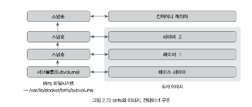
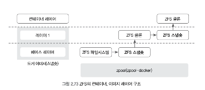

### Btrfs 드라이버 사용하기

Btrfs는 리눅스 파일시스템 중 하나로, SSD 최적화, 데이터 압축 등 다양한 기능을 제공한다.
Devicemapper나 AUFS, OVerlayFs와는 다르게 파일시스템을 별도로 구성하지 않으면 도커에서 사용할 수 없으며, /var/lib/docker 디렉터리가 btrfs 파일시스템을 사용하는 공간에 마운트돼 있어야만 도커는 Btrfs를 스토리지 드라이버로 인식한다.

Btrfs는 리눅스 커널에 포함돼 있으므로 대부분의 리눅스 배포판에서 사용할 수 있다.



Btrfs 드라이버는 이미지와 컨테이너를 서브 볼륨과 스냅숏 단위로 관리한다.
구조자체는 AUFS, devicemapper 등 다른 스토리지 드라이버와 유사하다.

이미지에서 가장 아래에 있는 베이스 레이어(Base Layer)가 서브볼륨이 되고,
그 위에 쌓이는 자식 레이어(Child Layer)가 베이스 레이어에 대한 스냅숏으로 생성된다.

새로운 컨테이너가 생성되면 컨테이너 레이어가 이미지의 맨 위에 있는 레이어의 스냅숏으로서 생성된다.
Btrfs는 devicemapper와 달리 블록 단위가 아닌 파일 단위로 각 레이어를 저장하기 때문에
/var/lib/docker/btrfs 디렉터리에서 이를 확인할 수 있다.

Btrfs 드라이버를 사용하는 컨테이너 내부에서 새로운 파일을 생성하는 것은 devicemapper와 마찬가지로 allocate-on-demand 작업에 의해 일어난다.
이미 존재하던 파일에 스기 작업을 수행할 때는 원본 파일을 보존하고 스냅샷에 새로운 공간을 할당하는 RoW 방식을 사용한다.

Btrfs는 자체적으로 SSD에 최적화돼 있으며 대체적으로 우수한 성능을 보여준다.
또한 리눅스의 파일시스템이 제공하지 않는 여러 기능을 제공한다는 장점도 있다.

---

### ZFS 드라이버 사용하기

ZFS는 썬 마이크로시스템즈에서 개발했으며 Btrfs처럼 압축, 레플리카, 데이터 중복 제거 등 다양한 기능을 제공한다.
그러나 ZFS는 라이선스 문제로 리눅스 커널에 기본적으로 탑재돼 있지 않아 별도의 설치 과정이 필요하다.
이를 위해 ZFS on Linux(ZoL)라는 프로젝트가 ZFS를 독립적으로 설치할 수 있도록 모듈을 제공한다.



ZFS도 용어의 차이만 있을 뿐 다른 스토리지 드라이버와 유사한 구조를 띄운다.
ZFS 드라이버를 사용하면 이미지와 컨테이너 레이어는 ZFS 파일 시스템, ZFS 클론, ZFS 스냅숏으로 구분되어 관리된다.

이미지 베이스 레이어가 ZFS 파일시스템이 되고, 이로부터 ZFS 스냅숏을 생성해 하나의 레이러를 구성한다. 이 ZFS 스냅숏에서 ZFS 클론을 생성해 이를 컨테이너 레이어를 위한 공간으로 사용한다.
ZFS 클론을 다시 스냅숏으로 만들면 다시 이미지 레이어로 생성되며, 이전과 동일한 과정을 거쳐 하나의 이미지로 사용된다.

ZFS의 쓰기와 읽기 작업도 Btrfs와 유사하게 RoW를 사용한다.
컨테이너 레이어에서 새로운 데이터를 쓸 때는 allocate-ondemand 작업에 의해 zpool로부터 새로운 블록을 할당받고 쓰기 작업을 수행한다.

이미 존재하는 파일에 쓰기 작업을 수행할 때는 컨테이너 레이어인 ZFS 클론에 zpool로부터 128KB 크기의 새로운 블록을 여러 개 할당하고 이 블록에 쓰기 작업을 수행한다.

ZFS는 성능뿐 아니라 안정성에 초점을 뒀으며, 앞서 언급한 것처럼 압축과 중복 데이터 중복 제거 등 여러 기능을 제공한다. 또한 ZFS는 ARC(Adaptive Replacement Cache)라고 하는 메모리 구조로 디스크 블록을 캐시하기 때문에 PaaS 환경에서도 나쁘지 않은 스토리지다.

그러나 기억해야할 것은 ZFS는 결고 가벼운 파일시스템이 아니라는 점이다.
ZFS는 메모리를 상당히 소모하는 파일 시스템이기 때문에 ZFS를 스토리지 드라이버로 사용하는 도커에서 많은 수의 컨테이너를 동시에 사용해야 한다면 호스트의 자원 사용량을 수시로 확인하는 것이 좋다.

---

### 2.5.3.4 컨테이너 저장 공간 설정

컨테이너 내부에서 사용되는 파일 시스템의 크기는 되커가 사용하고 있는 스토리지 드라이버에 따라 조금씩 다르다.

예를 들어 도커 엔진이 AUFS나 overlay2 등의 스토리지를 드라이버를 사용하도록 설정돼 있다면 컨테이너는 호스트와 저장 공간의 크기를 공유한다.

따라서 overlay2를 기본적으로 사용하는 우분투의 도커에서는 컨테이너 내부에서의 저장 공간이 호스트의 저장 공간 크기와 같다.

```bash
docker info | grep overlay2
# Storage Driver: overlay2

docker run -it --name ubuntu ubuntu:14.04
df -h
# Filesystem      Size  Used Avail Use% Mounted on
# overlay         8.0G  3.2G  4.8G  41% /
```

#### devicemapper에서의 컨테이너 저장 공간 설정

devicemapper에서 저장 공간 크기를 제한하려면 부록 A를 참고해 도커 데몬에 아래의 옵션을 추가한다.

```text
DOCKER_OPTS="... --storage-driver=devicemapper --storage-opt dm.basesize=20G ...."
```

--storage-driver 는 백엔드 스토리지 드라이버로서 devicemapper를,
--storage-opt dm.basesize는 컨테이너의 기본 저장 공간의 크기를 20GB로 설정한다.
아무런 설정을 하지 않으면 기본값 10G로 설정돼 있다.

dm.basesize 옵션의 값은 도커 엔진이 이미지를 내려받을 때 이미지 자체의 옵션으로 내장시키기 때문에 도커 데몬의 dm.basesize 옵션을 변경해도 기존에 사용하던 10G인 설정을 가진 이미지가 존재한다면 컨테이너의 파일 시스템 크기는 변하지 않는다.

따라서 도커에 초기 상태로 초기화한 뒤 사용해야만 정상적으로 적용된다.
단, 이 작업은 도커의 데이터를 저장하는 디렉터리를 삭제하기 때문에 모든 파일을 백업해 두는 것을 권장한다.

```text
# service docker stop
# rm -rf /var/lib/docker
# service docker start
```

또는 컨테이너를 생성할 때 --storage-opt 옵션을 통해 저장 공간의 크기를 제한할 수 있다.
그러나 --storage-opt의 값은 도커 데몬에서 절정한 dm.basesize 값보다 커야 한다.

```bash
docker run -it --storage-opt size=25G cetos:7
```

#### overlay2에서의 컨테이너 저장 공간 설정

스토리지 드라이버로 overlay2를 사용하고 있으며, 도커 데이터가 저장되어 있는 디스크가 xfs 파일시스템인 경우 project quota 라는 기능을 이용해 컨테이너의 저장 공간을 제한할 수 있다.

>새로운 디스크를 호스트에 추가하는 방법은 작업 환경에 적합한 방법을 선택해야 한다.
>AWS EC2 인스턴스에서 도커를 사용하고 있다면 새로운 EBS 볼륨을 생성해 인스턴스에 연결할 수도 있고, 버추얼 박스에서는 가상 디스크를 생성하고 가상 머신에 연결해도 된다.
>또는 라즈베리 파이나 물리서버 등에서 도커를 사용하고 있다면 단순히 사용하지 않는 USB를 서버에 꽂아서 새로운 디스크로 사용할 수 있다.

테스트를 위해 사용할 디스크를 xfs 파일 시스템으로 포맷

```bash
mkfs.xfs /dev/xvdf
```

해당 디스크를 마운트하기 위한 디렉터리를 생성한 뒤 디스크를 마운트한다.

```bash
mkdir /mnt/xfs
mount /dev/xvdf /mnt/xfs -o rw,pquota
```

옵션을 도커 데몬에 추가후 도커를 재시작

```text
DOCKER_OPTS="--storage-driver=overlay2 --data-root=/mnt/xfs"
```

docker info 명령어를 통해 스토리지 드라이버와 파일 시스템이 제대로 설정되었는지 확인

```bash
docker info | grep Storage
docker info | grep Backing
```

--storage-opt 옵션을 통해 저장 공간을 제한

```bash
docker run -it --storage-opt size=1G centos:7
```

이처럼 새롭게 디스크를 추가하고 포맷하는 작업은 어디까지나 이해를 돕기위한 예시이며
주 디스크가 이미 xfs로 포맷되어 있다면 새로운 디스크를 추가하지 않고 마운트 옵션만 변경할 수도 있다.
그뿐만 아니라 도커 스토리지 드라이버로 overlay2를 사용하고 있다면 스토리지 드라이버는 변경하지 않아도 된다.


---

## 2.5.4 도커 데몬 모니터링

### 2.5.4.1 도커 데몬 디버그 모드

도커 데몬에서 어떤 일이 얼나는지 가장 확실하고 정확하게 자세히 알아내는 방법은
도커 데몬을 디버그 옵션으로 실행하는 것이다.

Remote API의 입출력뿐만 아니라 로컬 도커 클라이언트에서 오가는 모든 명령어를 로그로 출력한다.
디버그 모드는 도커 데몬을 실행할 때 -D 옵션을 추가해서 사용할 수 있다.

```bash
dockerd -D
```

호스트에 있는 파일을 읽거나 도커 데몬을 포그라운드 상태로 실행해야 한다는 단점이있다.

### 2.5.4.2 event, stats, system df 명령어

#### event

`evets` 명령어는 도커 데몬에 어떤 일이 일어나고 있는지를 실시간 스트림 로그로 보여준다.
다음 명령어 중 하나를 입력하면 도커 데몬이 수행한 명령어의 결과를 실시간으로 볼 수 있다.

```bash
docker events
docker system events
```

도커 클라이언트에서 입력하는 모든 명령어가 출력되는 것은 아니다.
컨테이너 관련 명령어, 이미지 관련 명령어, 볼륨, 네트워크, 플로그인 등에 관한 명령어의 수행 결과가 출력된다.

filter 옵션을 통해 원하는 정보만 출력하도록 할 수 있다.
출력 종류는 container, image, volume, network, plugin, daemon 으로 나뉘며
특정 항목에 대한 출력 결과만 보고싶다면 `--filter 'type='image'` 와 같이 설정하면된다.

#### stats

`docker stats` 명령어는 실행 중인 모든 컨테이너의 자원 사용량을 스트림으로 출력한다.

```bash
docker stats
```

실행중인 모든 컨테이너의 CPU, 메모리 제한 및 사용량, 네트워크 입출력, 블록 입출력 정보를 출력한다.
기본적으로 스트림 형태로 출력되며, 스트림이 아닌 한 번만 출력하는 방식을 사용하고 싶다면
`--no-stream` 옵션을 추가한다.

#### system df

`system dif` 명령어는 도커에서 사용하고 있는 이미지, 컨테이너, 로컬 볼륨의 총 개수 및 사용중이 개수, 크기, 삭제함으로써 확보 가능한 공간을 출력한다.

```bash
docker system df
```

사용 중이지 않은 컨테이너와 볼륨은 `docker container prune` `docker volume prune`으로 한꺼번에 삭제할 수 있다.
`docker image prune` 명령어를 사용하면 사용 중이지 않은 댕글링 이미지를 삭제한다.

>댕글링 이미지는 docker images 명령어의 출력 결과에서 이름이 `<none>:<none>`인 이미지를 뜻한다.

### 2.5.4.3 CAdvisor

CAdivisor는 구글이 만든 컨테이너 모니터링 도구로 컨테이너로서 간단히 설치할 수 있고
컨테이너별 실시간 자원 사용량 및 도커 모니터링 정보를 시각화해서 보여준다.

CAdvisor는 오픈 소스로서 깃허브에서 소스코드로 사용할 수 있으며, 도커 허브에서 도커 이미지로도 배포되고 있다.

그러나 CAdvisor는 단일 도커 호스트만을 모니터링할 수 있다는 한계가 있다.
여러 개의 호스트로 도커를 사용하고 있으며, 이를 기반으로 PaaS(Platform as a Service) 같은 도커 클러스터를 구축했다면 단일 CAdvisror 컨테이너는 용도에 맞지 않을 수도 있다.

이를 위해서 보통은 쿠버네티스나 스웜 모드 등과 같은 오케스트레이션 툴을 설치한 뒤에
프로메테우스, InfluxDB 등을 이용해 여러 호스트의 데이터를 수집하는 것이 일반적이다.

## 2.5.5 Remote API 라이브러리를 이용한 도커 사용

필요에 따라서 -H 옵션을 원격의 도커 데몬을 제어하기 위해 사용하는 것도 좋은 방법이 될 수 있지만 컨테이너 애플리케이션이 수행해야 할 작업이 많거나 애플리케이션 초기화 등에 복잡한 과정이 포함돼 있다면 도커를 제어하는 라이브러리를 사용해 이를 좀 더 쉽게 해결할 수 있다.

도커를 제어하고 싶을 경우 일일이 Remote API 에 대한 요청을 소스코드로 제작할 필요 없이 이미 Remote API를 래핑해서 사용하기 쉽게 만들어놓은 라이브러리를 이용할 수 있다.

라이브러리 목록은 도커 SDK 페이지에서 확인할 수 있다.

도커 기반 언어인 Go는 물론 C#, C, Python, Dart, PHP, Java 등 많은 라이브러리를 오픈소스로 사용할 수 있다.

