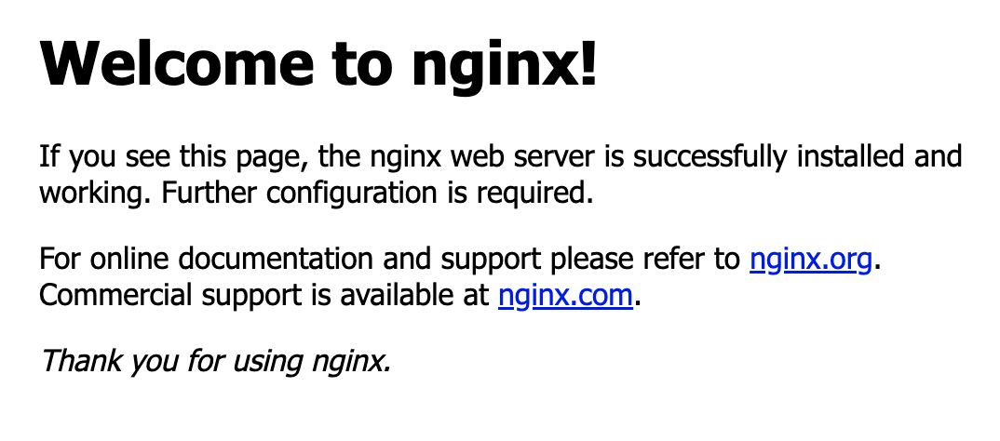

# 3.1 도커 스웜을 사용해야 하는 이유

지금까지 알아본 도커 사용법은 대부분 하나의 호스트를 기준으로 한다.

그러나 실제로 도커를 운영 환경에 적용한다면 조금 이야기가 달라진다.
하나의 호스트 머신에서 도커 엔진을 구동하다가 CPU, 메모리, 디스크 용량과 같은 자원이 부족하면 이를 어떻게 해결할까?

가장 간단한 해답은 "성능이 좋은 서버를 새로 산다" 이다.
하지만 좋은 해답이 아니다.

이를 해결하기 위해 여러 방법이 제안됐지만,
가장 많이 사용하는 방법은 **여러 대의 서버를 클러스터로 만들어 자원을 병렬로 확장하는 것**이다.

예를 들어 8GB 메모리가 탑재된 서버 3대에 도커 엔진을 설치해 실제 운영 환경에 사용한다고 가정해보자.
이 3대의 서버에 컨테이너가 너무 많이 생성돼 있어 더는 컨테이너를 사용할 수 없다고 판단되면 8GB의 메모리가 탑재된 새로운 서버를 추가해 자원을 늘리는 것이다.
이렇게 추가된 서버 자원만큼 클러스터 내의 가용 자원은 늘어나므로 총 사용 가능한 자원은 32GB가 된다.

그러나 여러 대의 서버를 하나의 자원 풀로 만드는 것은 쉬운 작업이 아니다.
- 새로운 서버나 컨테이너가 추가됐을 때 이를 발견(Service Discovery)하는 작업
- 어떤 서버에 컨테이너를 할당할 것인가에 대한 스케줄러와 로드밸런서 문제,
- 클러스터 내의 서버가 다운 됐을 때 고가용성(High Availability)을 어떻게 보장할지
  등이 문제로 남아있다.

그러나 다행히도 이러한 문제를 해결하는 여러 솔루션을 오픈소스로 활용할 수 있고
이 가운데 대표적인 것이 바로 도커에서 공식적으로 제공하는 **도커 스웜**과 **스웜 모드** 이다.

# 스웜 클래식과 도커 스웜 모드

스웜 클래식과 스웜 모드는
여러 대의 도커 서버를 하나의 클러스터로 만들어 컨테이너를 생성하는 여러 기능을 제공한다.

- 다양한 전략을 세워 컨테이너를 특정 도커 서버에 할당할 수 있다.
- 유동적으로 서버를 확장할 수도 있다.
- 스웜 클러스터에 등록된 서버의 컨테이너를 쉽게 관리할 수 있다.

PaaS와 같은 용도로 도커 서버 클러스터링을 고려하고 있다면 가장 먼저 스웜을 사용하는 것을 권장한다.
(도커 스웜 모드가 실제 운영 환경에서 많이 쓰이는 것은 아니다.)

# 도커 스웜의 두 가지 종류

#### 첫 번째
도커 버전 1.6 이후 부터 사용할 수 있는 **컨테이너로서의 스웜**
#### 두 번째
도커 버전 1.12 이후부터 사용할 수 있는 **도커 스웜 모드**

책에서는 두 종류의 스웜을 구분하기 위해 첫 번째를 '스웜 클래식' 두 번째를 '스웜 모드' 라고 부른다.

# 스웜 클래식과 스웜 모드의 차이점

가장 큰 차이점은 그 목적에 있다.

#### 스웜 클래식
- 여러 대의 도커 서버를 하나의 지점에서 사용하도록 단일 접근점을 제공
- docker run, docker ps 등 도커 명령어와 도커 API로 클러스터의 서버를 제어하고 관리할 수 있는 기능을 제공한다.
- 분산 코디네이터, 에이전트 등이 별도로 실행되어야 한다.
- 도커 공식 문서에서도 레거시(Legacy)로 언급되고 있다.
#### 스웜 모드
- 마이크로서비스 아키텍처의 컨테이너를 다루기 위한 클러스터링 기능에 초점
- 같은 컨테이너를 동시에 여러 개 생성해 필요에 따라 유동적으로 컨테이너의 수를 조절할 수 있으며, 컨테이너로의 연결을 분산하는 로드밸런싱 기능을 자체적으로 지원한다.
- 클러스터링을 위한 모든 도구가 도커 엔진 자체에 내장돼 있어 더욱 쉽게 서버 클러스터를 구축

애플리케이션의 특성에 따라 적절한 것을 선택해 사용하면 되지만
스웜 모드가 서비스 확장성과 안정성 등 여러 측면에서 스웜 클래식보다 뛰어나기 때문에 일반적으로는 스웜 모드를 더 많이 사용한다.

>분산 코디네이터는 클러스터에 영입할 새로운 서버의 발견, 클러스터의 각종 설정 저장, 데이터 동기화 등에 주로 이용된다.
>etcd, zookeeper, consul 등이 대표적인 예이며, 스웜 클래식은 대부분의 분산 코디네이터를 사용할 수 있다.
>스웜 모드는 분산 코디네이터를 별도로 구축하지 않아도 된다.

# 스웜 모드

스웜 모드는 별도의 설치 과정이 필요하지 않으며 도커 엔진 자체에 내장돼 있다.

docker info 명령을 통해 도커 엔진의 스웜 모드 클러스터 정보를 확인할 수 있다.

```bash
docker info | grep Swarm
# Swarm: inactive
```

>서버 클러스터링을 할 때는 반드시 각 서버의 시각을 NTP(Network Time Protocol) 등의 툴을 이용해 동기화해야 한다.
>서버 간에 설정된 시각이 다를 경우 예상치 못한 오류가 발생할 수 있기 때문이다.

실습을 위해 docker-machine을 사용해 VM을 띄워보자.
docker-machine 설치 후 실행해보니 자꾸 에러가 났다.

```txt
➜ docker-machine start myvm1
Starting "myvm1"...
(myvm1) Check network to re-create if needed...
(myvm1) Creating a new host-only adapter produced an error: /usr/local/bin/VBoxManage hostonlyif create failed:
(myvm1) 0%...NS_ERROR_FAILURE
(myvm1) VBoxManage: error: Failed to create the host-only adapter
(myvm1) VBoxManage: error: VBoxNetAdpCtl: Error while adding new interface: failed to open /dev/vboxnetctl: No such file or directory
(myvm1) VBoxManage: error: Details: code NS_ERROR_FAILURE (0x80004005), component HostNetworkInterfaceWrap, interface IHostNetworkInterface
(myvm1) VBoxManage: error: Context: "RTEXITCODE handleCreate(HandlerArg *)" at line 105 of file VBoxManageHostonly.cpp
(myvm1)
(myvm1) This is a known VirtualBox bug. Let's try to recover anyway...
Error setting up host only network on machine start: The host-only adapter we just created is not visible. This is a well known VirtualBox bug. You might want to uninstall it and reinstall at least version 5.0.12 that is is supposed to fix this issue
```

찾아보니 아직
https://forums.virtualbox.org/viewtopic.php?t=110252
[Monterey 12](macappstores://apps.apple.com/app/macos-monterey/id1576738294?mt=12)이후 버전은 아직 지원하지 않는것같다.

MacOS 다운그레이드를 통해 해결가능해 보이지만, 생략하기로 하였다.

# nginx 웹 서버 서비스 생성하기

```bash
docker service create --name myweb --replicas 2 -p 80:80 nginx
```

nginx 는 간단하게 위 명령으로 띄워볼 수 있다.



