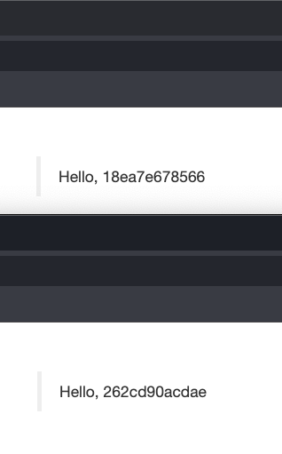

# 서비스 모드

서비스의 모드는 두 가지가 있다.

### 복제 모드 (replicated)

하나는 이전에 만들어 보았던 Nginx 웹 서비스와 같이 레플리카셋의 수를 정의해 그만큼의 같은 컨테이너를 생성하는 복제모드

### 글로벌 모드 (global)

글로벌 서비스는 스웜 클러스터 내에서 사용할 수 있는 모든 노드에 컨테이너를 반드시 하나씩 생성한다.
따라서 글로벌 모드로 생성한 서비스는 레플리카셋의 수를 별도로 지정하지 않는다.

글로벌 서비스는 스웜 클러스터를 모니터링하기 위한 에이전트 컨테이너 등을 생성해야 할 때 유용하다.

생성은 `docker service create --mode global` 명령어를 통해 생성할 수 있다.

`--mode` 옵션을 별도로 설정하지 않으면 복제 모드를 사용한다.

예제
```bash
docker service create  --name global_web --mode "global" nginx
docker service ls
docker service ps global_web
```

# 스웜 모드의 서비스 장애 복구

복제 모드로 설정된 서비스의 컨테이너가 정지하거나
특정 노드가 다운되면 스웜 매니저는 새로운 컨테이너를 생성해 자동으로 이를 복구한다.

예를들어 `docker rm -f` 를 통해 서비스 중 컨테이너 하나를 삭제하거나,
`service docker stop` 를 통해 특정 노드를 장애상태로 만들었을때
매니저 노드에서 `docker node ls`를 통해 확인해보면 노드의 상태가 Down으로 바뀐다.

이후 `docker service ps` 명령을 통해 컨테이너 목록을 확인해보면 구동 중이던 컨테이너가 종료됐으며 이를 복구하기 위한 swarm-manager 노드에 생성된 것을 확인할 수 있다.


**다운됐던 노드를 다시 시작해 정상적인 상태를 회복해도
장애를 복구하기 위해 다른 노드로 옮겨진 컨테이너가 해당 노드에 자동으로 할당되지는 않는다.**

즉, 재균형(rebalance) 작업이 일어나지 않는다는 뜻인데,
새로운 노드를 추가하거나 다운됐던 노드를 다시 복구했을 때 서비스의 컨테이너 할당의 균형을 맞추기 위해서는 `scael` 명령어를 이용해 컨테이너 수를 줄이고 다시 늘려야한다.

예제
```bash
docker service scale myweb=1
docker service scale myweb=4
```

# 서비스 롤링 업데이트

스웜 모드는 롤링 업데이트를 자체적으로 지원하며, 매우 간단하게 사용할 수 있다.

>롤링 업데이트란?
>애플리케이션을 업데이트 할 때 사용되는 배포 전략 중 하나이다.
>새 버전을 배포하면서, 새 버전 파드를 하나씩 늘려가고 기존 버전의 파드를 줄여나가는면서
>점진적으로 배포하는 전략

예제
```bash
# 서비스 생성
docker service create --name myweb2 --replicas 3 nginx:1.10
# 서비스의 이미지 업데이트 : 이미지를 nginx:1.11 로 업데이트
docker service update --image nginx:1.11 myweb2

docker service ps myweb2
```

```txt
ID             NAME           IMAGE        NODE             DESIRED STATE   CURRENT STATE                 ERROR     PORTS
chweaq02wopx   myweb2.1       nginx:1.11   docker-desktop   Running         Running about a minute ago
erz930fdt1n5    \_ myweb2.1   nginx:1.10   docker-desktop   Shutdown        Shutdown about a minute ago
bmta3gwbbvmg   myweb2.2       nginx:1.11   docker-desktop   Running         Running about a minute ago
27wb7oghwk5n    \_ myweb2.2   nginx:1.10   docker-desktop   Shutdown        Shutdown about a minute ago
szvx56vbk105   myweb2.3       nginx:1.11   docker-desktop   Running         Running about a minute ago
lksfrse9ccuy    \_ myweb2.3   nginx:1.10   docker-desktop   Shutdown        Shutdown about a minute ago
```

출력 결과를 살펴보면
NAME 항목이 `\__` 가 붙은 컨테이너가 롤링 업데이트의 대상이 되어 삭제된 컨테이너이다.
NAME 항목이 `\__` 가 붙지않은 컨테이너가 롤링 업데이트로 새롭게 생성된 컨테이너다.

서비스를 생성할 때
- 롤링 업데이트의 주기
- 업데이트를 동시에 진행할 컨테이너 개수
- 업데이트 실패했을 때
  어떻게 할 것인지 설정할 수 있다.

설정하지 않으면 주기 없이 차례대로 컨테이너를 한 개씩 업데이트한다.

예제
```bash
docker service create \
--replicas 4 \
--name myweb3 \
--update-delay 10s \
--update-parallelism 2 \
nginx: 1.10
```

롤링 업데이트 설정은 `docker service inspect` 또는 `docker inspect --type service` 명령으로 확인할 수 있다.

```txt
$ docker service inspect --pretty myweb2

ID:             vr5w54262ehfja0ark1am21lb
Name:           myweb2
Service Mode:   Replicated
 Replicas:      3
UpdateStatus:
 State:         completed
 Started:       10 minutes ago
 Completed:     9 minutes ago
 Message:       update completed
Placement:
UpdateConfig:
 Parallelism:   1
 On failure:    pause
 Monitoring Period: 5s
 Max failure ratio: 0
 Update order:      stop-first
RollbackConfig:
 Parallelism:   1
 On failure:    pause
 Monitoring Period: 5s
 Max failure ratio: 0
 Rollback order:    stop-first
ContainerSpec:
 Image:         nginx:1.11@sha256:e6693c20186f837fc393390135d8a598a96a833917917789d63766cab6c59582
 Init:          false
Resources:
Endpoint Mode:  vip
```

On failure 항목이 pause인 경우
**업데이트 도중 오류가 발생하면 롤링 업데이트를 중지하는 것을 의미한다.**

아무런 설정을 하지않으면 기본적으로 pause 이며,
서비스를 생성할 때 `--update-failure-action` 옵션을 통해 값을 continue로 지정하게되면
오류가 발생해도 롤링 업데이트를 진행할 수 있게 한다.

서비스 롤링 업데이트 후 롤링 업데이트 전으로 되돌리는 rollback 또한 가능하다.
`docker service rollback myweb2`

# 서비스 컨테이너에 설정 정보 전달하기 : config, secret

스웜 모드와 같은 서버 클러스터에서 파일 공유를 위해 설정 파일을 호스트마다 마련해두는 것은 매우 비효율적인 일이다.

그 뿐만 아니라 비밀번호와 같이 민감한 정보를 환경변수로 설정하는 것또한
보안상으로 매우 바람직하지 않기 때문에 이런 습관은 지양하는 것이 좋다.

이를 위해 스웜 모드에서는 secret 과 config 라는 기능을 제공한다.

### secret
비밀번호나 SSH 키, 인증서 키와 같이 보안에 민감한 데이터를 전송하기 위해서 사용
### config
nginx나 레지스트리 설정 파일과 같이 암호화할 필요가 없는 설정값들에 대해 사용

이 두 기능은 스웜모드에서만 사용될 수 있는 기능이며
`docker run` 명령에서는 사용할 수 없다.

MYSQL과 같이 일반적으로 사용하는 컨테이너들은 스웜모드에서도 동일하게 사용할 수 있기 때문에
두 기능을 활용하고 싶다면 스웜 모드를 사용하는 것이 좋다.

## secret

### secret 생성
`docker secret create`
예시 : `echo 1q2w3e4r | docker secret create my_mysql_password -`

생성 시 실제 값을 확인할 수 없으며 매니저 노드간에 암호화된 상태로 저장된다.

### secret 사용
```bash
docker service create --name mysql --replicas 1 \ --secret source=my_mysql_password,target=mysql_root_password \ --secret source=my_mysql_password,target=mysql_password \ -e MYSQL_ROOT_PASSWORD_FILE="/run/secrets/mysql_root_password" \ -e MYSQL_PASSWORD_FILE="/run/secrets/mysql_password" \ -e MYSQL_DATABASE="wordpress" mysql:5.7
```

--secret 옵션을 통해 컨테이너로 공유된 값은
기본적으로 컨테이너 내부의 /run/secrets/ 디렉터리에 마운트된다.

여기서는 target 의 값이 각각 mysql_root_password, mysql_password로 설정되어
/run/secrets 디렉터리에 해당 이름의 파일이 각각 존재할 것이다.

```txt
$ docker exec mysql.1.z81n9nxx9lxu2cjs0bt8ajd2a ls /run/secrets
mysql_password
mysql_root_password
```

경로를 확인해보면 디렉터리에 해당 이름의 파일이 각각 존재한다.

그러나 이러한 방식의 값 전달에는 고려할 점이 있다.
컨테이너 내부의 애플리케이션이 특정 경로의 파일 값을 참조할 수 있도록 설계해야한다는 것이다.
위 예시는 옵션을 통해서 특정 경로의 파일로부터 비밀번호를 로드할 수 있게 되어있다.
이처럼 애플리케이션을 개발할 때 설정 변수를 파일로부터 동적으로 읽어올 수 있도록 설계하면 secret, config의 장점을 활용할 수 있다.
## config

### config 생성
`docker config create registry-config config.yml`

`docker config inspect [name]` 을 통해 확인해보면
Data 항목이 존재한다.

```txt
[
    {
        "ID": "ys4okk0jvraiym5ptsgf5t7xe",
        "Version": {
            "Index": 303
        },
        "CreatedAt": "2024-03-17T11:50:30.834126655Z",
        "UpdatedAt": "2024-03-17T11:50:30.834126655Z",
        "Spec": {
            "Name": "registry-config",
            "Labels": {},
            "Data": "aGVsbG93b3JsZAo="
        }
    }
]
```

config는 입력된 값을 base64로 인코딩 한 뒤에 저장하며
base64 디코딩을 통해 값을 확인할 수 있다.

`echo aGVsbG93b3JsZAo= | base64 -d`

### config 사용
```bash
docker service create --name yml_registry -p 5000:5000 \
--config source=registry-config, target=/etc/docker/registry/config.yml \
registry:2.6
```

secret과 config의 값을 수정할 수는 없지만
서비스 컨테이너가 새로운 값을 사용해야 한다면
`docker service update` 명령어에
- `--config-rm`
- `--config-add`
- `--config-rm`
- `--secret-add`
  옵션을 사용해 서비스가 사용하는 secret이나 config를 추가하고 삭제할 수 있다.


# 도커 스웜 네트워크

스웜 모드는 여러 개의 도커 엔진에 같은 컨테이너를 분상해서 할당하기 때문에
각 도커 데몬의 네트워크가 하나로 묶인,
이른바 네트워크 풀이 필요하다.

뿐만 아니라 서비스를 외부로 노출했을 때 어느 노드로 접근하더라도 해당 서비스의 컨테이너에 접근할 수 있게 라우팅 기능이 필요하다.

이런 네트워크 기능은 스웜 모드가 자체적으로 지원하는 네트워크 드라이버를 통해 사용할 수 있다.

### 네트워크 목록 확인

```bash
docker network ls
```

bridge, host, none, docker_gwbridge, ingress 네트워크를 확인할 수 있다.
docker_gwbridge 네트워크는 스엄에서 오버레이 네트워크를 사용할 때 사용
ingress 네트워크는 로드 밸런싱과 라우팅 메시에 사용된다.

## ingress 네트워크

스웜 클러스터를 생성하면 자동으로 등록되는 네트워크
스웜 모드를 사용할 때만 유효하다.

매니저 노드뿐 아니라 스웜 클러스터에 등록된 노드라면 전부 ingress 네트워크가 생성된다.

ingress 네트워크는 어떤 스웜노드에 접근하더라도 서비스 내의 컨테이너에 접근할 수 있게 설정하는
라우팅 메시를 구성하고

서비스 내의 컨테이너에 대한 접근을 라운드 로빈 방식으로 분산하는 로드 밸런싱을 담당한다.

ingress 네트워크 예제
```bash
docker service create --name hostname \
-p 80:80 \
--replicas=4 \
alicek106/book:hostname
```

웹 페이지에 접근해보면 `odkcer ps` 명령어로 확인한 컨테이너 ID가 브라우저에 표시된다.



스웜 모드로 생성된 모든 서비스의 컨테이너가 외부로 노출되기 위해 무조건 ingress 네트워크를 사용해야 하는 것은 아니다.

`docker run -p` 를 통해 외부에 컨테이너를 노출했던 것처럼 호스트의 특정 포트를 사용하도록 설정할 수 있다.

그러나 ingress 네트워크를 사용하지 않고 서비스를 외부로 노출할 경우
어느 호스트에서 컨테이너가 생성될지 알 수 없어 포트 및 서비스 관리가 어렵다는 단점이 있다.
가급적이면 ingress 네트워크를 통해 외부로 서비스를 노출시키는 것이 좋다.

## 오버레이 네트워크

스웜 클러스터 내의 컨테이너가 할당받는 IP 주소는 어떻게 설정돼 있을까?
적당한 호스트를 골라 컨테이너 내부에서 ifconfig 명령어를 실행해 확인해보자.

```txt
docker exec 262cd90acdae ifconfig
eth0      Link encap:Ethernet  HWaddr 02:42:0a:00:00:05
          inet addr:10.0.0.5  Bcast:10.0.0.255  Mask:255.255.255.0
          ...

eth1      Link encap:Ethernet  HWaddr 02:42:ac:13:00:06
          inet addr:172.19.0.6  Bcast:172.19.255.255  Mask:255.255.0.0
          ...

lo        Link encap:Local Loopback
          inet addr:127.0.0.1  Mask:255.0.0.0
          ...
```

eth0, eth1, lo 가 할당됐고
eth0이 ingress 네트워크와 연결된 네트워크 카드다.

한가지 주목할 것은 swarm-manager에서 생성된 컨테이너와 swarm-worker1에서 생성된 컨테이너는 IP 주소가 차례로 할당됐다는 것이다.

ingress 네트워크는 오버레이 네트워크 드라이버를 사용한다.
오버레이 네트워크는 여러 개의 도커 데몬을 하나의 네트워크 풀로 만드는 네트워크 가상화 기술의 하나로서, 도커에 오버레이 네트워크를 적용하면 여러 도커 데몬에 존재하는 컨테이너가 서로 통신할 수 있다.

즉 여러개의 스웜 노드에 할당된 컨테이너는 오버레이 네트워크 서브넷에 해당하는 IP대역을 할당받아
이 IP를 통해 서로 통신할 수 있다는 것

## docker_gwbridge 네트워크

오버레이 네트워크를 사용하지 않는 컨테이너는 기본적으로 존재하는 브리지 네트워크를 사용해 외부와 연결한다.

그러나 ingress를 포함한 모든 오버레이 네트워크는 이와 다른 브리지 네트워크인 docke_gwbridge 네트워크와 함께 사용된다.

- 외부로 나가는 통신 및 오버레이 네트워크 트래픽 종단점(VTEP) 역할을 담당한다.
- 컨테이너 내부의 네트워크 인터페이스 카드 중 eth1과 연결된다.

## 사용자 정의 오버레이 네트워크

스웜 모드는 자체 키-값 저장소를 갖고 있으므로 별도의 구성 없이 사용자 정의 오버레이 네트워크를 생성하고 사용할 수 있다.

생성
```bash
docker service create \
--subnet: 10.0.9.0/24 \
-d overay \
myoverlay
```

## 서비스 디스커버리

같은 컨테이너를 여러 개 만들어 사용할 때 쟁점이 되는 부분 중 하나는 새로 생성된 컨테이너 생성의 발견
혹은 없어진 컨테이너의 감지이다.

일반적으로 이 동작은 주키퍼, etcd등 분산 코디네이터를 외부에 두고 사용해서 해결하지만
**스웜 모드는 서비스 발견 기능을 자체적으로 지원한다.**

예를 들어
2개의 컨테이너 레플리카를 갖는 B 서비스
A 서비스는 B서비스의 컨테이너를 사용한다고 가정

`docker service scale` 명령어로 서비스 B의 컨테이너를 3개로 늘렸을때
스웜 모드에서 A컨테이너는 B라는 이름으로 서비스 B의 컨테이너에 모두 접근할 수 있다.

**IP 주소를 알  필요도, 새롭게 생성된 사실도 알 필요가 없으며 B라는 서비스 이름만 알면 된다.**


## 스웜 모드 볼륨

도커 데몬 명령어 중 run 명령어에서 -v 옵션을 사용할 때 호스트와 디렉터리를 공유하는 경우와
볼륨을 사용하는 경우에 대한 구분이 딱히 없었다.

예를 들어 두 명령어는 -v 옵션을 동일하게 사용하지만 형식에 따라 도커 볼륨을 사용하느냐, 호스트와 디렉터리를 공유하느냐를 결정한다.

```bash
# 호스트와 디렉터리를 공유하는 경우
docker run -it --name host_dir_case -v /root:root ubuntu:14.04

# 도커 볼륨을 사용하는 경우
docker run -it --name volume_case -v myvolume:/root ubuntu:14.04
```

이런 기능을 스웜 모드에서도 사용할 수 있다.
그러나 스웜 모드에서는 도커 볼륨을 사용할지, 호스트 외 디렉터리를  공유할지를 좀 더 명확히 해 볼륨을 사용한다.
**즉 서비스를 생성할 때 도커 볼륨을 사용할지 호스트와 디렉터리를 공유할지 명시해야한다.**

자세한 내용은 책 231p를 참고하도록 하자.

## 도커 스웜 모드 노드 다루기, 서비스 제약 설정

생략
