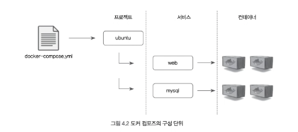

# 도커 컴포즈를 사용하는 이유

여러 개의 컨테이너가 하나의 애플리케이션으로 동작할 때 이를 테스트하려면
각 컨테이너를 하나 씩 생성해야한다.

예를들어, 웹 애플리케이션을 테스트하려면 웹 서버 컨테이너와 데이터베이스 컨테이너를 생성해야한다.
```bash
docker run --name mysql -d alicek106/composetest:mysql mysqld

docker run -d 80:80 \
--link mysql:db --name web \
alicek106/composetest:web apachectl -DFORGROUND
```

이처럼 여러 개의 컨테이너로 구성된 애플리케이션을 구축하기위해 run 명령을 반복할 수 있지만
번거롭다

매번 CLI로 컨테이너를 생성하기보다는 도커 컴포즈를 이용해 여러 개의 컨테이너를 하나의 프로젝트로서 다루는 것이 용이하다.

도커 컴포즈는 여러 개의 컨테이너의 옵션과 환경을 정의한 파일을 읽어 컨테이너를 순차적으로 생성하는 방식으로 동작한다.

- run 명령어 옵션을 그대로 사용할 수 있다.
- 각 컨테이너의 의존성, 네트워크, 볼륨 등을 함께 정의할 수 있다.
- 스웜 모드의 서비스와 유사하게 설정 파일에 정의된 서비스 컨테이너 수를 유동적으로 조절할 수 있다.
- 컨테이너 서비스 디스커버리도 자동으로 이루어진다.

### 어떤 상황에 써야할까?
소규모 컨테이너 개발 환경에서는 run 명령어로 컨테이너를 생성하는 것이 더 편리할 수도 있다.
컨테이너의 수가 많아지고 정의해야할 옵션이 많다면 도커 컴포즈를 활용하자.

# 도커 컴포즈 설치

리눅스 환경에서 다음과 같이 설치할 수 있다.

설치는 [홈페이지](https://docs.docker.com/compose/install/)에서 직접 살펴보도록 하자.

설치 후 정상적으로 완료됐는지 확인하기 위해 다음과 같이 버전을 확인할 수 있다.

```bash
docker-compose -v
```

# 4.3 도커 컴포즈 사용

도커 컴포즈는 컨테이너의 설정이 정의된 YAML 파일을 읽어 도커 엔진을 통해 컨테이너를 생성한다.

## docker-compose.yml

```yml
version: '3.0'  
services:  
  web:  
    image: alicek106/composetest:web  
    ports:  
      - "80:80"  
    links:  
      - mysql:db  
    command: apachectl -DFOREGROUND  
  mysql:  
    image: alicek106/composetest:mysql  
    command: mysqld
```

### version
YAML 파일 포맷의 버전을 나타낸다.
버전은 1, 2, 2.1, 3.0 등이 있다.
도커 컴포즈 1.8 버전은 2를, 도커 컴포즈 1.9는 버전 2.1을
도커 컴포즈 1.10은 버전 3.0을 사용한다.

단 버전 1은 사용되지 않는다.
**도커 컴포즈 버전은 도커 엔진 버전에 의존성이 있으므로 가능하다면 최신 버전을 사용하는 것이 좋다.**
도커 엔진과 도커 컴포즈의 호환성 목록은 [releases](https://github.com/docker/compose/releases) 에서 확인하자.

### sevices
생성될 컨테이너들을 묶어놓은 단위이다.
서비스 항목 아래에는 각 컨테이너에 적용될 생성 옵션을 지정한다.

### web, mysql
생성될 서비스의 이름이다.
이 항목 아래에 컨테이너가 생성될 때 필요한 옵션을 지정할 수 있다.
docker run에서 사용하는 옵션을 정의할 수 있다.

## 도커 컴포즈의 프로젝트, 서비스, 컨테이너

도커 컴포즈는 컨테이너를 프로젝트 및 서비스 단위로 구분하므로
컨테이너 이름은 일반적으로 다음과 같은 형식으로 정해진다.

`[프로젝트이름]_[서비스이름]_[서비스 내에서 컨테이너의 번호]`

위 예제에서 생성한 프로젝트의 이름은 ubuntu 이고 각 서비스의 이름은 mysql, web이다.

`docker-compose up -d` 를 실행했을 때 프로젝트의 이름을 별도로 입력하지 않았지만 도커 컴포즈는 기본적으로 `docker-compose.yml` 파일이 위치한 디렉터리의 이름을 프로젝트 이름으로 사용한다.

프로젝트의 이름은 `docker-compose.yml` 파일이 저장된 디렉터리의 이름에 따라 다를 것이다.



그림과 같이 하나의 프로젝트는 여러 개의 서비스로 구성되고
각 서비스는 여러 개의 컨테이너로 구성된다.

스웜 모드의 서비스와 마찬가지로
하나의 서비스에는 여러 개의 컨테이너가 존재할 수 있으므로
차례대로 증가하는 컨테이너의 번호를 붙여 서비스 내의 컨테이너를 구별한다.

### `docker-compose scale`
컨테이너 수를 늘이거나 줄여서 컨테이너 수를 수정할 수 있다.

위 예제에서는 ubuntu_mysql_1만 있지만 `docker-compose scale` 명령어로
ubuntu_mysql_2 ubuntu_mysql_3을 생성할 수 있다.

`docker-compose scale mysql=2`

### `docker-compose up`
명령어 끝에 서비스 이름을 입력해 yml 파일에 명시된 특정 서비스의 컨테이너만 생성할 수 있다.

`docker-compose up -d mysql`

### `docker-compose run`
위 명령어로 컨테이너를 생성할 수도 있다. 이때 Interactive 셸을 사용할 수 있다.

`docker-compose run web /bin/bash`

### `docker-compose down`
생성된 프로젝트는 위 명령어로 삭제할 수 있다.
프로젝트를 삭제하면 서비스의 컨테이너 또한 전부 정지된 뒤 삭제된다.

**도커 컴포즈는 기본적으로 현재 디렉터리의 이름으로 된 프로젝트를 제어한다.**
그러나 -p 옵션에 프로젝트의 이름을 사용해 제어할 프로젝트 이름을 명시할 수 있다.

즉 -p 옵션을 사용하면 yml 파일로 서로 다른 여러 개의 프로젝트를 생성하고 제어할 수 있다.
`docker-compose -p myproject down`
