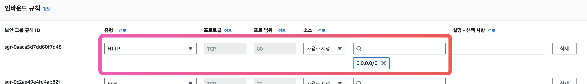
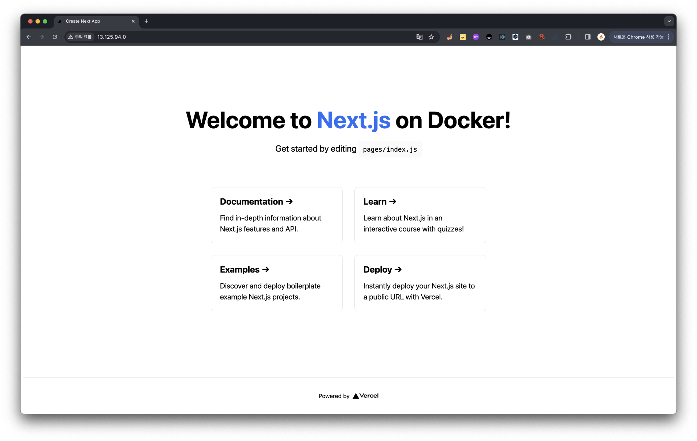

## 도커 컴포즈 활용

도커 컴포즈를 실제 개발환경에서 사용하려면 더 많은 옵션과 명령어가 필요하다.
yml 파일에서 자주 쓰이는 항목들을 알아보자.

YAML 파일은 크게
- 버전 정의
- 서비스 정의
- 볼륨 정의
- 네트워크 정의
  4가지 항목으로 구성된다.

도커 컴포즈는 기본적으로 현재 디렉터리 또는 상위에서 docker-compose.yml 이라는 이름의 YAML 파일을 찾아 컨테이너를 생성한다.
그러나 docker-compose -f 옵션을 사용하면 yml 파일의 위치와 이름을 지정할 수 있다.

```bash
docker-compose \
-f /home/alicek106/my_compose_file.yml \
up -d
```

### 버전 정의

위에서 언급하였듯이 YAML 파일 포맷에는 버전 1, 2, 2.1, 3이 있다.
버전 3은 도커 스웜 모드와 호환되는 버전이므로 가능하면 최신 버전의 도커 컴포즈를 사용하는 것이 좋다.

버전 항목은 일반적으로 YAML 파일의 맨 윗 부분에 명시한다.

### 서비스 정의

서비스는 도커 컴포즈로 생성할 컨테이너의 옵션을 정의한다.
이 항목에 쓰인 각 서비스는 컨테이너로 구현되며, 하나의 프로젝트로서 도커 컴포즈에 의해 관리된다.
서비스의 이름은 services의 하위 항목으로 정의하고
컨테이너의 옵션은 서비스 이름의 하위 항목에 정의한다.

```yml
services:
	my_container_1:
		image: ...
	my_container_2:
		image: ...
```

주요 컨테이너 옵션을 살펴보자.
추가 서비스 항목은 공식 문서를 참고하자.

- image : 서비스 컨테이너를 생성할 때 쓰일 이미지의 이름을 설정한다. 이미지 이름 포맷은 docker run 과 같다. 만일 이미지가 도커에 존재하지 않으면 저장소에서 자동으로 다운받는다.

```yml
services:
	my_container_1:
		image: alicek106/composetest:mysql
```

- links: docker run 명령어의 --link 와 같으며 다른 서비스에 서비스 명만으로 접근할 수 있도록 설정한다.`[SERVICE:ALIAS]`의 형식을 사용하면 서비스에 별칭으로도 접근할 수 있다.

```yml
services:
	my_container_1:
		links:
			- db
			- db:database
			- redis
```

- environment: docker run 명령어의 --env -e 옵션과 동일하다. 컨테이너 내부에서 사용할 환경변수를 지정하며 딕셔너리 나 배열 형태로 사용할 수 있다.

```yml
services:
	web:
		enviroment:
			-MYSQL_ROOT_PASSWORD=mypassword
			-MYSQL_DATA_BASE_NAME=mydb
		# 또는 아래와 같이 사용한다.
		enviroment:
			-MYSQL_ROOT_PASSWORD: mypassword
			-MYSQL_DATA_BASE_NAME: mydb
```

- command : 컨테이너가 실행될 때 수행할 명령어를 설정하며, docker run 명령어의 마지막에 붙는 커맨드와 같다. Dockerfile의 RUN과 같은 배열 형태로도 사용할 수 있다.

```yml
services:
	web:
		image: alicek106/composetest:web
		command: apachectl -DFORGROUND
	# 또는 아래와 같이 사용한다.
	web:
		image: alicek106/composetest:web
		command: [apachectl, -DFORGROUND]
```

- depends_on : 특정 컨테이너에 대한 의존 관계를 나타내며, 이 항목에 명시된 컨테이너가 먼저 생성되고 실행된다. 다음 예제에서 web 컨테이너보다 mysql 컨테이너가 먼저 생성된다. links도 depends_on과 같이 컨테이너의 생성 순서와 실행 순서를 정의하지만 depends_on은 서비스 이름으로만 접근할 수 있다는 점이 다르다.

```yml
services:
	web:
		image: alicek106/composetest:web
		depends_on
			- mysql
	mysql:
		image: alicek106/composetest:mysql
```

특정 서비스의 컨테이너만 생성하되 의존성이 없는 컨테이너를 생성하려면 --no-deps 옵션을 사용한다.

`docker-compose up --no-deps web`

links, depends_on 모두 실행 순서만 설정할 뿐 컨테이너 내부의 애플리케이션이 준비된 상태인지에 대해서는 확인하지 않는다.

예를 들어, 데이터베이스 컨테이너와 웹 서버 컨테이너가 정해진 순서대로 실행됐더라도 데이터베이스가 초기화 중이라면 웹 서버 컨테이너가 정상적으로 동작하지 않을 수도 있다.

이를 해결하는 방법으로 컨테이너에 셸 스크립트를 entrypoint로 지정하는 방법이 있다.
YAML 파일의 entrypoint에 다음과 같이 지정한다.

```yml
services:
	web:
		...
		entrypoint: ./sync_script.sh mysql:3306
```

entrypoint에 지정된 sync_script.sh는 다음과 같은 형식을 가진다.
until 구문의 조건 안에 다른 컨테이너의 애플리케이션이 준비됐는지 확인하는 명령을 입력한다.
예: curl mysql:3306

```shell
untill (상태를 확인할 수 있는 명령어); do
	echo "depend container is not available yet"
	sleep 1
done
echo "depends_on contianer is ready"
```

- port: docker run 명령어의 -p와 같으며 서비스의 컨테이너를 개방할 포트를 설정한다. 그러나 단일 호스트 환경에서 80:80 과 같이 호스트의 특정 포트를 서비스의 컨테이너에 연결하면 docker-compose scale 명령어로 서비스의 컨테이너의 수를 늘릴 수 없다.

```yml
services:
	web:
		image: ...
		ports:
			- "8080"
			- "8081-8085"
			- "80:80"
			...
```

- build: build 항목에 정의된 Dockerfile에서 이미지를 빌드해 서비스의 컨테이너를 생성하도록 설정한다.

예제에서는 ./composetest 디렉터리에 저장된 Dockerfile로 이미지를 빌드해 컨테이너를 생성한다.
새롭게 빌드될 이미지의 이름은 Image 항목에 정의된 이름이 된다.

```yml
services:
	web:
		build: ./composetest
		image: alicek106/composetest:web
```

또한 build 항목에서는 Dockerfile에 사용될 컨텍스트나 Dockerfile의 이름.
Dockerfile에서 사용될 인자 값을 설정할 수 있다.
다음과 같이 image항목을 설정하지 않으면 이미지의 이름은 `[프로젝트이름]:서비스이름]`이 된다.

```yml
services:
	web:
		build: ./composetest
		context: ./composetest
		dockerfile: myDockerfile
		args:
			HOST_NAME: web
			HOST_CONFIG: self_config
```

build 항목을 YAML 파일에 정의해 프로젝트를 생성하고 난 뒤 Dockerfile을 변경하고 다시 프로젝트를 생성해도 이미지를 새로 빌드하지 않는다.

`docker-compose up -d`에 `--build` 옵션을 추가하거나
`docker-compose build` 명령을 사용해 Dockerfile이 변경돼도 컨테이너를 생성할 때마다 빌드하도록 설정할 수 있다.

- enxtends: 다른 YAML 파일이나 현재 YAML 파일에서 서비스 속성을 상속받게 설정한다.

2개의 YAML 파일이 있다고 가정해보자.

```yml
#상속 받을 파일 docker-compose.yml
version: '3.0'
	services:
		web:
			extends:
				file: extend_compose.yml
				service: extend_web
```

```yml
#설정을 상속해줄 extends-compose.yml
version: '3.0'
	services:
		extend_web:
		image: ubuntu:14.04
		ports:
			- "80:80"
```

docker-compose.yml 의 web 서비스는 extend_compose.yml의 extend_web 서비스의 옵션을 그대로 갖게 된다.
즉 web 서비스의 컨테이너는 ubuntu:!4.04 이미지의 80:80 포트로 설정된다.
file 항목을 설정하지 않으면 현재 YAML 파일에서 extends할 서비스를 찾는다.

>도커 컴포즈 일부 버전에서 extends가 동작하지 않을 수 있다.
>이를 해결하려면 최신 버전의 도커 컴포즈를 사용하거나 version을 3.0이 아닌 2.x으로 내려 사용해보도록 하자.

### 네트워크 정의

- driver: 도커 컴포즈는 생성된 컨테이너를 위해 기본적으로 브리지 타입의 네트워크를 생성한다.

driver 항목을 정의해 서비스의 컨테이너가 브리지 네트워크가 아닌 다른 네트워크를 사용하도록 설정할 수 있다.
특정 드라이버에 필요한 옵션은 하위 학목인 driver_ops로 전달한다.

- ipam: IPAM(IP Address Manager)를 위해 사용할 수 있는 옵션으로 subnet, ip 범위 등을 설정할 수 있다. driver 항목에는 IPAM을 지원하는 드라이버의 이름을 입력한다.

- external: YAML 파일을 통해 프로젝트를 생성할 때마다 네트워크를 생성하는 것이 아닌, 기존의 네트워크를 사용하도록 설정한다.

이를 설정하려면 사용하려는 외부 네트워크의 이름을 하위 항목으로 입력한 뒤 external의 값을 true로 설정한다. external 옵션은 준비된 네트워크를 사용하므로 driver, driver_ops, ipam 옵션과 함께 사용할 수 없다.

### 볼륨 정의

- driver: 볼륨을 생성할 때 사용될 드라이버를 설정한다. (default: local)

추가옵션은 하위 항목인 driver_opts 를 통해 인자로 설정할 수 있다.

- external: 도커 컴포즈는 YAML 파일에서 volume, volumes-from 옵션 등을 사용하면 프로젝트마다 볼륨을 생성한다.

옵션을 설정하면 볼륨을 프로젝트를 생성할 때마다 매번 생성하지 않고 기존 볼륨을 사용하도록 설정한다.

### YAML 파일 검증하기

YAML 파일을 작성할 때 오타 검사나 파일 포맷이 적절한지 등을 검사하려면
`docker-compose config` 명령어를 사용한다.

기본적으로 현재 디렉터리의 docker-compose.yml 파일을 검사하지만
`docker-compose -f (yml 파일 경로) config` 와 같이 파일의 경로로 설정할 수 있다.

## 도커 컴포즈 네트워크

YAML 파일에 네트워크 항목을 정의하지 않으면 도커 컴포즈는 프로젝트별로 브리지 타입의 네트워크를 생성한다. 생성된 네트워크의 이름은 `[프로젝트 이름]_default`로 설정되며,
`docker-compose up` 명령어로 생성되고 `docker-compose down` 명령어로 삭제된다.

```shell
docker-compose up -d
docker-compose down
```

`dockewr-compose up` 명령어뿐 아니라 `docker-compose scale` 명령어로 생성되는 컨테이너 전부가 이 브리지 타입의 네트워크를 사용한다.

서비스 내의 컨테이너는 `--net-alias`가 서비스의 이름을 갖도록 자동적으로 설정되므로
이 네트워크에 속한 컨테이너는 **서비스의 이름으로 서비스 내의 컨테이너에 접근**할 수 있다.

## 도커 스웜 모드와 함께 사용하기

도커 컴포즈 1.10 버전에서 스웜 모드와 함께 사용할 수 있는 YAML 버전 3이 배포됨과 동시에 스웜모드와 함께 사용되는 개념인 스택(stack)이 도커 엔진 1.13 버전에 추가됐다.

스택은 YAML 파일에서 생성된 컨테이너의 묶음으로서 YAML 파일로 스택을 생성하면
YAML 파일에 정의된 서비스가 스웜 모드의 클러스터에서 일괄적으로 생성된다.

즉, YAML 파일에 정의된 서비스가 스웜모드의 서비스로 변환된 것이다.
정리하면 docker stack은 여러 개의 서비스로 구성된 애플리케이션을 관리하기 위한 도구다.
서비스를 관리하기 때문에 docker stack은 스웜모드에서만 사용이 가능하다.

단 스택은 도커 컴포즈 명령어인 docker-compose가 아닌 **docker stack으로 제어**해야한다.
정확히 말하면 스택은 도커 컴포즈에 의해 생성된 것이 아니라 스웜 모드 클러스터의 매니저에 의해 생성된 것이다.

이하 사용 방법 생략

## 도커 컴포즈로 웹 개발환경 구성하기

### EC2 인스턴스 생성

인스턴스를 생성하고 docker를 설치한다.

```bash
yum install docker
service docker start
```

다음으로 nginx 이미지를 내려받는다.

```bash
docker search nginx
docker pull nginx
docker images
```

### docker-compose install

docker-compose latest 버전 설치

```bash
sudo curl -L https://github.com/docker/compose/releases/latest/download/docker-compose-$(uname -s)-$(uname -m) -o /usr/local/bin/docker-compose
```

권한 변경

```bash
sudo chmod +x /usr/local/bin/docker-compose
```

버전 확인

```bash
docker-compose version
```

[참고자료](https://gist.github.com/npearce/6f3c7826c7499587f00957fee62f8ee9)

이후 사용할 EC2 인스턴스의 보안그룹을 수정해야한다. 여기서 인바운드 규칙을 설정한다.
80포트를 열어주었다.



### Next.js 프로젝트 설정

프로젝트는 Next.js 에서 제공하는 [예제](https://github.com/vercel/next.js/tree/canary/examples/with-docker)로 대체한다.

```bash
npx create-next-app --example with-docker nextjs-docker
```

위 명령어로 쉽게 프로젝트를 생성할 수 있다.

```txt
## Using Docker

1. [Install Docker](https://docs.docker.com/get-docker/) on your machine.
2. Build your container: `docker build -t nextjs-docker .`.
3. Run your container: `docker run -p 3000:3000 nextjs-docker`.

You can view your images created with `docker images`.
```

이미지를 생성하는 방법은 위와같이 README 에 잘 소개가 되어있다.

### docker-compose.yml 작성하기

```yml
version: '3.0'
services:
  nginx:
    image: nginx:latest
    ports:
      - "80:80"
    volumes:
      - ./nginx.conf:/etc/nginx/nginx.conf
    container_name: nginx-web
    depends_on:
      - web
  web:
    image: nextjs-docker
    ports:
      - "3000:3000"
    container_name: nextjs-web
```

nginx.conf를 추가한다.
경로가 다르다면 docker-compose.yml의 volumes 경로를 수정해줄 필요가 있다.

```txt
user  nginx;
worker_processes  auto;

error_log  /var/log/nginx/error.log notice;
pid        /var/run/nginx.pid;


events {
    worker_connections  1024;
}


http {
    include       /etc/nginx/mime.types;
    default_type  application/octet-stream;

    log_format  main  '$remote_addr - $remote_user [$time_local] "$request" '
                      '$status $body_bytes_sent "$http_referer" '
                      '"$http_user_agent" "$http_x_forwarded_for"';

    access_log  /var/log/nginx/access.log  main;

    sendfile        on;
    #tcp_nopush     on;

    keepalive_timeout  65;

    #gzip  on;


	upstream next-web {
		server nextjs-web:3000;
	}
	server {
		listen 80;
		
		location / {
			proxy_http_version 1.1;
			proxy_set_header Upgrade $http_upgrade;
			proxy_set_header Connection 'upgrade';
			proxy_set_header Host $host;
			proxy_set_header X-Real-IP $remote_addr;
			proxy_set_header X-Forwarded-For $proxy_add_x_forwarded_for;
			proxy_set_header X-Forwarded-Proto $scheme;
			proxy_cache_bypass $http_upgrade;
			proxy_pass http://next-web;
		}
	}
}
```


이후 `docker-compose up -d` 명령을 실행하고 확인해보면 정상적으로 동작하는 것을 볼 수 있다.



